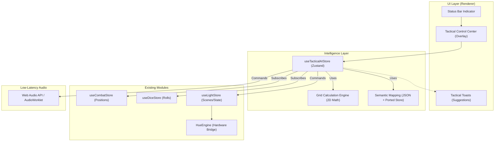

# Architecture Decision Document - Cerveau Tactique

_Ce document est le fruit d'une collaboration par étapes. Les décisions architecturales sont consignées ici au fur et à mesure pour garantir la cohérence technique et éviter les conflits d'implémentation entre agents._

## 1. Initialisation du Design

L'architecture de "Cerveau Tactique" repose sur la fusion fluide entre une logique décisionnelle locale (GM-OS) et des services d'ambiance externes (Philips Hue, Media Hub).

### Documents de Référence Chargés
- **PRD Validé** : Définit les contrats de capacité (RF1-12) et les cibles NFR.
- **Product Brief** : Vision de la "plateforme d'immersion totale".
- **Architecture Patterns** : Modèles existants pour le bridging matériel (Hue Bridge).
- **Taxonomie Sémantique** : Guide pour le mapping prompt-to-tags Audio/Visual.
- **GM-OS Rules (instructions.md)** : Standard "Bridge", usage exclusif de Tailwind et protection Anti-Régression.

## 2. Analyse du Contexte Projet

### Synthèse des Exigences

**Exigences Fonctionnelles (FR) :**
- Architecture centrée sur le **"Bouton Unique"** : Déclenchement coordonné de l'audio, de la lumière et des visuels à partir d'une seule entrée narrative.
- Contrat de capacité RF1-RF12 : Couvre la chaîne complète, du prompt à l'effet matériel.

**Exigences Non-Fonctionnelles (NFR) :**
- **Performance :** Latence sub-seconde impérative pour ne pas briser le rythme de jeu.
- **Fiabilité :** Le "Zero Silence" est la priorité (fallback LIFO local).
- **Sécurité :** Chiffrement local des secrets via `native.safeStorage`.

### Échelle et Complexité
- **Dépendances :** API Philips Hue, API Gemini/OpenAI (Cloud), Système de fichiers local (Media Hub).
- **Complexité logicielle :** Haute (Gestion de flux asynchrones multiples et synchronisation matérielle).

### Contraintes Techniques Identifiées
- **Architecture Bridge :** Isolation stricte de la logique métier (TS) via `window.appBridge` pour garantir la portabilité future.
- **Local-First :** La curation audio doit fonctionner sans internet si les médias sont présents localement.
- **Préservation de l'existant :** Le module `light-os` (connecteur Philips Bridge) est fonctionnel et doit être préservé. L'architecture "Cerveau Tactique" doit s'interfacer avec lui sans modification disruptive.

## 3. Évaluation du Modèle de Départ (Starter)

### Domaine Technologique Principal
- **Desktop Bridge** : Application Electron hybride (Local/Cloud/IoT).
- **Base Existante** : GM-OS v5 (HTML, TypeScript, Tailwind, Vitest).

### Fondations Techniques Sélectionnées

**1. Pilotage Matériel (Pont Hue)**
- **Sélection :** `node-hue-api`
- **Raison :** Support complet de l'API Philips Hue Bridge, gestion native des promesses (async/await), et compatibilité parfaite avec l'environnement Node.js d'Electron.
- **Alternative rejetée :** `node-phea` (trop spécifique à Entertainment API, moins flexible pour le contrôle général).

**2. Gestion Audio Haute Performance**
- **Sélection :** Web Audio API + `AudioWorklet`
- **Raison :** Seule méthode garantissant un traitement audio hors du thread principal de l'UI, éliminant les micro-coupures lors des interactions MJ complexes. Usage de `audio-buffer` pour la manipulation de données brutes si nécessaire.

### Choix Architecturaux du Starter
- **Langage :** TypeScript (Standard GM-OS v5).
- **Styling :** Tailwind CSS.
- **Communication :** Pont IPC via `appBridge` (Isolation sécurité).
- **Tests :** Vitest (Mocks AudioContext et Bridge requis).

## 4. Décisions Architecturales Fondamentales

- **Impact :** Facilitation des tests unitaires et isolation logicielle de la "couche d'intelligence".

### Catégorie 2 : Sécurité et Confidentialité

**D2.1 : Stockage des Secrets (Clés API, Hue Bridge)**
- **Décision :** Priorité à la Portabilité (Persistance Store).
- **Description :** Les secrets seront stockés dans le store Zustand persisté. Bien que moins sécurisés que le `safeStorage` (lié à la machine), ce choix garantit que le MJ peut copier son dossier `GM-OS` d'un PC à l'autre sans perdre ses configurations. 
- **Raison :** Besoin utilisateur de mobilité et de simplicité de sauvegarde (Agreement John/David).

**D2.2 : Protection de la Vie Privée (Souveraineté des données)**
- **Décision :** Anonymisation Narrative Stricte.
- **Description :** Aucun identifiant matériel (ID Pont Hue, noms de lumières réels) n'est envoyé au Cloud/LLM. Seul le contexte narratif filtré est transmis pour obtenir les tags sémantiques.
- **Raison :** Indépendance vis-à-vis du Cloud pour la topologie physique du domicile.

### Catégorie 3 : API et Communication (Pont Tactique)

**D3.1 : Calcul de Portée et Modificateurs (Grid Bridge)**
- **Décision :** Calcul Côté Renderer (Option A).
- **Description :** Les calculs de distance (Pythagore sur grille) seront effectués directement dans le hook `useTacticalAI` au sein du processus de rendu.
- **Raison :** Garantit un feedback immédiat (< 16ms) pour l'affichage des modificateurs tactiques sans latence IPC.

**D3.2 : Standard de Communication Inter-Stores**
- **Décision :** Orchestration par Abonnement (useTacticalAIStore).
- **Description :** Le nouveau store s'abonnera aux changements des stores `useCombatStore` et `useDiceStore` pour déclencher les suggestions en temps réel.
- **Impact :** Découplage maximal des systèmes existants.

**D3.3 : Protocole de File d'Attente Matérielle (LIFO + Priorités)**
- **Décision :** Système de File à Priorités Étagées.
- **Description :** Les ordres envoyés au `HueEngine` seront triés par une file d'attente intelligente :
    1. **Priorité 1 (Immédiat/Flash) :** Effets de dégâts, sorts instantanés. Interrompent tout le reste.
    2. **Priorité 2 (Combat/Tactique) :** Changements d'état de combat, suggestions de portée.
    3. **Priorité 3 (Ambiance/Fond) :** Cycles lents, effets météo. Peuvent être écrasés par P1/P2 (LIFO).
- **Raison :** Garantit la réactivité des feedbacks critiques tout en évitant la saturation du pont Hue.

**D3.4 : Service de Curation Audio (Selection Intelligence)**
- **Décision :** Gestion par Playlist Fluide & Buffer LIFO (Option C).
- **Description :** Le moteur audio maintiendra une file d'attente fluide pour les ambiances, tout en permettant des interruptions immédiates ("Cuts") pour les sons tactiques (Priority 1). Usage de la Web Audio API pour des transitions sans clic ni coupure.
- **Raison :** Équilibre parfait entre immersion narrative (fluidité) et réactivité tactique (sons d'impact immédiats).

### Catégorie 4 : Architecture Frontend

**D4.1 : Déclencheur UI "Bouton d'Ambiance"**
- **Décision :** Approche Hybride (Barre d'État + Panneau Flottant).
- **Description :** Un indicateur discret dans la barre d'état existante affiche le statut de l'IA. Un clic ouvre un "Tactical Control Center" en overlay (glassmorphism) pour les réglages fins.
- **Raison :** Préserve l'espace de jeu sur la carte tout en offrant un accès rapide à l'intelligence narrative.

**D4.2 : Système de Suggestions Tactiques**
- **Décision :** Tactical Toasts (Option A).
- **Description :** Les conseils (portée, modificateurs, smart dispel) sont affichés via des notifications élégantes en bas à droite de l'écran.
- **Raison :** Moins intrusif que les overlays dynamiques, permet de ne pas surcharger la vue de combat.

### Catégorie 5 : Implémentation Sécurité & Confidentialité

**D5.1 : Stockage des Secrets MJ**
- **Décision :** Store Zustand Persisté avec encryption légère.
- **Description :** Bien que la portabilité soit privilégiée (D2.1), les clés API seront stockées dans un champ `secrets` du store, manipulé via un hook `useSecretManager` qui s'assure que ces données ne sont jamais affichées en clair dans les logs ou la console de dev.
- **Raison :** Équilibre entre sécurité "développeur" et commodité utilisateur.

**D5.2 : Pipeline d'Anonymisation Narrative**
- **Décision :** Filtrage Regex pré-envoi.
- **Description :** Un service de nettoyage (`NarrativeCleaner`) supprimera les patterns ressemblant à des adresses IP, des noms de fichiers locaux ou des identifiants matériels avant l'envoi au LLM.
- **Raison :** Protection de la vie privée sans impacter la qualité narrative du prompt.

### Catégorie 5 : Implémentation Sécurité & Confidentialité

**D5.1 : Stockage des Secrets MJ**
- **Décision :** Store Zustand Persisté avec encryption légère.
- **Description :** Bien que la portabilité soit privilégiée (D2.1), les clés API seront stockées dans un champ `secrets` du store, manipulé via un hook `useSecretManager` qui s'assure que ces données ne sont jamais affichées en clair.
- **Raison :** Équilibre entre sécurité "développeur" et commodité utilisateur.

**D5.2 : Pipeline d'Anonymisation Narrative**
- **Décision :** Filtrage Regex pré-envoi.
- **Description :** Un service de nettoyage (`NarrativeCleaner`) supprimera les patterns sensibles avant l'envoi au LLM.
- **Raison :** Protection de la vie privée.

### Catégorie 6 : Design UI/UX Final

**D6.1 : Indicateur de Status "Cerveau"**
- **Décision :** Icône Pulsante en Barre d'État.
- **Description :** Une icône 🧠 dans la barre d'état de GM-OS servant d'indicateur d'activité (pulse bleu pendant l'analyse).
- **Raison :** Minimalisme et feedback non-intrusif.

**D6.2 : Tactical Control Center**
- **Décision :** Panneau Flottant (Glassmorphism).
- **Description :** Volet overlay regroupant les réglages d'intensité de l'IA, les logs de suggestions et un bouton d'arrêt d'urgence.
- **Raison :** Centralisation des contrôles avancés sans encombrer la zone de jeu.

## 6. Diagramme d'Architecture (Mermaid)

## 6. Séquence d'Implémentation Recommandée

1. **Sprint 1 : Fondations & Store** - Création de `useTacticalAIStore` et du mapping statique.
2. **Sprint 2 : Grid Bridge** - Implémentation du moteur de calcul de distance 2D coté Renderer.
3. **Sprint 3 : Hardware & Audio** - Connexion au `HueEngine` (Presets) et mise en place de la Web Audio API.
4. **Sprint 4 : UI & Feedback** - Intégration du Control Center et des Tactical Toasts.
