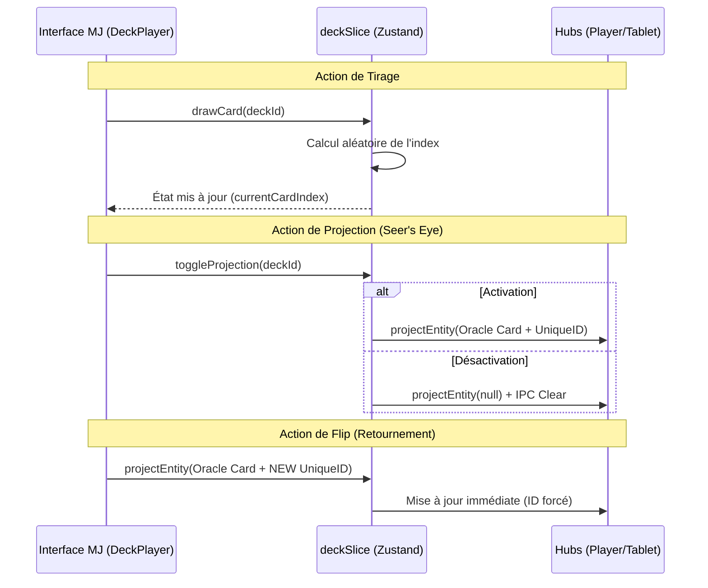

# Architecture Logique : Deck-OS & Projection

Ce document détaille le flux logique des données et les mécanismes de synchronisation du module **Deck-OS** dans GM-OS v5.

## 🏗️ Vue d'Ensemble du Flux Logique

L'architecture repose sur un triangle de responsabilité : l'interface MJ (Commande), le Store Zustand (État), et les Hubs (Restitution).

## 🔐 Mécanismes de Synchronisation

### 1. Forçage de la Mise à Jour (Cache-Busting Logique)
Pour garantir que les Hubs rechargent l'image de la carte lors d'un "Flip" (même si l'image source semble identique), le système injecte un `projectionId` basé sur un timestamp (`Date.now()`). 
Cela contourne l'optimisation de React/Zustand qui pourrait ignorer un changement d'état si l'objet entité est structurellement proche du précédent.

### 2. Gestion de l'État "Oracle"
Les cartes de deck sont traitées comme des entités de type `Oracle`. Ce type spécifique déclenche un middleware visuel dans les Hubs :
- **Entité standard (NPC/Lieu)** : Affiche Portrait + Nom + Description.
- **Entité Oracle (Carte)** : Affiche uniquement l'image brute ("Clean View") pour maximiser l'immersion.

### 3. Résolution des Médias
Le `mediaResolver` transforme les chemins logiques stockés dans le store (ex: `assets/decks/torg/drama/card_5.png`) en URLs physiques accessibles par le navigateur, en gérant les préfixes protocolaires si nécessaire.

## 🛠️ Composants Clés

| Composant | Rôle |
| :--- | :--- |
| `deckSlice.ts` | Gère la pile de pioche, la défausse et la logique de sélection aléatoire. |
| `DeckPlayer.tsx` | Fournit les contrôles interactifs au MJ (Tirer, Mélanger, Projeter). |
| `PlayerHub.tsx` | Intercepte les entités projetées et applique le mode "Oracle" si nécessaire. |
| `useImageStore.ts` | Point central de l'IPC pour synchroniser les médias entre les différentes fenêtres. |
