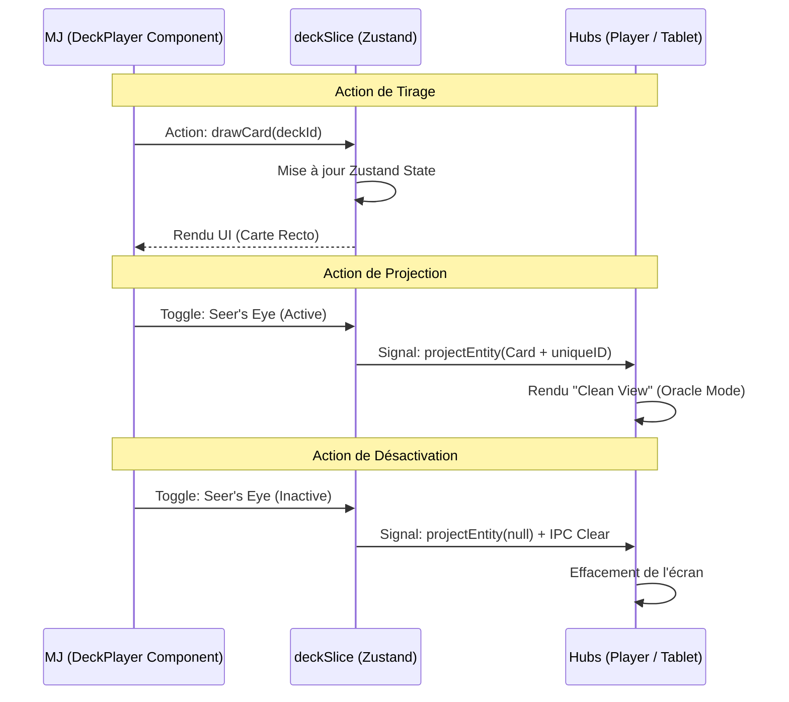

# Architecture : Deck-OS & Projection Oracle

Ce document détaille l'architecture logique du module **Deck-OS** dans GM-OS v5.

## 🏗️ Flux de Données Logique

L'architecture est conçue pour assurer une synchronisation en temps réel entre le Maître de Jeu et les interfaces distantes (Player Hub, Tablet Hub).

## 🔐 Mécanismes Techniques

### 1. Synchronisation Robuste (Cache-Busting)
Pour forcer les Hubs distants à rafraîchir l'image lors d'un "Flip" ou d'un changement de carte rapide (même si l'image source semble identique), le système injecte un `projectionId` basé sur un timestamp (`Date.now()`). Cela garantit que chaque état projeté est perçu comme unique par le store Zustand des Hubs.

### 2. Mode Oracle (Clean View)
Le système identifie les cartes comme des entités de type `Oracle`. Ce type spécifique déclenche un affichage immersif sur les Hubs :
- Masquage des noms, descriptions et statistiques.
- Affichage de l'illustration en grand format avec cadre cyan dynamique.
- Animation de respiration synchronisée avec la voix du MJ.

### 3. Résolution des Médias
Le service `mediaResolver` traduit les chemins relatifs (ex: `assets/decks/...`) en URLs physiques. Il gère la fallback automatiques vers le dos de la carte si l'image cible est manquante.

## 🛠️ Composants de Référence

- **Logique** : `src/modules/session/store/deckSlice.ts`
- **Contrôle** : `src/modules/session/components/DeckPlayer.tsx`
- **Rendu** : `src/components/PlayerHub.tsx` & `src/components/TabletHub.tsx`
