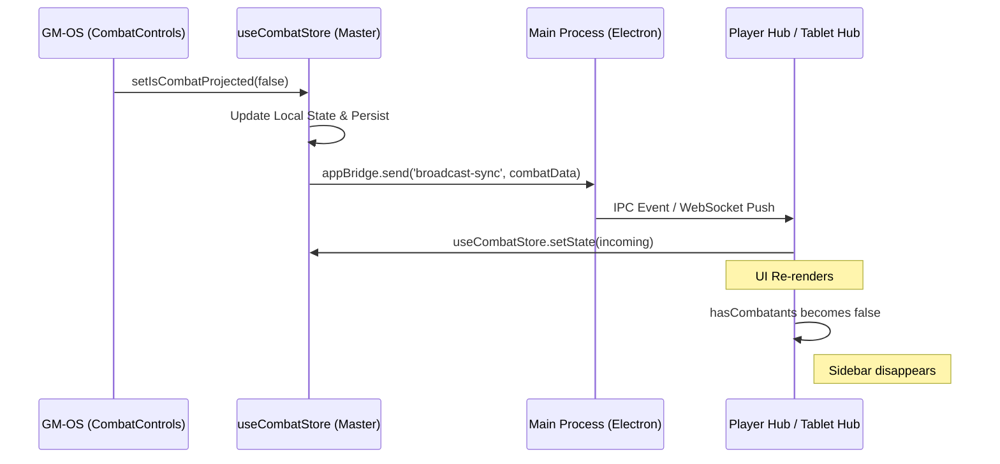

# ⚔️ Combat-OS : Système de Projection & Visibilité

Cette documentation détaille l'architecture technique permettant au MJ de contrôler la projection de l'interface de combat et de gérer la visibilité sélective des combattants sur les écrans joueurs.

## 🏗️ Architecture du Contrôle de Projection

La projection de Combat-OS repose sur un état global synchronisé qui déclenche le rendu conditionnel sur les interfaces "esclaves" (Player Hub, Tablet Hub, Moniteurs).

### État Global (`useCombatStore.ts`)

L'état est géré via la propriété `isCombatProjected` (booléen) :
- **True (Défaut)** : Le module de combat est rendu sur les projections si au moins un combattant est visible.
- **False** : Le rendu est totalement supprimé des projections, même si un combat est en cours.

Le basculement de cet état via `setIsCombatProjected` déclenche une synchronisation immédiate via le protocole `broadcastSync`, diffusant le nouvel état à toutes les fenêtres Electron et clients WebSocket rattachés.

## 🛡️ Algorithme de Filtrage de Visibilité

Pour garantir l'immersion, les PNJ peuvent être masqués individuellement sans interrompre le flux du combat pour le MJ.

### Termes d'Invisibilité Reconnus
Le système scanne les statuts des combattants pour les mots-clés suivants (insensible à la casse) :
- `invisible`, `invisibilité`
- `caché`, `hidden`

### Logique de Rendu Conditionnel
Dans les composants `PlayerHub.tsx` et `TabletHub.tsx`, la liste des combattants est filtrée avant le rendu :

```typescript
const visibleCombatants = combatants.filter(c => 
    c.isPlayer || !c.statuses.some(s => {
        const n = s.name.toLowerCase();
        return n === 'invisible' || n === 'invisibilité' || n === 'caché' || n === 'hidden';
    })
);

const hasCombatants = isCombatProjected && visibleCombatants.length > 0;
```

> [!IMPORTANT]
> Les personnages Joueurs (`isPlayer: true`) ne sont JAMAIS filtrés par cet algorithme, garantissant que leur position et état sont toujours visibles par leurs pairs.
> **Note** : Sur la carte tactique (Map-OS), la visibilité est également gérée physiquement par les calques du brouillard de guerre. Voir [Map-OS Technical Doc](./Map_OS_Technical_Doc.md).

## 🔄 Flux de Données (Data Flow)

Le diagramme suivant illustre comment l'ordre de masquage transite du MJ vers les joueurs :



## 📦 Composants Impactés

### Interface MJ (`src/modules/combat/components/`)
- **CombatControls.tsx** : Intégration de l'interrupteur `MonitorPlay` / `MonitorOff` dans le header. Utilise des classes Tailwind dynamiques pour le feedback visuel (Glow Emerald vs Dimmed Red).

### Interfaces Joueurs (`src/components/`)
- **PlayerHub.tsx** : Le composant principal utilise `hasCombatants` pour ajuster le layout (ex: `pr-80` pour laisser la place à la sidebar).
- **TabletHub.tsx** : Version optimisée pour mobile, gère le masquage de la sidebar en bas ou à droite selon l'orientation.

## 🧪 Tests de Robustesse
Le système de filtrage est testé pour s'assurer qu'un PNJ invisible redevenu visible (statut supprimé) réapparaît instantanément sur toutes les vues sans rafraîchissement manuel, grâce à la réactivité de Zustand et au lien `storage` inter-fenêtres.
