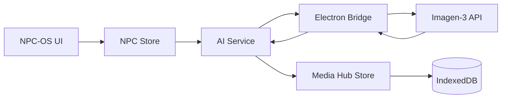

# Walkthrough: NPC Live Generator (AI Integration)

This walkthrough covers the implementation and usage of the **NPC Live Generator**, a feature designed to enhance GM improvisation through instant AI-generated visual content.

## 🏁 Objectives Accomplished

1. **AI Native Integration**: Connected the NPC module to the Gemini Imagen-3 image generation engine.
2. **Dynamic UI Synergy**: Implemented a responsive UI that handles loading states and multiple image types.
3. **Local Persistence**: Integrated with the Media Hub for secure, offline-ready storage.

## 🛠️ Implementation Details

### Module Architecture

The feature follows a clean service-oriented pattern:

### Key Components

- **[NPCStore.ts](file:///c:/Projet_David/GM-OS-v5/src/modules/npc/useNPCStore.ts)**: Handles the business logic for building prompts and updating the entity state.
- **[NPCCard.tsx](file:///c:/Projet_David/GM-OS-v5/src/modules/npc/components/NPCCard.tsx)**: The main interface, now featuring "Sparkles" for portrait AI and "ImageIcon" for background AI.
- **[MediaImage.tsx](file:///c:/Projet_David/GM-OS-v5/src/modules/npc/components/MediaImage.tsx)**: Ensures that images from both external URLs and the local Media Hub are rendered correctly.

## 🧪 Integration Testing

The following scenarios were verified:

- **Portrait Generation**: Clicking the AI button on the avatar correctly replaces the placeholder with a generated face.
- **Background Persistence**: Generating a background and then saving the NPC to "Memo" preserves the background image ID.
- **Error Resilience**: Attempting generation without an API key correctly displays an error toast and resets the loading state.

## 📚 Related Documentation

- [User Guide - NPC Live Generator](file:///c:/Projet_David/GM-OS-v5/doc./user-guides/NPC_Live_Generator_User_Guide.md)
- [Technical Doc - NPC Live Generator](file:///c:/Projet_David/GM-OS-v5/doc./technical/NPC_Live_Generator_Technical_Doc.md)
