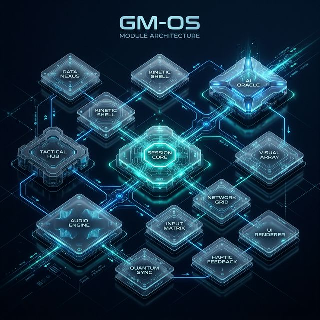
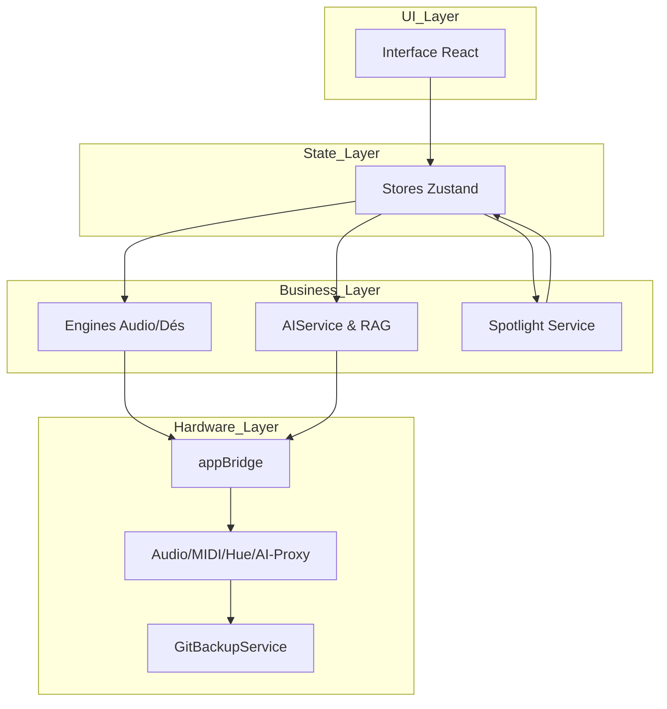
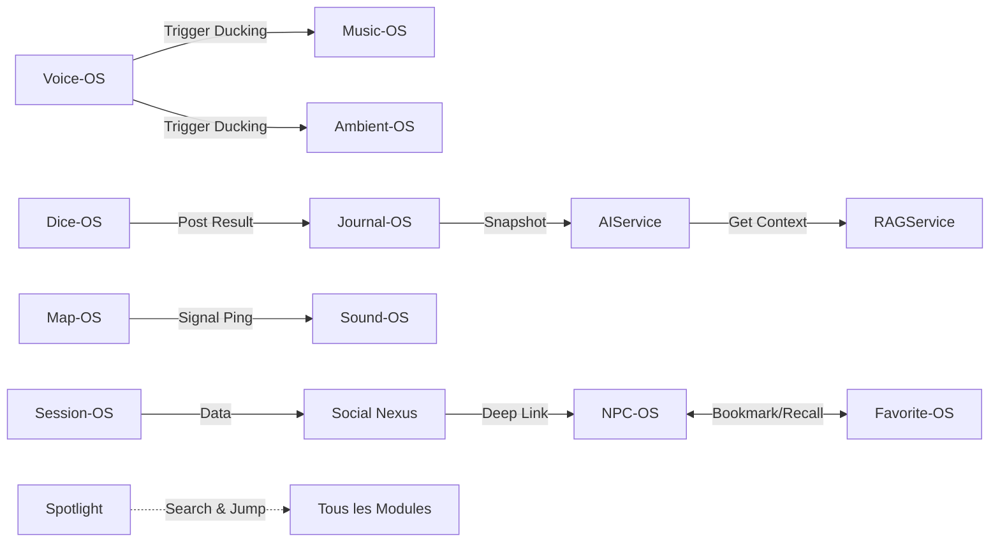
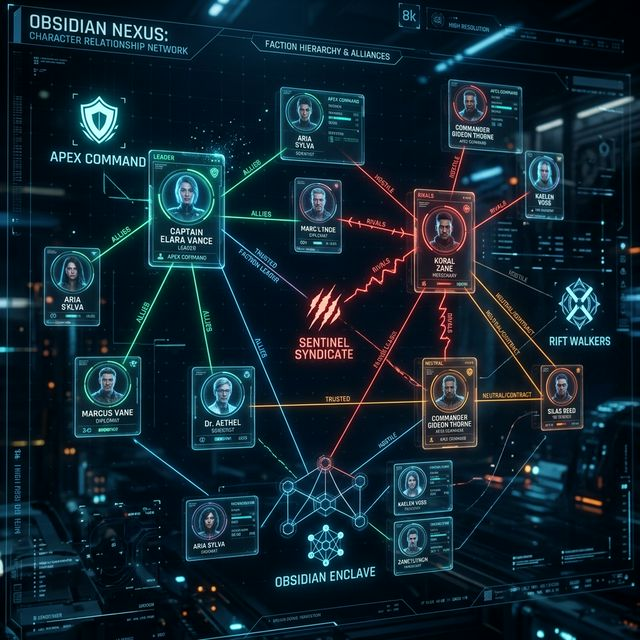
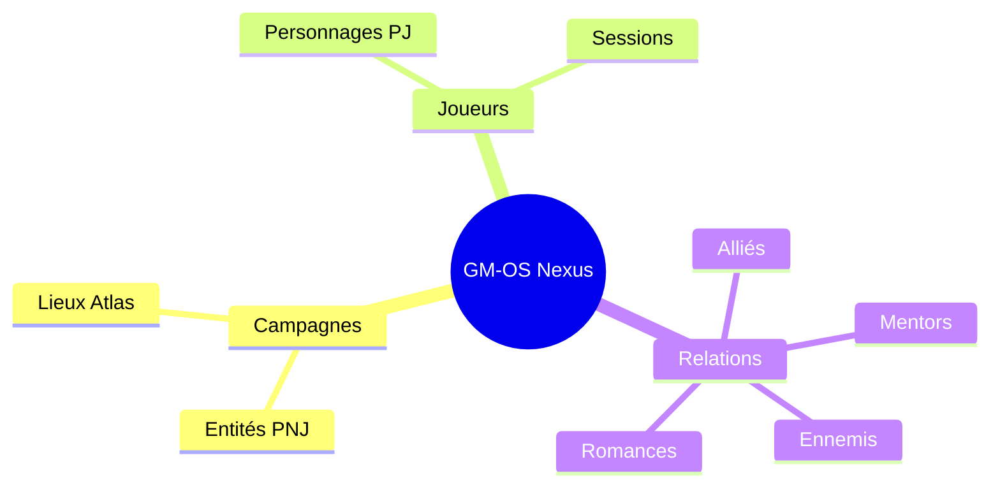
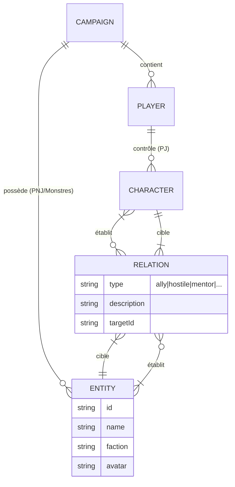
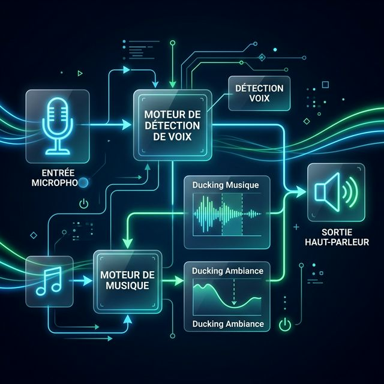
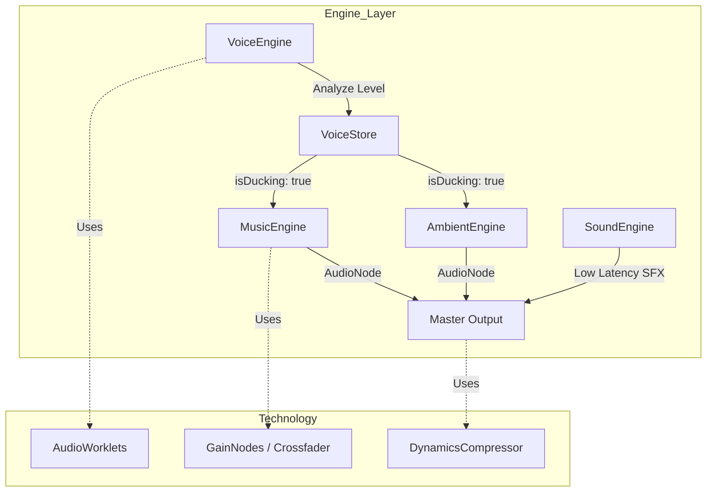

# 🗺️ Vue d'Ensemble de l'Architecture (GM-OS v5)

Ce document présente l'architecture modulaire de GM-OS v5, expliquant comment les différents modules interagissent pour offrir une expérience MJ fluide, immersive et multi-écrans.

## 🏗️ Architecture Globale (High-Level)

GM-OS repose sur quatre piliers fondamentaux :

1. **UI (React/Tailwind)** : Interface purement fonctionnelle pilotée par l'état global.
2. **State Management (Zustand)** : Stores persistants gérant l'état et déclenchant les Engines via abonnements. Inclut désormais un **Layout Manager** et un **Dice Store** persistant.
3. **Engines & Services (Singleton)** : Logique lourde (Audio, Dés, IA) découplée de React pour la performance.
4. **Bridge (`appBridge`)** : Couche d'abstraction facilitant le passage entre Electron, Tauri ou le Web. Intègre désormais une **détection d'événements matériels (Workspace Sync v2)** pour l'adaptation dynamique.
5. **Decoupling Strategy (v5.3)** : Utilisation d'un accès dynamique via l'objet global `window` pour les moteurs métier au sein des composants UI racine (Shell, Header). Cela évite les dépendances circulaires au démarrage tout en permettant un contrôle total (ex: Panic Button).
6. **Cross-Window Sync** : Utilisation d'événements `storage` pour forcer la réhydratation des stores Zustand dans les fenêtres secondaires (Player Hub).

## 🧩 Écosystème de Modules

GM-OS est un système modulaire où le **Session OS** agit comme chef d'orchestre principal.

### 1. Fondations & Logique de Jeu
- **Session-OS** : Pilier central gérant les campagnes, les entités (PJ/PNJ) et la chronologie. Intègre le **Layout Manager** qui synchronise l'interface (module actif, thèmes, panels) à la volée lors d'un changement de campagne.
- **Social Nexus** : Module de visualisation de graphe social (Force-Graph) intégré à `Session-OS`. Il permet de cartographier les relations et de naviguer par "deep-link" vers les fiches.
- **Dice-OS** : Géré par le **DiceEngine**, il supporte des dizaines de systèmes (Pools, Explosives, Year Zero). La projection des résultats est automatisée vers le Player Hub avec un délai de persistance de 5 secondes.
- **Combat-OS** : Orchestre l'initiative et les tours, synchronisé avec le `Journal-OS`.
- **Spotlight (Universal Search)** : Service de recherche transverse inter-stores (`CMD+K`) permettant de naviguer instantanément entre les entités, cartes, musiques et règles.

### 2. Le Stack Audio Engine
Le système audio est divisé en quatre moteurs spécialisés, tous synchronisés pour l'immersion :
- **Global Stop Control (`Panic Button`)** : Orchestrateur de haut niveau capable de stopper simultanément tous les moteurs (Music, Ambient, Sound) ainsi que les projections d'images et les éclairages. [v5.3.0]
- **Music-OS (`MusicEngine`)** : Double platine (Deck A/B) avec crossfader et streaming.
- **Ambient-OS (`AmbientEngine`)** : Mixeur 8 pistes pour les boucles d'ambiance avec correction de phase.
- **Sound-OS (`SoundEngine`)** : Sampler basse latence pour les effets sonores (SFX).
- **Voice-OS (`VoiceEngine`)** : Processeur vocal temps réel (Pitch, Reverb) utilisant des **AudioWorklets**.

### 3. Visual & Immersion

- **Image-OS** : Projection de médias et gestion des noirs (Blackout).
- **Map-OS** : Gestion tactique multicouche, brouillard de guerre dynamique et Zones de Danger v2 (Auras mobiles, terrains difficiles avec coût de mouvement, et synchronisation domotique/audio).
- **Storyboard** : Automatisation d'ambiances combinant Son + Image + Lumières (Hue/MIDI).

## 🔄 Interactions & Flux de Données

Le système utilise des abonnements (subscribes) pour synchroniser les moteurs sans polluer les composants React.

### Focus : Modèle de Relations (Social Nexus)

Le Social Nexus centralise les interactions entre toutes les entités de jeu. Les relations sont directionnelles et portent des métadonnées narratives.

### Concepts Clés

- **Ducking Automatique** : Le `VoiceEngine` notifie le store d'une détection vocale, ce qui force les moteurs Music et Ambient à réduire leur gain via `setTargetAtTime`.
- **RAG & Oracle** : L'IA (`AIService`) consulte le `RAGService` pour obtenir des extraits de règles ou de lore avant de générer une réponse narrative basée sur les snapshots du `Journal-OS`.

## 💾 Persistance & Robustesse

- **Single Source of Truth** : Tous les stores critiques sont synchronisés avec le **Tablet Hub** via des deltas JSON minimaux.
- **Media Hub (m-xxxx)** : Les avatars et médias sont indexés dans une base de données locale (IndexedDB) pour un accès ultra-rapide sans dépendance directe au système de fichiers.
  - **Architecture Modulaire** : Composants découplés (`MediaItemThumbnail`, `TacticalDetailPanel`, `FullScreenPreview`) pour une maintenance facilitée.
  - **Filtrage Tactique** : Le Hub supporte une isolation par campagne (`activeCampaignId`), permettant un mode "Operational Focus" pour les sessions en cours.
  - **HUD Tactique** : Le panneau de détails est un composant latéral indépendant permettant l'attribution interactive des campagnes sans quitter le contexte de navigation.
- **Protocole `gmos://`** : Middleware HTTP permettant d'afficher des médias locaux tout en respectant la sécurité des navigateurs.

### Focus : Audio Workflow (Low-Latency)

> [!NOTE]
> Les schémas ci-dessous sont au format **Mermaid**. Si votre éditeur ne les affiche pas graphiquement, vous verrez le code source entre balises.

---

> [!TIP]
> Pour des détails techniques approfondis sur chaque sous-système, consultez les fichiers dans le dossier [Technical Docs/](../Technical%20Docs/).
