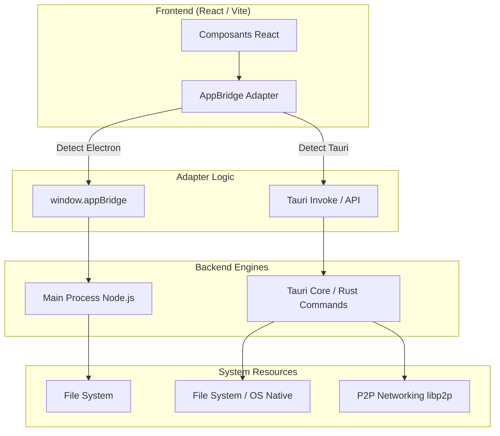

# 🗺️ Blueprints Architecturaux : Migration GM-OS v7 (Tauri)

Ce document détaille la structure technique adoptée pour migrer de l'architecture monolithique Electron vers une architecture modulaire et performante basée sur Tauri et Rust.

## 1. Schéma Global : Pont Agnostique (Bridge v3)

L'objectif est de découpler totalement l'Interface Utilisateur (React) du Système Hôte (Backend).

## 2. Blueprint de Communication (IPC)

### Flux Electron (Ancien)
- **Frontend** : `window.appBridge.module.method(args)`
- **Intermédiaire** : `preload.ts` mappant IPC Renderer à IPC Main.
- **Backend** : `ipcMain.handle('channel', ...)` dans Node.js.

### Flux Tauri (Nouveau)
- **Frontend** : `AppBridge.module.method(args)`
- **Intermédiaire** : `invoke('command_name', { args })` ou `emit('event', [args])` pour les événements asynchrones.
- **Backend** : `#[tauri::command]` en Rust ou `window.emit` pour les notifications vers l'UI.

**Pattern de Compatibilité (Arguments Spreading)** :
Pour supporter les méthodes acceptant plusieurs arguments (format Electron), le bridge encapsule les données dans un tableau unique lors de l'émission. Le récepteur utilise l'opérateur spread (`...payload`) pour restaurer la signature originale de la fonction.

**Avantage** : Sécurité accrue (isolation par défaut), typage fort avec Rust, et réduction drastique de la latence.

## 3. Stratégie de Portage des Modules

Chaque module Node.js critique doit être mappé vers une alternative Rust :

| Module Node.js | Usage dans GM-OS | Equivalent Rust (Tauri) |
| :--- | :--- | :--- |
| `fs-extra` / `fs` | Sessions, Bases de données | `std::fs` / `tauri::path` |
| `adm-zip` | Nexus-OS (Bundles .gmos) | `zip-rs` crate |
| `ws` / `socket.io` | Synchronisation Hubs | `libp2p` (P2P natif) |
| `child_process` | AI MCP (Python) | `tauri::api::process::Command` |
| `os` | Info système, IPs | `sysinfo` crate |

## 4. Blueprint de Performance
- **RAM** : Cible < 150Mo au repos (contre 450Mo+ avec Electron).
- **CPU** : Déportation du mixage audio et de la compression de données sur des threads Rust (non bloquant pour l'UI).
- **Lancement** : Cible < 2s.

---
*Document de référence pour les développeurs v7.*
