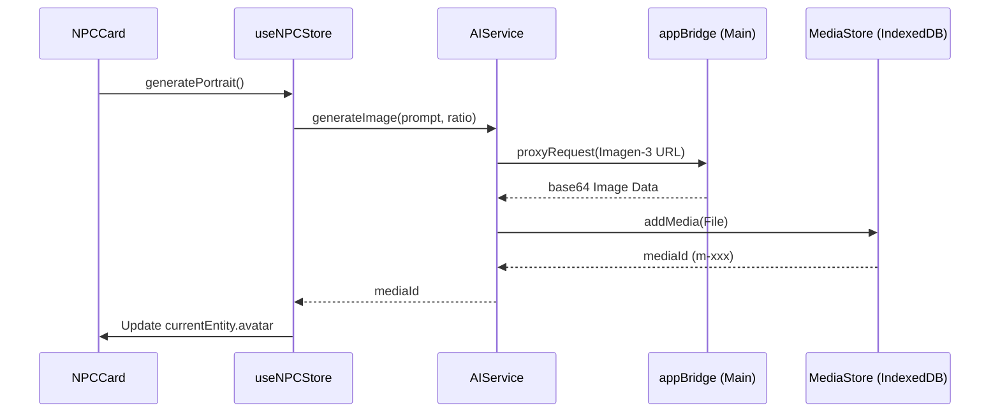

# Technical Documentation: NPC Live Generator

This document describes the architecture and implementation details of the AI-powered image generation system for the NPC module.

## Architecture Overview

The NPC Live Generator integrates **Gemini (Imagen-3)** for image synthesis and **IndexedDB** for persistence. It follows the decoupled architecture of GM-OS v5, using the `appBridge` for secure API calls and localized state management with `Zustand`.

### Diagram: Image Generation Flow



## Internal Components

### 1. `useNPCStore` (State Management)

The store manages the lifecycle of the generation process:

- `isGeneratingImage`: Boolean flag to handle UI loading states.
- `generatePortrait()`: Orchestrates the prompt construction and calls `AIService`.
- `generateBackground()`: Similar to portrait, but uses a 16:9 aspect ratio and environmental prompts.

### 2. `MediaImage` (UI Component)

A specialized React component used to resolve and display images.

- **Capabilities**: Resolves Media Hub IDs (`m-xxx`) by retrieving blobs from IndexedDB.
- **Memory Management**: Automatically revokes Object URLs on unmount to prevent leaks.

### 3. `AIService` (AI Bridge)

Located in `src/modules/ai/AIService.ts`, it handles the direct communication with Google's generative models via the Electron bridge.

## Data Structure

The `NPCEntity` interface is extended to support background art:

```typescript
export interface NPCEntity {
    id: string;
    avatar?: string;      // URL or Media ID
    background?: string;  // Media ID
    fields: Record<string, string>;
}
```

## Prompt Engineering Logic

Prompts are dynamically constructed within `useNPCStore.ts` using the entity's current fields:

```typescript
const traits = Object.entries(currentEntity.fields)
    .map(([k, v]) => `${k}: ${v}`)
    .join(", ");

const prompt = `A professional fantasy RPG character portrait of a ${currentEntity.name}. ${traits}. ...`;
```

## Best Practices and Compliance

- **Asynchronous Execution**: All generation calls are non-blocking for the main UI thread.
- **Error Handling**: Comprehensive try-catch blocks reset the generation state upon failure.
- **Privacy**: Images are stored in the user's local profile, not uploaded to external servers (besides the generation request).
