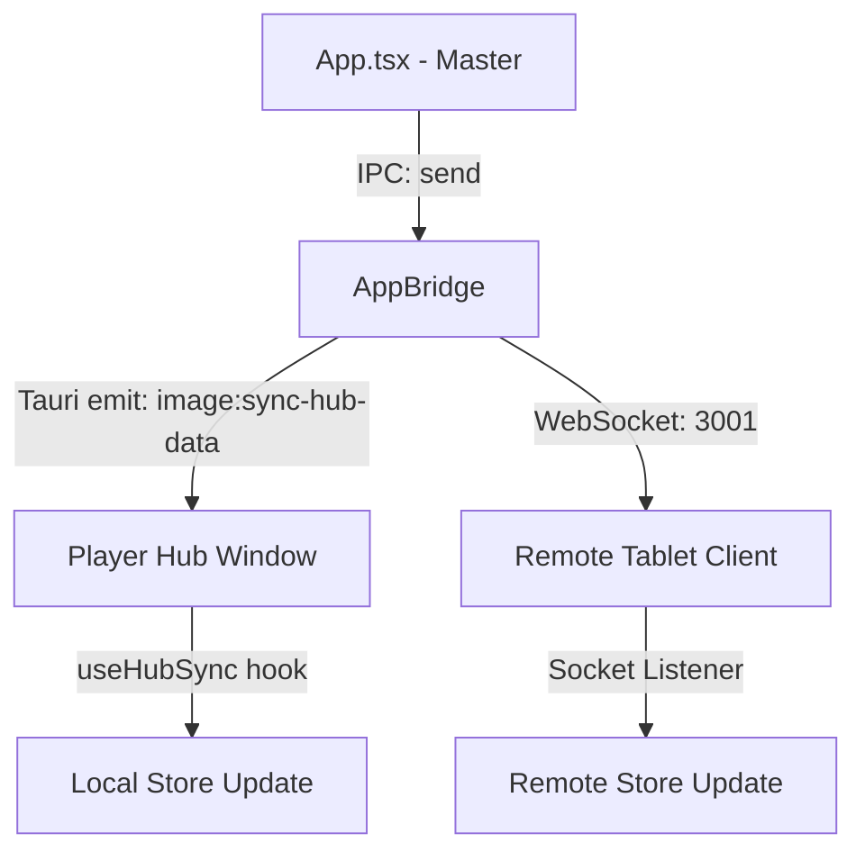
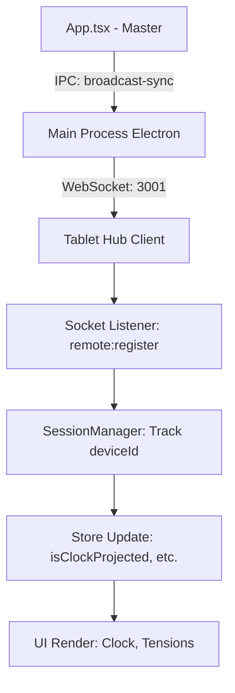

# 🛠️ Tablet Hub : Architecture Technique

Le **Tablet Hub** est un module "second-screen" pour GM-OS v5. Il fonctionne comme une instance web légère de l'application, synchronisée en temps réel avec le processus principal (Electron/Vite) via WebSocket.

## 🏗️ Architecture "Hybrid Bridge" (v7 Tauri)

Le Hub peut désormais s'exécuter dans deux contextes distincts :

1.  **Mode Local (Player Hub Window)** : Exécuté comme une fenêtre native Tauri sur le même PC que le MJ. Il accède à l'objet `window.appBridge` et utilise l'**IPC haute vitesse** (Tauri `emit`/`listen`).
2.  **Mode Distant (Tablet/Smartphone)** : Exécuté dans un navigateur externe via le protocole **Nexus**. Il ne peut pas accéder au bridge et repose exclusivement sur **WebSocket**.

### Protocole de Résilience (Nexus v6.1)
Le Hub utilise un **Enregistrement Réactif**. Contrairement aux versions précédentes, l'identité (Pseudo, Personnage) est transmise dès la sélection dans le Lobby via un message `remote:register`. Si l'identité change, une re-validation immédiate est effectuée pour garantir l'unicité de la session.

### Stratégies de Synchronisation

1.  **IPC (Array Spreading)** : Sous Tauri v2, les données sont envoyées via `AppBridge.send`. Le récepteur (Player Hub) déballe les arguments pour mettre à jour ses hooks `useHubSync` instantanément.
2.  **WebSocket (Differential Sync)** : Pour les clients distants, le MJ PC continue de diffuser les deltas via un serveur WebSocket local (Port 3001).
3.  **Local Asset Middleware (Tauri asset://)** : Sur le Player Hub local, les images utilisent le protocole `asset://`. Pour le Hub distant, elles transitent par le proxy HTTP local.

---

## 🔄 Protocole de Synchronisation

Le Hub utilise un modèle de synchronisation "One-Way" (Maître vers Esclave) :

### Flux de Données :
1.  Le MJ modifie un état (ex: remplit un segment de jauge).
2.  `App.tsx` détecte le changement via une souscription (`useClockStore.subscribe`).
3.  L'application prépare un payload `sync` contenant les extraits pertinents des stores :
    - `clock`: `isClockProjected`, `timestamp`, `tensions`, `theme`.
    - `combat`: `combatants` (avec avatars résolus), `round`, `currentTurnIdx`.
    - `entities`: Liste filtrée des PNJ/Monstres de la campagne active (`activeCampaignId`) marqués comme `isVisibleByPlayers`.
    - `liveEntity`: L'entité actuellement projetée en "Spotlight".
    - `liveImagePath`: Image d'ambiance ou de scène projetée.
    - `voiceLevel`: Intensité sonore pour le visualiseur.
4.  Le payload est envoyé via IPC au Main Process Electron, puis diffusé vers tous les clients WebSocket connectés.
5.  Le `TabletHub.tsx` reçoit le message `sync` et met à jour ses stores locaux via `useStore.setState()`.
6.  **Filtrage Intelligent** : Pour optimiser la bande passante, le MJ n'envoie que les entités dont l'ID de campagne correspond à la session active, évitant ainsi de charger des PNJ d'autres aventures sur la tablette.

## 🛡️ Session Manager & Robustesse

La v5.1 introduit le `SessionManager.ts` (Main Process) pour gérer la persistance des connexions :

- **Session Takeover** : Un joueur peut reprendre sa session sur un autre appareil (nécessite l'approbation du MJ via le Lobby).
- **Lobby Monitor** : Interface intégrée au MJ pour visualiser les terminaux connectés, leur état de santé, et gérer les verrous de personnages.
- **Protocole d'Éjection (Force Reset)** : Le MJ peut envoyer un signal `remote:eject-all` qui ordonne à tous les clients de vider leur `localStorage` (`resetIdentity`) et ferme physiquement les sockets.

## 📦 Structure du Composant `TabletHub.tsx`

### Écrans de Rendu :
- **Narrative Clock** : Utilise le `ClockVisualizer`.
- **Jauges de Tension** : Rendu dynamique via une grille responsive.
- **Grille de Projection Unifiée** : Utilise le composant `HubProjectionCard` pour afficher les entités et images.
- **Déduplication Intelligente** : Un algorithme de filtrage (ID > Nom > Image) garantit qu'une entité n'apparaît qu'une seule fois à l'écran, même si elle est à la fois "Projetée" et "Synchronisée".
- **Trombinoscope** : Galerie interactive filtrant les entités reçues via WebSocket.
- **Détails PNJ** : Vue modale immersive.
- **Footer Réactif** : Indicateur de volume sonore (`voiceLevel`) intégré pour un feedback vocal en temps réel.

## 🧪 Tests Automatisés

Le Hub est couvert par `src/components/__tests__/TabletHub.test.tsx` :
- **Mocks Vitest** : Simulation des stores Zustand avec injection manuelle de `.persist.rehydrate`.
- **Validation DOM** : Vérifie l'absence de composants lourds comme `Map-OS` pour garantir la légèreté sur mobile.
- **Réactivité** : Teste le masquage automatique de l'horloge selon la projection.
