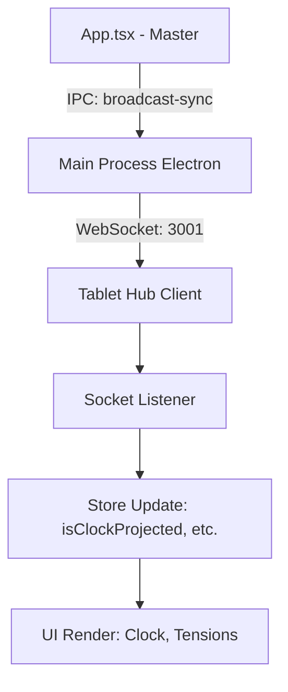

# 🛠️ Tablet Hub : Architecture Technique

Le **Tablet Hub** est un module "second-screen" pour GM-OS v5. Il fonctionne comme une instance web légère de l'application, synchronisée en temps réel avec le processus principal (Electron/Vite) via WebSocket.

## 🏗️ Architecture "Bridge-less"

Contrairement au reste de l'application (Renderer), le Hub peut s'exécuter dans un navigateur distant (tablette, smartphone). Il ne peut donc pas accéder à l'objet `window.appBridge` natif d'Electron.

### Stratégies de Substitution :
1.  **WebSocket (Direct Sync)** : Toute l'activité de l'état global (Stores Zustand) est capturée par `App.tsx` (le "Maître") et diffusée via un serveur WebSocket local (Port 3001).
2.  **Résolution Media via Base64** : Comme un navigateur distant ne peut pas accéder au système de fichiers local (`appBridge.fs`), toutes les images (PNJ, Favoris, Combatants) sont converties en `data:image/...` (Base64) par le Maître avant l'envoi du paquet de synchronisation.
3.  **Cache Performance** : Pour éviter des conversions Base64 redondantes à chaque seconde (tick 1Hz), un `mediaResolver` avec cache (`Map`) est utilisé côté Maître.

## 🔄 Protocole de Synchronisation

Le Hub utilise un modèle de synchronisation "One-Way" (Maître vers Esclave) :

### Flux de Données :
1.  Le MJ modifie un état (ex: remplit un segment de jauge).
2.  `App.tsx` détecte le changement via une souscription (`useClockStore.subscribe`).
3.  L'application prépare un payload `sync` contenant les extraits pertinents des stores :
    - `clock`: `isClockProjected`, `timestamp`, `tensions`, `theme`.
    - `combat`: `combatants` (avec avatars résolus), `round`, `currentTurnIdx`.
    - `voiceLevel`: Intensité sonore pour le visualiseur.
4.  Le payload est envoyé via IPC au Main Process Electron, puis diffusé vers tous les clients WebSocket connectés.
5.  Le `TabletHub.tsx` reçoit le message `sync` et met à jour ses stores locaux via `useStore.setState()`.

## 📦 Structure du Composant `TabletHub.tsx`

### Écrans de Rendu :
- **Narrative Clock** : Utilise le `ClockVisualizer` en mode réduit (`scale-0.7`).
- **Jauges de Tension** : Rendu dynamique via une grille responsive.
- **Header Widgets** : Zone auto-masquable basée sur l'état `isClockProjected`.

## 🧪 Tests Automatisés

Le Hub est couvert par `src/components/__tests__/TabletHub.test.tsx` :
- **Mocks Vitest** : Simulation des stores Zustand avec injection manuelle de `.persist.rehydrate`.
- **Validation DOM** : Vérifie l'absence de composants lourds comme `Map-OS` pour garantir la légèreté sur mobile.
- **Réactivité** : Teste le masquage automatique de l'horloge selon la projection.
