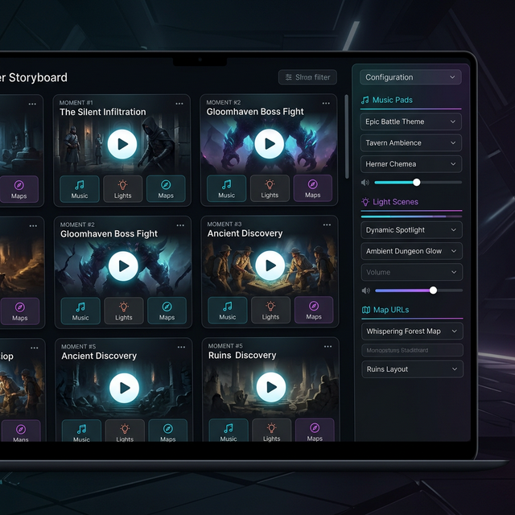

# 🎬 Storyboard

Le module **Master Storyboard** est le chef d'orchestre de votre partie. Il vous permet de synchroniser instantanément l'ambiance sonore, l'éclairage et les visuels pour créer des moments cinématographiques inoubliables via une interface de montage intuitive.

## 📋 Présentation du Module

Le Storyboard utilise une **Table de Montage Horizontale** (façon pellicule de film) pour organiser vos "Moments". Un moment est une configuration prédéfinie qui impacte plusieurs modules simultanément :

1. **Musique** : Lance une piste spécifique de vos playlists.
2. **Ambiance (Ambient-OS)** : Rappelle un mixage complet de 8 pistes de fond.
3. **Effets Sonores (Sound-OS)** : Déclenche un pad SFX précis.
4. **Lumières** : Applique une scène Hue (ex: Alerte Rouge, Nuit Calme).
5. **Cartes (Atlas)** : Charge une carte spécifique pour les joueurs.
6. **Images** : Affiche une illustration ou un portrait de PNJ sur le Hub.

## 🚀 Comment l'utiliser ?

### 1. Accéder au module
Cliquez sur l'icône 🎬 (**Storyboard**) dans la section **Modules** de la barre latérale du **Session-OS**.

### 2. Créer une séquence

- Cliquez sur **+ Ajouter une séquence**, en haut à droite.
- Nommez-la (*« Rencontre avec l'Inquisiteur »*).
- Choisissez ses éléments dans le panneau de droite.

#### « Capturer active » — six boutons, quatre qui répondent

Chaque élément a **son propre** petit bouton *Capturer active*, qui recopie ce qui tourne en ce
moment sur votre poste. Il n'y a pas de bouton global.

| Élément | Ce que la capture prend |
| :--- | :--- |
| **Musique** | Le morceau de la platine qui joue |
| **Lumière** | La scène Hue active |
| **Carte** | La carte chargée sur le plateau tactique |
| **Image** | L'image projetée sur l'écran courant d'Image-OS |
| **Bruitage** | ⛔ rien — Sound-OS **empile** ses sons, il n'y a pas de pad « actif » unique |
| **Ambiance** | ⛔ rien — Ambient-OS applique ses scènes sans retenir laquelle |

> ⛔ **Deux de ces boutons ne marchaient pas, et ne le disaient pas.** *Carte* et *Image*
> interrogeaient des champs qui n'existent pas (`currentMapUrl`, `activeMediaId`) : le clic ne
> posait rien et n'affichait aucun message. **Corrigé le 2026-09-04** — et quand il n'y a
> effectivement rien à prendre, le bouton le dit désormais.

<!-- -->

> 🔎 **Les deux derniers ne sont pas cassés, ils sont impossibles.** Un bruitage et une ambiance se
> choisissent dans la liste ; il n'existe aucun « état courant » à recopier. Le message qui
> s'affichait à leur place était bâti sur les mauvaises clés de traduction — on lisait
> *« Sound-OS : ex: Combat Final »*.

### 3. Organiser votre Scénario (Drag & Drop)
Le Storyboard fonctionne comme un logiciel de montage :
- **Réorganiser** : Maintenez le clic sur l'icône **Grip** (les 6 points à gauche du numéro) pour déplacer une séquence sur la pellicule.
- **Dupliquer** : Cliquez sur l'icône **Copier** (double page) pour créer une variante d'une séquence existante.
- **Supprimer** : Utilisez l'icône **Poubelle** pour retirer une scène de votre montage.

### 4. Déclencher en Direct
Cliquez simplement sur le gros bouton **PLAY** au centre d'une carte.
- Tous les modules liés s'ajusteront instantanément.
- Une lueur pulsée entoure la séquence active pour vous aider à vous repérer.

---

## 🔊 Choisir **où ça sort** (v6.5)

Un moment ne dit plus seulement *quoi* déclencher, mais *où* :

- **Sortie audio** : chaque son d'un moment peut viser une enceinte précise (un pad Sound-OS sur les enceintes du fond pendant que la musique reste devant). Laissez **Sortie du module** pour garder le comportement habituel.
- **Écran de projection** : chaque image peut viser un écran nommé, l'**Écran courant d'Image-OS** ou le **Player Hub**.

> [!NOTE]
> Le volume général et le ducking de la voix s'appliquent **aussi** aux sons détournés vers une autre enceinte.

## 🅰️ Le Titre à l'écran

Chaque moment peut afficher un **titre** par-dessus l'image projetée, dans la police du thème du jeu :

- **Titre affiché sur l'écran** : le texte, facultatif.
- **Fondu (s)** : la durée du fondu, à l'entrée comme à la sortie.
- **Durée (s)** : combien de temps il reste. **Laissez vide pour un titre permanent** — il s'en ira alors avec son moment.

> [!TIP]
> Un écran allumé au milieu d'une séquence **rattrape** le titre en cours : vous n'avez pas à relancer le moment.

## 🎭 Une séquence est une parenthèse

Lancer une séquence **referme la précédente**, mais chaque moteur a sa règle — et elles ne sont pas
arbitraires : elles suivent la façon dont chaque module se comporte quand un autre son arrive.

| Ce que la précédente avait posé | En **changeant** de séquence | En **arrêtant** le moment |
| :--- | :--- | :--- |
| **Image** | s'éteint en fondu, sauf si la nouvelle en projette une | s'éteint |
| **Bruitage** | s'arrête **toujours** — Sound-OS empile, il ne remplace pas | s'arrête |
| **Ambiance** | s'arrête, **sauf si la nouvelle apporte sa propre scène** | s'arrête |
| **Musique** | s'arrête, **sauf si la nouvelle apporte sa musique** — les platines s'enchaînent alors en fondu croisé | ⭐ **elle reste** |
| **Lumières** | restent | restent |

> ⛔ **Correction.** Cette page annonçait que « la musique fait exception : elle continue ». C'est
> vrai quand vous **arrêtez** un moment — arrêter une parenthèse ne doit pas faire tomber le silence
> sur la table —, et faux quand vous **passez à la séquence suivante** : là, elle s'arrête si la
> nouvelle n'en apporte pas. Les deux gestes n'ont pas la même règle.

<!-- -->

> 🔎 **Deux précautions que vous ne verrez jamais, et qui vous évitent des accidents.**
> La platine ne s'arrête **que si elle joue encore ce morceau-là** : si vous avez changé de piste à
> la main entre-temps, la séquence n'y touche pas. Et l'ambiance s'éteint **piste par piste**, en
> ne coupant que celles que sa propre scène avait allumées — la pluie que vous aviez lancée avant
> la séquence continue de tomber.

> [!IMPORTANT]
> **Le Storyboard ne va pas jusqu'aux tablettes des joueurs.** Il pilote vos enceintes, vos écrans
> de projection **et le Player Hub** — l'écran partagé —, mais rien de ce qu'il déclenche
> n'apparaît sur le Tablet Hub que chacun tient en main. Cette page disait le contraire du Player
> Hub, qui est bien une destination.

*Corrigé le 2026-09-04.*

---

## 💡 Exemples d'utilisation

### Scénario A : L'Embuscade
Préparez une séquence nommée "Embuscade" qui :
- Lance une musique de combat tendue.
- Passe les lumières en orange pulsé.
- Affiche la carte du sentier forestier.
- Joue un cri de guerre via le Sound-OS.

### Scénario B : La Révélation
Préparez un moment nommé "Secret Révélé" qui :
- Coupe la musique de fond.
- Affiche l'illustration d'une ancienne relique.
- Passe les lumières au blanc froid intense.
- Lance une ambiance sonore "Vibrations Mystiques".

---

> [!TIP]
> Vous pouvez également déclencher ces séquences à distance depuis votre smartphone via le **GM Remote Control** !

---

*Guide révisé le 2026-09-04, code à l'appui. Deux affirmations corrigées : la musique ne survit pas
à un changement de séquence, seulement à l'arrêt d'un moment ; et le Storyboard atteint bien le
Player Hub, pas les tablettes. Deux boutons **Capturer active** réparés dans la foulée — ils
visaient des champs qui n'existent pas et échouaient sans un mot.*
