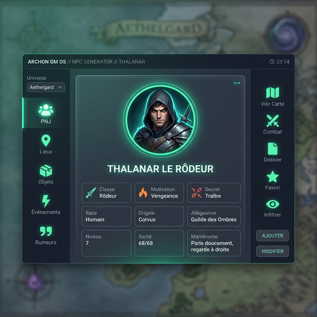

# 🎭 NPC-OS

**NPC OS** est l'outil ultime d'improvisation et de préparation de GM-OS. Il permet de générer instantanément des personnages, des lieux, des rumeurs ou des objets, tout en assurant une cohérence thématique parfaite avec votre univers de jeu.



## 📋 Présentation du Module

NPC OS n'est pas qu'un simple générateur de noms. C'est un moteur de données capable de construire des entités complexes et de les injecter directement dans les autres modules de l'OS :

1. **Sélecteur de Catégories** : Choisissez entre PNJ, Lieux, Objets, Événements ou Rumeurs.
2. **Sélecteur d'Univers** : Filtrez vos bases de données par univers (ex: Cyberpunk, Fantasy, Alien).
3. **Fiche d'Entité** : Visualisez les détails générés (traits, secrets, motivations, descriptions).
4. **Intégrateur de Médias** : Liez un avatar et préparez la projection pour vos joueurs.
5. **Actions Rapides** : Exportez vers le Combat OS, la Map ou le Wiki de session.

## 🗄️ Comment alimenter le module ?

NPC OS est un module "Data-Driven". Il puise sa connaissance dans des fichiers JSON structurés.

### Format des fichiers de données
Pour ajouter vos propres tables de génération, créez des fichiers JSON suivant ce format :
- **Nom du fichier** : `Univers_Thème.json` (ex: `Fantasy_Marchands.json`)
- **Structure interne** : Un objet dont chaque clé est une catégorie de champ et chaque valeur est une liste de possibilités.

```json
{
  "Nom": ["Grog", "Thalanar", "Elara"],
  "Métier": ["Forgeron", "Apothicaire", "Voleur de poules"],
  "Trait": ["Bègue", "Balafré", "Toujours souriant"],
  "Secret": ["Est un espion", "A peur des chats"]
}
```

### Emplacement des bases
Les fichiers doivent être déposés dans le dossier `databases/` à la racine de l'application, classés dans les sous-dossiers correspondant aux catégories (`npcs`, `places`, `rumors`, etc.). L'OS les détectera automatiquement au prochain lancement.

## 🎲 Génération et Improvisation

- **Générer** : Cliquez sur le bouton principal (Dés). NPC OS pioche une valeur unique dans chaque liste de votre fichier JSON pour créer une fiche cohérente.
- **Extraction Intelligente** : Le système détecte automatiquement quel champ doit servir de "Titre" (Titre, Nom, Personnage, etc.).

## 🤖 Enrichissement par IA (Ollama)

Désormais, **NPC OS** tire parti de l'intelligence artificielle locale pour sublimer vos tirages.

- **Détails Sublimés** : Lorsque l'option **AI Enrichment** est activée, l'IA (via Ollama) analyse les traits aléatoires piochés et les reformule de manière littéraire pour une lecture plus immersive.
- **Suggestion de Prompt Image** : Basée sur la description enrichie, l'IA génère automatiquement un prompt optimisé pour la création d'un avatar visuel.
- **Toggle de Contrôle** : Vous pouvez activer ou désactiver l'enrichissement à tout moment via le bouton **IA** dans les contrôles du module (en haut à droite).

## 🖼️ Immersion et Hub Joueur

- **Avatar** : Cliquez sur le cadre de l'avatar pour lier une image locale ou web à votre entité.
- **Voice Sync (Cible)** : Si vous utilisez **Voice OS**, l'avatar émet un léger pulse visuel au rythme de votre voix lorsque vous parlez, renforçant l'immersion des joueurs.
- **⭐ Sa voix, générée et gardée** : le bouton **Vocal** propose des réglages de voix d'après les
  notes et les traits du PNJ, et les **enregistre sur sa fiche**. Un second bouton, *Sa voix*, les
  repose plus tard sur le rack. Ce qui est gardé est **l'état réel du rack après application** —
  donc vos retouches aux curseurs, pas la suggestion brute du modèle.

  ⚠️ Ce n'est **pas** une synthèse vocale : GM-OS transforme **votre** voix.
  → [Guide Voice-OS](./74-Voice-OS-la-voix.md)

> 📌 **Les PNJ de votre campagne ont les mêmes boutons depuis le 2026-09-04**, dans leur galerie.
> Le profilage vocal n'existait jusque-là que dans NPC-OS — un module à part.
- **Projection Hub** : Cliquez sur l'icône **Œil** pour projeter instantanément la fiche (image + texte sélectionné) sur le Player Hub des joueurs.

## 🔗 Intégrations Cross-Modules

| Action | Description |
| :--- | :--- |
| **⚔️ Combat** | Envoie le PNJ directement dans le **Combat OS** avec des PV et une initiative aléatoire. |
| **📍 Map** | Crée un pion (Token) avec l'avatar et le nom sur la carte tactique actuelle de **Map OS**. |
| **📝 Wiki & Journal** | Ajoute une entrée complète dans le Wiki ET une trace dans le Journal de session. |
| **⭐ Favoris** | Enregistre l'entité dans votre **Panthéon** pour une réutilisation dans d'autres campagnes. |
| **🎁 Donner** | Transfère l'objet à un PJ en enregistrant précisément le **destinataire** dans le Journal. |
| **💾 Mémo** | Garde l'entité dans l'historique local pour ne pas la perdre. |

## 🖼️ Galerie des PNJs (Session)

Dans le Cockpit de session, l'accès à la **NPC Gallery** a été optimisé pour la fluidité narrative :

- **Préservation du Contexte** : Si vous accédez à la galerie via un lien direct (ex: depuis le Social Nexus), l'OS vous affiche immédiatement la fiche détaillée demandée.
- **Navigation Fluide** : Le bouton "Retour à la Galerie" vous permet de revenir instantanément à la liste complète tout en gardant vos filtres de recherche.

---

## 💡 Astuces pour le MJ

> [!TIP]
> **Notes du MJ** : Chaque fiche possède une zone de notes persistante. Vous pouvez y noter les interactions des joueurs avec ce PNJ ou ce lieu. Ces notes seront sauvegardées si vous déplacez l'entité dans vos **Mémos** ou vos **Favoris**.

> [!IMPORTANT]
> **Cohérence des Noms** : Si votre fichier JSON contient les champs "Prénom" et "Nom", NPC OS les combinera intelligemment pour former le titre principal de la fiche.

---

## ⚙️ Détails Techniques

- **Catégories Supportées** : NPC, Lieux, Objets, Événements, Rumeurs.
- **Persistance** : Utilise `IndexedDB` via Zustand pour conserver vos mémos et vos notes entre deux lancements de l'application.
