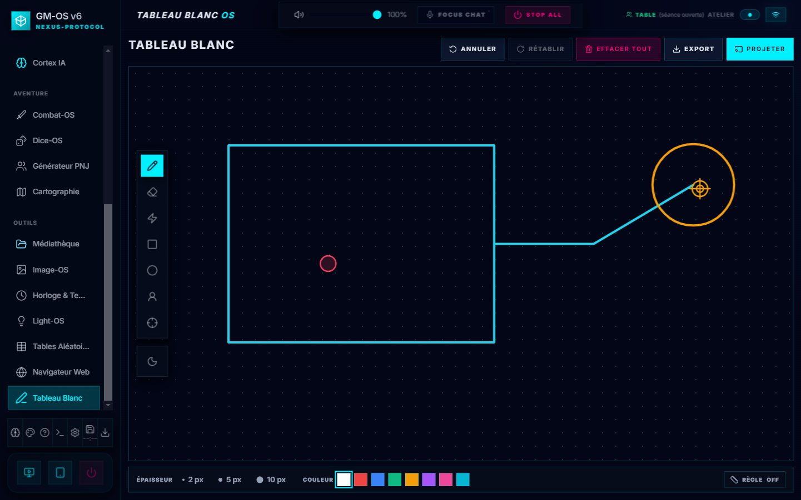

# 🎨 Whiteboard-OS

**Whiteboard-OS** est votre espace de dessin et d'annotation en temps réel. Que ce soit pour esquisser un plan tactique, illustrer une énigme ou prendre des notes visuelles, c'est l'outil idéal pour communiquer visuellement avec vos joueurs.

---

## 🖌️ Outils de Dessin

*Disposition refondue le 2026-10-03 : la surface au plus large, une barre compacte à gauche,
l'épaisseur, les couleurs et la règle en pied.*

La barre de gauche, de haut en bas :
- **Crayon** : le dessin à main levée.
- **Gomme** : efface des segments de traits.
- **Laser** : un trait éphémère qui disparaît de lui-même, pour désigner sans salir.
- **Rectangle** et **Cercle**.
- **Pion** et **Cible** — *nouveaux* : ils se posent d'un clic, avec un **nom facultatif**. Un pion
  pour un personnage, une cible pour un objectif.
- **Le papier**, sombre ou clair. Le blanc et le noir suivent le papier.

### En pied
- **Épaisseur** : 2, 5 ou 10 px.
- **Couleur** : un nuancier de huit couleurs.
- **Règle** — *nouvelle* : elle mesure **en cases de la grille, dans l'unité du pilote** du jeu
  (mètres, cases, pieds…). La mesure est figée au moment du tracé.

---

## 📺 Projection Immersive
Transformez vos croquis en éléments de jeu partagés :
1. Cliquez sur le bouton **« Projeter »** en haut à droite.
2. Choisissez votre cible :
    - **Player Hub** : Le dessin s'affiche en temps réel sur l'interface de vos joueurs.
    - **Moniteur** : Envoie le dessin en plein écran sur un écran secondaire physique.

Le même dessinateur sert au poste du meneur, au Player Hub et aux tablettes : un trait, un pion ou
une règle s'y affichent pareil. Pendant la projection, **Arrêter** remplace *Projeter*.

---

## 🔄 Historique & Contrôles
- **Annuler / Rétablir** : en haut à droite, avec leur libellé.
- **Effacer tout** : vide le plateau **sans confirmation** — il s'annule, *Annuler* suffit.

---

### 📸 Snapshot Wiki & Journal (La fonction magique)
Une des fonctions les plus puissantes de Whiteboard-OS est son intégration avec le **Session Wiki** :
1. Cliquez sur **« Export »**, en haut à droite — il n'apparaît que pendant une séance.
2. GM-OS capture instantanément votre dessin.
3. Le fichier est automatiquement ajouté à votre **Media Hub**.
4. Une nouvelle fiche est créée dans le **Wiki de la session active**, incluant l'image.
5. Une entrée est créée dans le **Journal** avec la référence de la capture pour une navigation rapide.

> [!TIP]
> Utilisez cette fonction pour immortaliser les schémas complexes ou les plans de donjons
> improvisés que les joueurs devront consulter plus tard.

> ✅ **Corrigé le 2026-10-04 : Export apparaît pour la séance que la campagne a ouverte.** Il lisait
> la séance *sélectionnée* dans une liste : une séance lancée depuis le cockpit pouvait être ouverte
> sans le faire apparaître. Il suit désormais la même règle que le reste de GM-OS — *la campagne dit
> quelle séance est en cours*.

---

## 📱 Dessiner depuis le téléphone

La [télécommande](./60-Tablette-du-meneur.md) porte un onglet **Tableau** : vous croquez sur
l'écran tactile, le trait apparaît ici. Plus confortable qu'une souris pour un plan tracé à la
volée — et ça n'était écrit dans aucun des deux guides.

---

*Guide révisé le 2026-09-04, code à l'appui. Les cinq outils, la projection et l'export vers le
Media Hub, le wiki et le journal sont exacts. Ajouté : on peut **dessiner depuis la
télécommande**.*

*Relu le 2026-10-03 contre l'écran refondu (Pion, Cible, Règle ; un seul dessinateur pour les trois
écrans). Capture de la campagne de démonstration.*
