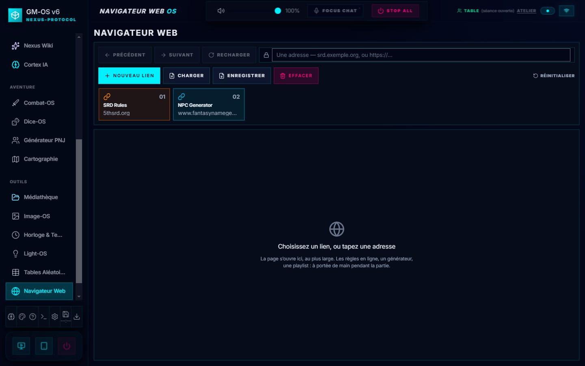

# 🌐 Web-OS

**Web-OS** est votre centre de commande pour toutes les ressources externes de votre campagne. C'est l'outil qui transforme GM-OS en une véritable plateforme unifiée en centralisant vos générateurs, wikis, et références de règles en un seul endroit.

---

## 🚀 Le Dashboard Web-OS

*Refondu le 2026-10-03, sur le choix de David : **la page s'ouvre dans GM-OS**.*

- **En haut, la barre de navigation** : **Précédent**, **Suivant**, **Recharger**, et l'**adresse**
  — tapez-en une, ou collez-la. **Ouvrir dans le navigateur** reste à portée, en tête, pour envoyer
  la page dans votre navigateur habituel.
- **Les liens en tuiles numérotées** : un clic ouvre le lien dans la page.
- **La page, au plus large.**

---

## 📂 Gestion de la Bibliothèque
- **Nouveau lien** : ajoutez une adresse et donnez-lui un nom clair.
- **Édition** : modifiez l'adresse ou le titre d'un lien existant à tout moment.
- **Réinitialiser** : restaure les liens livrés avec GM-OS.

> ⚠️ **« Effacer » et « Réinitialiser » ne font pas la même chose** : le premier vide la
> bibliothèque, le second la remplace par les liens d'origine. Les deux demandent confirmation, et
> aucun des deux ne se défait.

### 🔒 Une page tenue à l'écart de GM-OS

La page intégrée n'a **aucun accès** à GM-OS : ni à vos campagnes, ni à vos fichiers, ni à votre
disque. Elle tourne dans **sa propre session** de navigation, et **seules les adresses `http` et
`https`** y entrent. *Un site ouvert pour une règle ne doit rien pouvoir toucher d'autre.*

---

## 📺 Projeter une vidéo YouTube

**Ajouté le 2026-09-05, à la demande de David.** Collez l'adresse d'une vidéo
YouTube comme n'importe quel autre lien : Web-OS la **reconnaît**, remplace son
pictogramme par celui de YouTube, et ajoute un bouton **Projeter** dans les
commandes de sa tuile.

Les quatre écritures fonctionnent — celle du site, celle du bouton *Partager*,
celle du code d'intégration, et les *Shorts* — et le **point de départ est
conservé** si l'adresse en contient un (`?t=1m30s`).

**Vous choisissez l'écran au moment de lancer.** Le bouton ouvre la liste sur la tuile
lui-même : *Player Hub*, puis chaque moniteur détecté. Une ligne déjà allumée se
coupe d'un second appui.

Chaque écran où la vidéo est à l'antenne porte son **étiquette sur la tuile**, visible
sans survoler — *une vidéo qu'on a lancée et qu'on ne retrouve plus est une vidéo
qu'on ne peut pas couper.* Rien n'empêche de l'envoyer sur plusieurs écrans à la fois.

> ⭐ **Ce choix ne déplace pas la cible d'Image-OS.** Envoyer une vidéo sur le
> Moniteur 2 n'y enverra pas la prochaine image que vous projetterez depuis Image-OS.
> *Un geste ici ne doit pas déplacer vos images à votre insu.*

> ⛔ **Corrigé le 2026-09-05, à votre demande.** Le bouton nommait l'écran… réglé
> dans **Image-OS**, sans laisser en changer : viser le second moniteur demandait de
> quitter Web-OS, changer un réglage dans un autre module, et revenir.

> ⛔ **Trois choses qu'une vidéo YouTube ne fait pas comme un fichier**, et qu'il
> vaut mieux savoir avant la séance :
>
> - **Elle a besoin d'Internet.** Une coupure donne un cadre noir devant vos
>   joueurs.
> - **Elle ne part ni dans la sauvegarde ni dans Nexus.** Seule l'adresse voyage ;
>   la vidéo reste chez YouTube, et peut disparaître.
> - ⚠️ **Vous ne choisissez pas son enceinte de sortie.** Elle sort par l'appareil
>   de l'écran où elle joue. *Un cadre distant ne se branche sur aucun contexte
>   audio* — c'est la seule limite audio qui subsiste.
>
> GM-OS bride ce qu'il peut : domaine sans traceur, et les suggestions de fin
> réduites à la même chaîne. **Il n'existe aucun moyen de supprimer l'écran de fin
> de YouTube** ; coupez l'écran avant que la vidéo se termine.

> ⭐ **Son volume, lui, obéit à la table — depuis le 2026-09-05.** Le volume
> général, le mode Focus et le ducking de la voix l'atteignent, comme une vidéo de
> votre bibliothèque. *Je vous avais dit l'inverse : c'était confondre l'enceinte
> et le niveau.* La première reste hors de portée, le second se commande.
>
> ⚠️ **Un envoi sans accusé de réception.** GM-OS parle au lecteur de YouTube, qui
> ignore ce qui lui arrive avant d'être prêt. L'ordre est donc répété pendant les
> deux premières secondes. Si le niveau semble ne pas suivre au tout premier
> instant, c'est cela — il se rattrape.

> 💡 **Pour une vidéo que vous montrerez souvent**, téléchargez-la et posez-la dans
> [Image-OS](./24-Image-OS-la-regie-visuelle.md) : elle devient un pad comme un
> autre — sauvegardée, transportable, mixée, et fiable hors ligne.

## 💾 Sauvegarde & Partage (JSON)
Votre bibliothèque Web-OS est précieuse. Vous pouvez l'exporter et l'importer très simplement :
- **Enregistrer** : sauvegarde toute votre liste de liens dans un fichier JSON sur votre ordinateur.
- **Charger** : recharge une bibliothèque complète à partir d'un fichier JSON.
- **Effacer** : vide complètement la bibliothèque, après confirmation.

---

> [!TIP]
> **Organisation Tactique** : Créez une bibliothèque spécifique pour chaque système de jeu. Exportez-les en fichiers JSON nommés (ex: `web-alien.json`, `web-cthulhu.json`) et chargez la liste correspondante au début de votre séance !

---

*Complété le 2026-09-05 : Web-OS sait désormais **projeter une vidéo YouTube** sur un écran de
table, avec ses trois limites annoncées avant le clic. Voir aussi
[Image-OS](./24-Image-OS-la-regie-visuelle.md), qui a reçu les vidéos en fichier le même jour.*

*Relu le 2026-10-03 : la page intégrée remplace l'ouverture systématique dans le navigateur.
Capture de la campagne de démonstration.*
