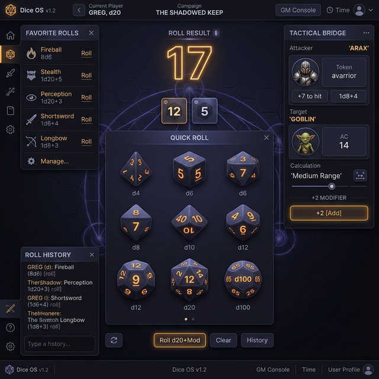

# 🎲 Dice-OS

**Dice OS** est le moteur de probabilités central de GM-OS. Plus qu'un simple lanceur de dés, c'est un outil universel capable de gérer les mécaniques de centaines de jeux de rôle, tout en restant connecté à l'action tactique sur votre carte.

## 📋 Présentation du Module

Dice OS se divise en trois zones principales :
1. **Le Configurateur (Haut)** : Choisissez votre mode de jeu et vos paramètres.
2. **Le Plateau de Lancement (Centre)** : Lancez vos dés d'un clic ou via des raccourcis.
3. **Le Pont Tactique & Résultats (Droite)** : Consultez vos succès et calculez vos modificateurs de portée.

## ⚙️ Modes de Lancement Supportés

Dice OS supporte nativement une immense variété de systèmes :

| Mode | Description | Exemple |
| :--- | :--- | :--- |
| **Standard** | Somme simple de dés + modificateur. | d20 + 5 |
| **Explosif** | Si le max est atteint, on relance et on ajoute au total. | 2d6 (6 relancé) |
| **Pool (Succès)** | Compte le nombre de dés dépassant un seuil (Target). | 8d10 vs 8 |
| **Pool Explosif** | Identique au Pool, mais les dés max en génèrent de nouveaux. | Vampire, Shadowrun |
| **Seuil (Threshold)** | Un test de réussite/échec simple (Réussite si ≥ ou ≤ X). | Appel de Cthulhu |
| **Avantage / Désav.** | Lance 2 dés et garde le meilleur ou le pire. | D&D 5e |
| **Year Zero (YZE)** | Gère deux pools séparés (Base et Équipement) avec "Fléaux". | Mutant, Alien |
| **Year Zero échelonné** | Deux dés de **tailles différentes** (attribut + compétence), la lettre décidant du dé. | Blade Runner |
| **FATE / Fudge** | Utilise des dés +, -, O pour un résultat narratif. | Fate |
| **Rolemaster** | Dés 100 "ouverts" avec relances sur les hauts et bas scores. | Rolemaster |
| **2d20** | Deux dés vingt comptés en réussites sous un seuil, le seuil venant de la fiche. | Dune, *2d20* |
| **Pourcentage (d100)** | Un dé cent sous une cible, gradué en **six degrés**. | Rêves de Dragons, L'Appel de Cthulhu, RuneQuest |
| **Formule Libre** | Saisie manuelle de formules complexes. | `2d6 + 1d4 - 2` |

> ⚠️ **Le seuil n'est pas toujours un nombre fixe.** Chez Dune il vaut une compétence **plus** un
> principe, choisis test par test, de 8 à 16 : un pilote peut donc décrire **de quoi un jet se
> compose**, en termes de champs de la fiche, au lieu d'inscrire un minimum qui sous-estimerait
> tous les personnages.

## 📊 Les six degrés de réussite

Un jet ne rend pas « réussi » ou « raté » : il rend **un degré sur une échelle commune**, du
meilleur au pire.

1. Réussite particulière
2. Réussite significative
3. Réussite normale
4. Échec normal
5. Échec particulier
6. Échec total

> ⭐ **L'échelle est commune, les nombres appartiennent au jeu.** L'Appel de Cthulhu et RuneQuest
> graduent en fractions du pourcentage ; Dune a son critique et sa complication ; Alien distingue
> réussite et surplus. Chaque jeu apporte **ses seuils** ; les six noms, eux, sont les mêmes partout
> — le meneur et la tablette d'un joueur ne peuvent donc pas dire deux choses différentes du même
> jet.

⚠️ **La table du livre fait foi contre la phrase qui prétend la résumer.** Les tables de conversion
sont transcrites telles quelles, exceptions comprises — un résumé qui « a l'air juste » produit des
degrés faux qu'aucune partie ne rattrape.

## 🎚️ Les Dés Échelonnés (Blade Runner)

Certains jeux ne lancent pas des dés tous identiques : la **lettre** inscrite sur la fiche décide de la taille du dé.

- **L'échelle** : `A` → D12, `B` → D10, `C` → D8, `D` → D6.
- **Deux dés de base** : un pour l'**attribut**, un pour la **compétence**. Vous les choisissez par leur lettre, pas par leur nombre de faces.
- **L'équipement** est facultatif, et échelonné lui aussi — le lui donner ajoute un troisième dé.
- **Lecture** : **6 ou plus** sur un dé vaut une réussite ; **10 ou plus** en vaut **deux** — ce qui n'est possible que sur un D10 ou un D12. La taille du dé décide donc de ce qu'il peut rapporter.
- **Avantage / Désavantage** : l'avantage ajoute un dé identique au plus petit, le désavantage retire le plus petit. Jamais les deux à la fois.

> [!TIP]
> **Votre choix l'emporte sur celui du pilote.** Si vous basculez le pupitre à la main en mode échelonné, le système de jeu actif ne le recouvre plus (corrigé le 03/09/2026 : deux D12 demandés lançaient des d6).

> [!NOTE]
> L'échelle des lettres est transcrite dans GM-OS, **pas dans le pilote de jeu** : une table recopiée par la Forge est une table qui peut être recopiée de travers sans que rien ne le dise.

---

## 🛰️ Le Pont Tactique (Tactical Bridge)

C'est la fonctionnalité signature de Dice OS. Elle permet de lier la position des jetons sur la carte à vos jets de dés :

1. **Sélectionnez un Attaquant** et une **Cible** dans le panneau de droite.
2. **Calcul de Portée** : Le moteur calcule instantanément la distance en cases et identifie la catégorie de portée (ex: *Portée Moyenne*).
3. **Application du Modificateur** : Cliquez sur le bouton de modificateur suggéré (ex: `-2`) pour l'appliquer automatiquement à votre prochain jet.

## ⭐ Quick Rolls (Favoris)

Ne perdez plus de temps à configurer vos sorts ou attaques récurrentes :
- **Ajout** : Cliquez sur le bouton "Ajouter", donnez un nom (ex: *Boule de Feu*) et saisissez la formule (ex: *8d6*).
- **Lancement** : Un clic sur le favori déclenche le jet instantanément.
- **Organisation** : Supprimez les favoris inutiles via la croix rouge.

## 📜 Historique et Analyse

Chaque jet est archivé dans l'historique :
- **Détail des Dés** : Visualisez chaque dé individuel pour vérifier les critiques.
- **Codes Couleur** : Vert pour les critiques max, rouge pour les échecs critiques, violet pour les dés explosés.
- **Répétitions (Batch)** : Vous pouvez configurer Dice OS pour lancer 10 fois le même jet d'un coup (pratique pour les groupes d'archers !).

---

## 💡 Astuces pour l'Expertise

> [!TIP]
> **Le Mode Système** : Si un "Game Driver" est actif dans votre session, Dice OS se configure automatiquement sur le bon mode (ex: il passera seul en mode YZE si vous jouez à Alien).

> [!IMPORTANT]
> **Dés Spéciaux (D66, D888)** : Saisir `1d66` dans la formule libre lancera deux d6 pour simuler un jet de dizaines et d'unités, avec un rendu visuel distinct par chiffre.

---

## ⚙️ Détails Techniques

- **Rendu 3D** : Bien que l'interface soit en 2D pour la rapidité, Dice OS envoie les commandes au **Player Hub** pour afficher de véritables lancers de dés 3D physiques aux joueurs.
- **Persistance** : Vos favoris (Quick Rolls) sont sauvegardés par campagne.
