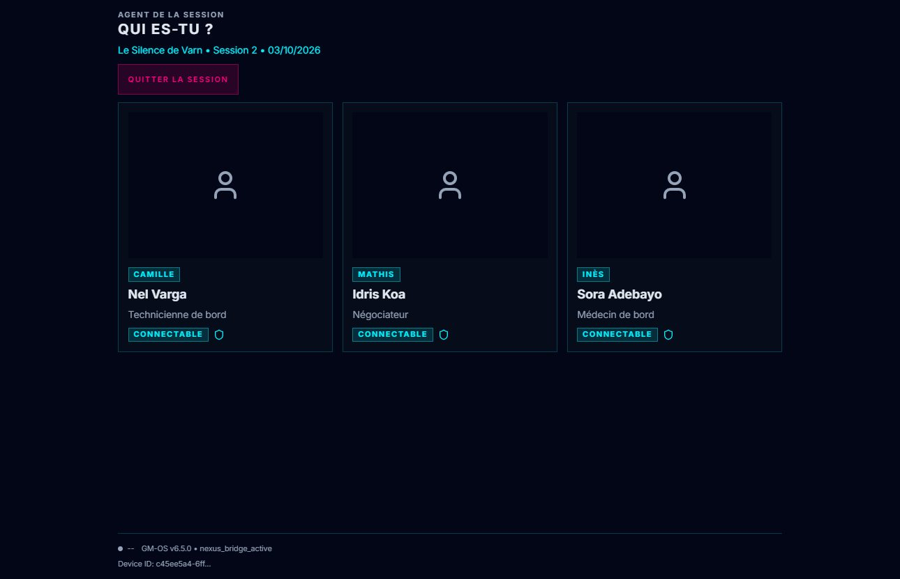
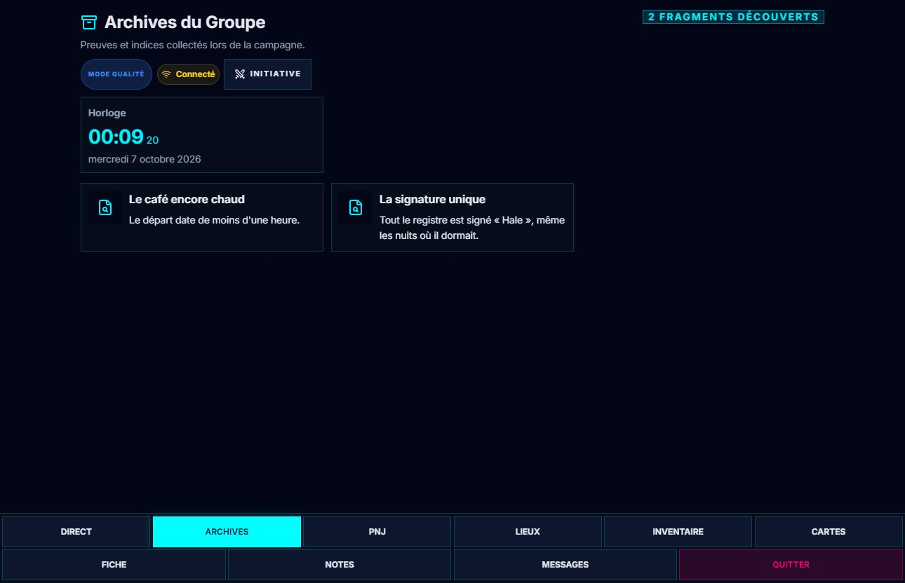
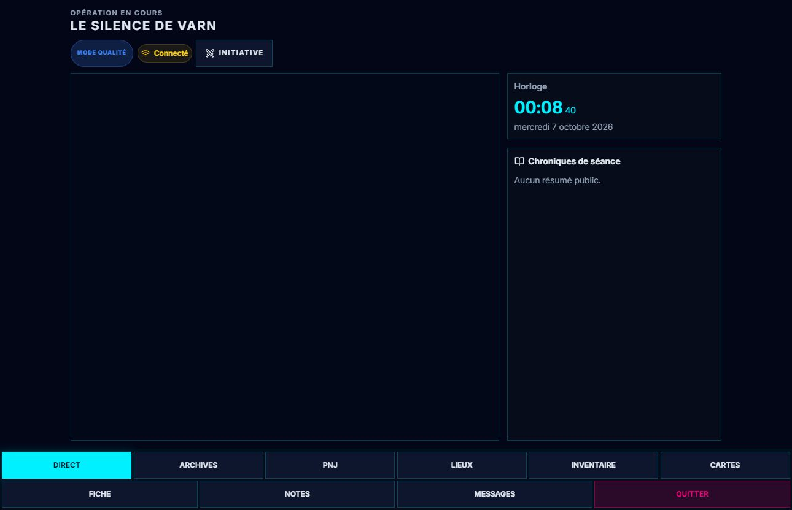

# 📱 Tablet Hub

Le Tablet Hub transforme une tablette, un téléphone ou un second écran en **poste joueur**. Chaque
joueur y trouve sa fiche, son inventaire, ses cartes, les lieux découverts, les PNJ rencontrés, et
tout ce que le meneur décide de projeter.

Deux guides le couvrent : celui-ci monte la table, le
[guide détaillé](./62-Tablette-des-joueurs-reglages-fins.md) explique ce qu'un joueur y fait.

Les tablettes suivent les couleurs du PC. Le halo de l'onglet sélectionné dépend
du thème ; les thèmes sans halo et le mode léger gardent la sélection par sa couleur.
Le contour de focus reste visible au clavier. Les transitions sont courtes ; le
mode léger et la préférence système de réduction des animations retirent les
mouvements décoratifs. Dans ces modes, les nouveaux messages restent signalés sans pulsation.

---

## 🔌 Brancher une tablette

**Deux chemins mènent au QR code** :

- **l'icône Wi-Fi**, en haut à droite de GM-OS (*Ouvrir le code de connexion PWA*), qui ouvre
  directement le QR code des joueurs ;
- **Paramètres › 04. Télécommande**, qui montre côte à côte le QR code de **votre** tablette (*GM
  Remote Control*) et celui des joueurs (*Tablet Hub*).

Le joueur scanne le second, et il est dans le Hub.

> 🔎 *Cette page disait le 2026-09-05 que le chemin des Paramètres n'existait pas : c'était vrai
> alors. Les Paramètres refondus (2026-10-03) l'ont créé.*

Ce que le QR code contient : `http://<adresse-du-MJ>:3001/?window=tablet&sync=3001`. Vous pouvez le
taper à la main si le scan échoue — **l'adresse s'affiche sous le code**, et c'est elle qu'il faut
recopier, en entier.

> ⛔ **Recopiez l'adresse affichée, pas celle-ci.** Le second nombre dit à la tablette **où joindre
> GM-OS**, et il n'est pas toujours égal au premier. Une tablette qui ne le reçoit pas s'affiche
> **connectée** et ne reçoit rien : elle montre alors une campagne de démonstration appelée « The
> Eternal Quest ». *C'est le signe qu'elle parle au mauvais serveur, jamais un problème de
> campagne.*

Toutes les machines doivent être sur **le même réseau Wi-Fi**.

### Ce que voit le joueur en arrivant

**« Qui es-tu ? »** : les personnages **présents à la séance**, avec le nom de leur joueur. C'est vous
qui déclarez le groupe présent, depuis le cockpit (*Gérer le groupe*) ; un personnage déjà pris par
une autre tablette n'est plus proposé.

Sur téléphone, les personnages apparaissent en cartes compactes ; en paysage, trois cartes
peuvent tenir côte à côte. Le nom de la campagne, la séance et **Quitter la session** restent
accessibles pendant que la liste défile. Chaque carte montre le personnage et son joueur.

### Choisir son personnage

À la première connexion, le joueur choisit son personnage dans la liste.

Avant ce choix, **Quitter la session** demande confirmation : **Non** revient à la liste,
**Oui, quitter** confirme la sortie. Le bandeau de confirmation se referme ensuite.

- **Un personnage à la fois.** Si quelqu'un l'utilise déjà, la connexion est refusée : c'est ce qui
  empêche deux tablettes de modifier la même fiche.
- **Débloquer** : le meneur peut libérer les personnages depuis le lobby des terminaux.
- **Quitter** (bouton en bas, à droite) libère le personnage pour quelqu'un d'autre.

> [!TIP]
> **Ajoutez le Hub à l'écran d'accueil.** Sur mobile, cela le lance en plein écran, sans barre
> d'adresse — c'est ce qui le fait ressembler à une application.

---

## 🧭 Les six onglets, et les quatre panneaux

La barre du bas donne accès aux six onglets et aux quatre panneaux. Dans chaque onglet,
les six onglets affichent leur nom sur deux rangées en portrait, une en paysage ;
**Fiche**, **Notes**, **Messages** et **Quitter** occupent la rangée suivante.

| Onglet | Ce qu'on y trouve |
| :--- | :--- |
| **Direct** | Ce que le meneur projette en ce moment : PNJ, lieux, images de scène. C'est l'écran par défaut. |
| **Archives** | Les **indices** révélés par le meneur, avec leur image. |
| **PNJ** | Le trombinoscope — tous les personnages marqués « visibles pour les joueurs ». |
| **Lieux** | L'**Atlas** de la campagne : les lieux découverts, à rouvrir quand on veut. |
| **Inventaire** | Le sac du personnage : donner, jeter, consulter. |
| **Cartes** | Les cartes tenues en main (Deck-OS). **Une pastille rouge compte les cartes qu'on vous tend.** |

| Bouton | Ce qu'il ouvre |
| :--- | :--- |
| **Fiche** | La fiche de personnage complète, au format du jeu |
| **Notes** | Les notes privées du joueur et son feedback de séance au meneur |
| **Messages** | La messagerie, avec le compte des non-lus |
| **Quitter** | Libère le personnage, après confirmation |

> 🔎 **Cette page ne décrivait aucun de ces onglets** — ni les indices, ni l'Atlas, ni les cartes en
> main, qui sont pourtant l'essentiel de ce qu'un joueur touche. Ajoutés le 2026-09-04.

**Archives**, **PNJ** et **Lieux** gardent leur titre et les commandes au-dessus de la liste.
Les noms peuvent revenir à la ligne. Faites défiler la liste pour retrouver une entrée,
puis touchez-la : son image et son texte s'ouvrent dans un lecteur avec **Fermer** en haut.
Le texte long défile sans déplacer ce bouton.

---

## 👁️ Ce qui s'affiche tout seul

### L'horloge et les jauges de tension

Sur **Direct**, elles apparaissent au-dessus de la projection en portrait, à sa droite en
paysage, **si le meneur a laissé la projection allumée dans Clock-OS**,
ce qui est le cas par défaut. Le Hub adopte le thème choisi par le meneur — Moderne, Cyberpunk ou
Old Style.

⚠️ **Les jauges de tension sont donc publiques par défaut**, avec leur nom et leur compte. Voir le
[guide de Clock-OS](./36-Clock-OS-horloges-et-jauges.md).

### Ce que le meneur projette

Dès qu'il projette un PNJ, un lieu ou une image, l'onglet **Direct** l'affiche — sans aucune action
du joueur. Plusieurs éléments s'organisent en grille, et un même personnage projeté par deux
chemins n'apparaît qu'une fois.

Les **Chroniques de séance** montrent le résumé public du meneur. Un texte long se lit en
faisant défiler ce panneau. La navigation reste accessible pendant la lecture.

### Les jets de dés

Un jet projeté s'affiche en plein écran pendant cinq secondes. →
[Guide de la projection des dés](./35-Projeter-un-jet.md)

### Le combat

Dans chaque onglet, le bouton **Initiative** dans la barre du haut ouvre l'ordre du combat.
**Fermer** revient à la projection. Les adversaires invisibles ou cachés ne figurent pas
dans cette liste.

### Le signal de voix

Une barre lumineuse en bas de l'écran réagit à la voix du meneur — de quoi savoir qui parle dans le
noir.

### L'état de la connexion

Une icône Wi-Fi en haut à droite dit si la tablette est synchronisée.

---

## 🛠️ Côté meneur : le lobby des terminaux

Dans les paramètres, le lobby montre en temps réel qui est connecté, avec quel personnage, et la
qualité du signal.

- **Vider les déconnectés** — nettoie la liste des anciens terminaux.
- **Éjecter tout** — déconnecte tout le monde et **libère tous les personnages**. C'est le remède
  quand quelqu'un est bloqué sur une fiche qu'il n'utilise plus.
- Le diagnostic donne l'adresse IP locale et l'état du serveur, sur le **port 3001**.

---

## 🔧 Dépannage

| Problème | Ce qu'il faut regarder |
| :--- | :--- |
| **« Accès refusé : personnage déjà connecté »** | Une autre tablette le tient. Le meneur libère depuis le lobby (*Éjecter tout*), ou le joueur d'avant clique sur *Quitter*. |
| **Le QR code ne mène nulle part** | Les deux appareils ne sont pas sur le même Wi-Fi. Vérifiez l'adresse affichée sous le code. |
| **Pas d'horloge sur la tablette** | Le meneur a éteint la projection dans Clock-OS. C'est un interrupteur unique pour l'horloge, les jauges **et** l'afficheur de table. |
| **Les images n'arrivent pas** | Elles passent par le port 3001. Une tablette connectée sur le port du serveur de développement ne les verra pas. |
| **L'onglet Cartes clignote** | On vous tend une carte : ouvrez-le pour l'accepter ou la refuser. |

---

## 💡 Placer la tablette

> [!TIP]
> **Au centre** si elle sert d'horloge commune et de compteur de tension. **Devant chaque joueur**
> si chacun tient sa fiche et son inventaire. Les deux usages n'ont pas la même position, et le Hub
> sert les deux.

Pour les longues séances, gardez-la branchée : l'écran reste allumé.

---

*Guide refait le 2026-09-04, code à l'appui. Retiré : le chemin de connexion, qui n'existait pas ;
une section entière déformée par des marques de fusion (`+` en début de ligne) et numérotée à
l'envers ; et une promesse de « 60 FPS sous Tauri v2 » — **GM-OS ne tourne pas sous Tauri**, mais
sous Electron, et personne n'a jamais mesuré ces images par seconde. Ajouté : les six onglets et
les quatre panneaux, qui n'étaient décrits nulle part.*

*Relu le 2026-10-03 : le QR code est aussi dans les Paramètres refondus. Captures de la campagne de
démonstration.*

*Relu le 2026-10-06 : J1 intégré (accueil, Direct, Inventaire, Cartes et fiche).
Navigation nommée, actions accessibles après défilement, PV transmis au meneur,
réserves tactiles et horloge reçue dès la connexion. Vérifié avec la campagne de démonstration.*

*J2, 2026-10-06 : Archives, PNJ, Lieux, messagerie, notifications et Notes/Feedback réagencés.
La navigation reste nommée dans les six onglets ; les lecteurs gardent leur sortie visible.*

*Relu le 2026-10-07 pour T5 : halos et focus intérieur contrasté suivent le thème du PC,
graphismes légers et réduction des animations respectés. Captures de démonstration
régénérées et regardées ; les essais sur les vrais appareils restent en T6.*
