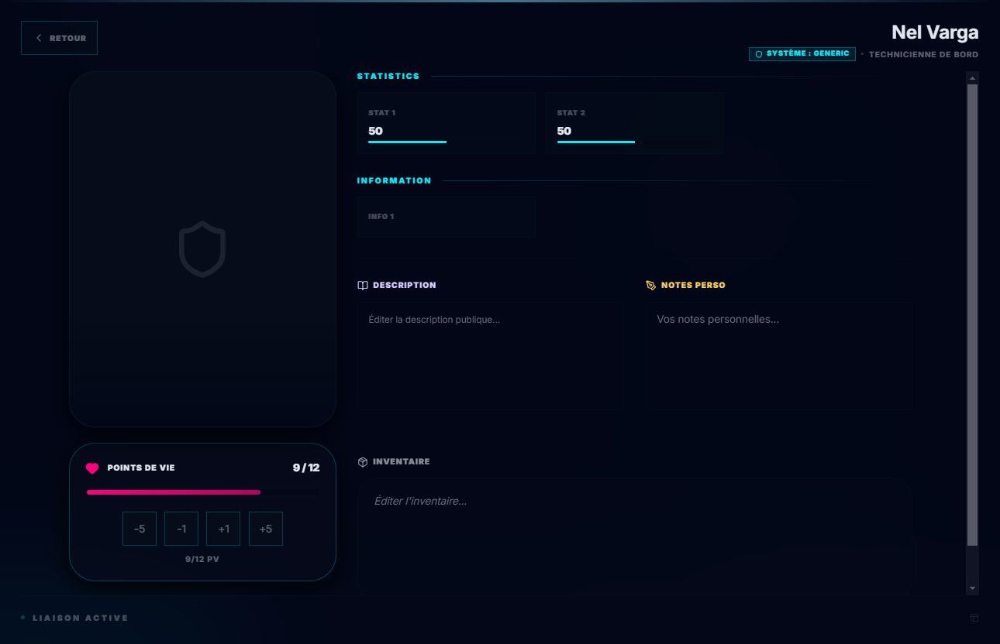
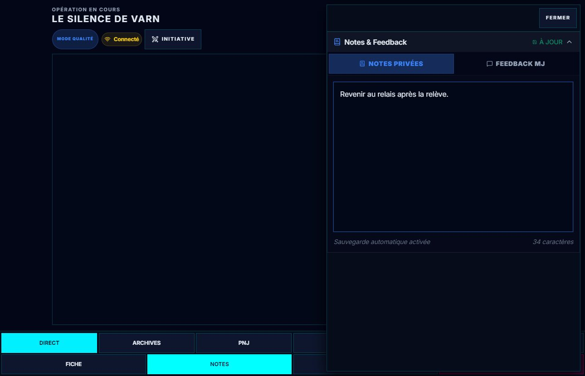
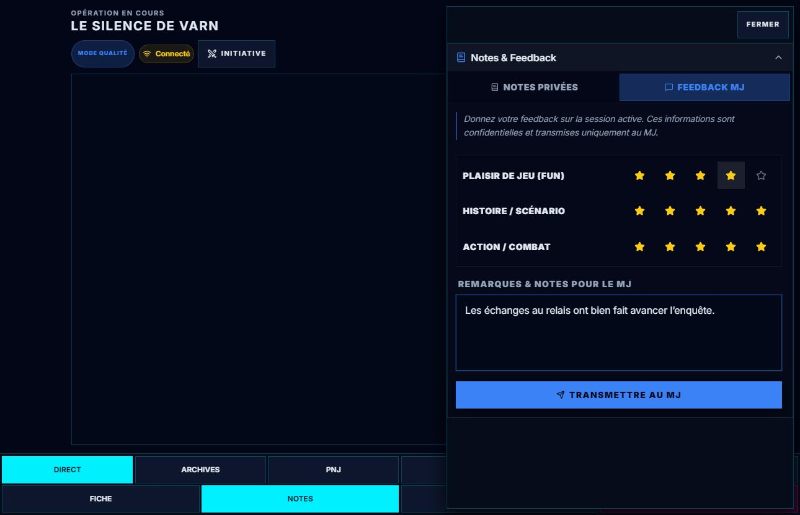
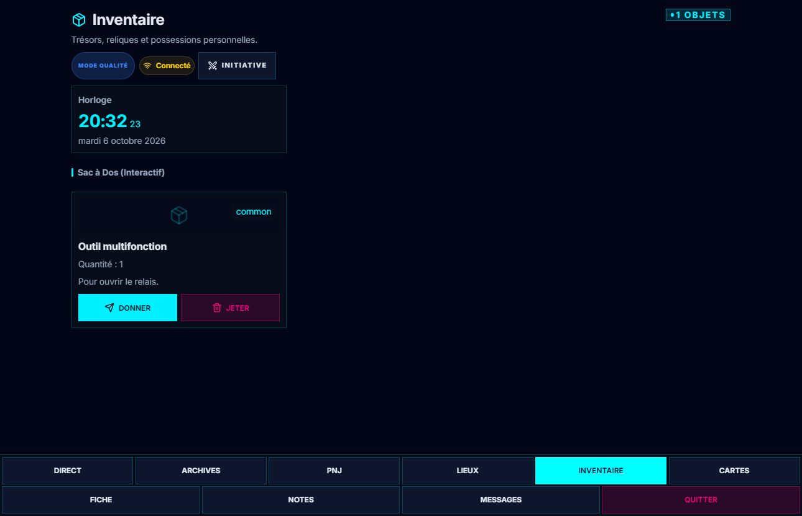
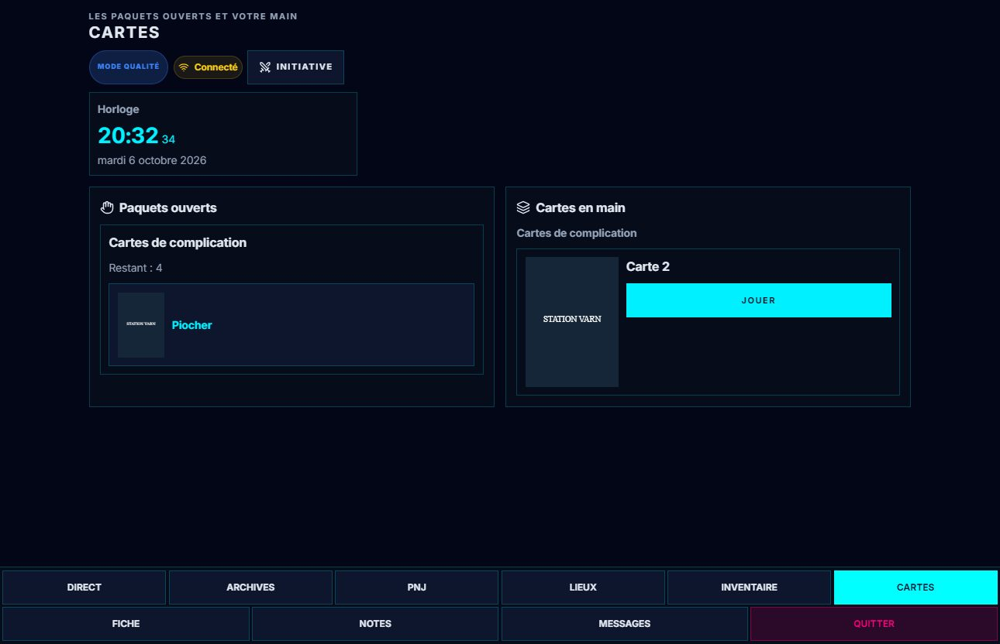
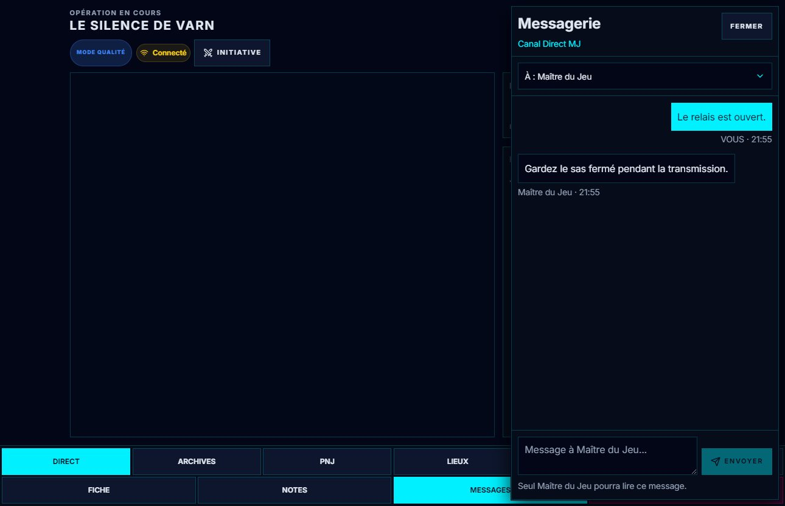
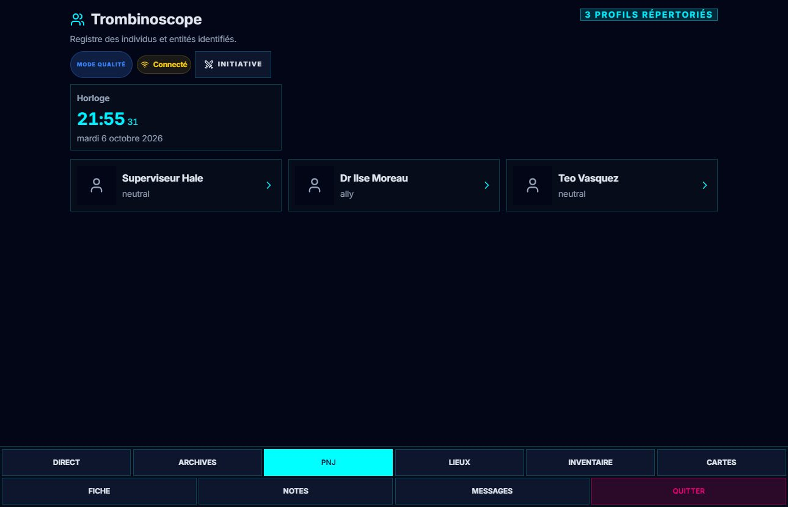
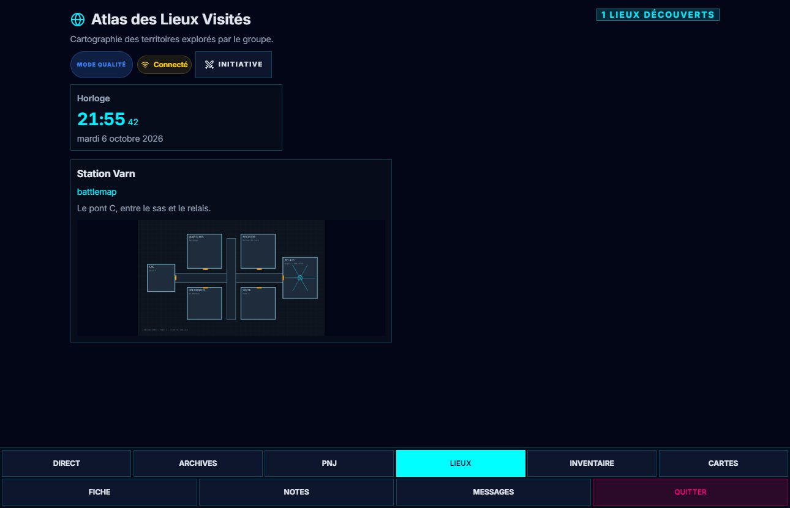

# 📱 Tablet Hub — usages avancés

Cette page s'adresse aux **joueurs**. Pour brancher les tablettes et comprendre les onglets, voir
d'abord le [guide du Tablet Hub](./61-Tablette-des-joueurs.md).

---

## 🔌 Se connecter

Le meneur affiche un QR code depuis l'icône **Wi-Fi** de sa barre du haut (*Connecter Joueurs* sur
un grand écran), ou depuis **Paramètres › 04. Télécommande**. Scannez-le, ou tapez l'adresse affichée
dessous :

```text
http://<adresse-du-MJ>:3001/?window=tablet&sync=3001
```

> ⛔ **Correction.** Cette page donnait `http://[IP-DU-MJ]:3000/hub`. **Ni le port ni le chemin
> n'étaient bons** — un joueur qui suivait ce guide n'arrivait nulle part. Le port applicatif est
> **3001**, et c'est le paramètre `?window=tablet` qui ouvre le Hub joueur.

Les deux nombres ne disent pas la même chose : le premier est **où charger l'application**, le
`sync=` est **où joindre GM-OS**. Ils sont égaux chez la plupart des meneurs, et ils diffèrent
lorsque GM-OS tourne depuis ses sources. **Recopiez donc l'adresse affichée à l'écran plutôt que
celle-ci.**

> ⚠️ **Si votre tablette affiche « The Eternal Quest »**, elle n'a pas reçu le `sync=`, ou pas le
> bon. Elle se croit connectée et ne reçoit rien ; ce nom est celui de la campagne d'exemple livrée
> avec GM-OS. Rescannez le QR code.

Choisissez ensuite votre personnage. **Un seul appareil par personnage** : si la fiche est déjà
prise, demandez au meneur de libérer les connexions.

L'accueil **Qui es-tu ?** garde la campagne, la séance et **Quitter la session** au-dessus de
la liste. Sur téléphone, les cartes sont compactes et la liste peut défiler ; en paysage,
elles se disposent en colonnes. Touchez la carte de votre personnage pour le rejoindre.
Si vous quittez avant le choix, confirmez avec **Oui, quitter**, ou touchez **Non** pour rester.

---

## 📡 Direct

**Direct** regroupe la projection actuelle du meneur, les horloges publiques et les
**Chroniques de séance**. En portrait, ces blocs se suivent ; en paysage, les informations
occupent la colonne à droite de la projection. Faites défiler pour lire un résumé long.

Les six onglets gardent leur nom dans la barre du bas ; **Fiche**, **Notes**, **Messages** et
**Quitter** sont sur la rangée suivante. Le bouton **Initiative** en haut ouvre l'ordre du
combat ; **Fermer** revient à Direct.

---

## 📇 Votre fiche

Bouton **Fiche**, dans la barre du bas. Elle s'affiche au format de votre jeu — Cthulhu Hack, Cyberpunk,
Rêves de Dragons — et non dans une présentation générique.

Vos **points de vie et vos statistiques** suivent en direct ce que fait le meneur : une blessure
appliquée de son côté apparaît sur votre écran sans rien rafraîchir.

Les boutons de PV de la vue synthétique transmettent aussi vos ajustements au meneur.
Les réserves communes du jeu, lorsqu’il en déclare, se trouvent sous l’en-tête : les
commandes **+** et **−** offrent des cibles de 44 px. Une réserve visible mais réservée
au meneur ne propose aucune commande aux joueurs.



---

## 📝 Vos notes privées

Bouton **Notes**.

Sur téléphone, le panneau occupe la place disponible ; en paysage, il s'ouvre à droite.
Le bouton **Fermer** reste en haut pendant que les notes ou le formulaire défilent.

- **Enregistrement automatique** : 1,5 seconde après votre dernière frappe. L'état **SYNCHRO…**
  puis **À JOUR** confirme l'envoi. La fermeture enregistre aussi la dernière saisie.
- **Persistance** : les notes appartiennent à votre personnage et vivent dans la campagne. Vous les
  retrouverez à la séance suivante.
- **Qui les lit** : vous, et **le meneur** depuis son cockpit. Les autres joueurs n'y ont pas accès.



L'onglet **Feedback MJ** recueille votre ressenti sur la séance active : plaisir de jeu,
histoire et combat/action. Touchez une des cinq étoiles pour chaque critère, puis ajoutez
vos remarques et touchez **Transmettre au MJ**. Chaque étoile offre une cible de 44 px.
Après l'envoi, **Modifier mon feedback** permet de le reprendre. Sans séance active,
l'envoi est désactivé.



---

## 🎒 Votre inventaire

Onglet **Inventaire**.

Une carte par rangée sur téléphone, deux en portrait, trois en paysage. Les noms,
quantités et descriptions restent lisibles ; **Donner** et **Jeter** restent accessibles
au-dessus de la navigation après défilement. Le choix du destinataire peut lui aussi défiler.



| Geste | Ce qui se passe |
| :--- | :--- |
| **Donner** | Choisissez un destinataire parmi les personnages joueurs. L'objet passe en **attente** (icône d'horloge). |
| **Jeter** | Confirmation obligatoire, puis l'objet disparaît — de votre sac et de la fiche que voit le meneur. |

> ⚠️ **Un don n'est pas immédiat.** Tant qu'il est en attente, l'objet reste chez vous avec son
> horloge. Il ne change de main qu'une fois l'échange validé — et le destinataire reçoit alors une
> notification, l'objet arrivant tout seul dans son sac.

Vous pouvez aussi **modifier votre inventaire à la main** depuis la fiche : le changement part chez
le meneur dès que vous quittez le champ.

---

## 🃏 Vos cartes

Onglet **Cartes**. C'est votre main : les cartes qu'un paquet vous a données et que vous gardez.

La pioche et la main sont empilées sur téléphone, côte à côte en paysage. **Piocher**
ajoute une carte ; **Jouer** reste accessible après défilement. Touchez une carte pour
l’agrandir, puis touchez le détail ou **Touchez pour fermer** pour revenir.
Un paquet vide reste affiché avec sa pioche désactivée. Une carte scellée reste anonyme.

**Donner à** propose uniquement les personnages de la campagne qui tiennent une tablette.
Le destinataire peut **Accepter** ou **Refuser** ; vos actions sur la carte sont suspendues
pendant l’attente de sa réponse. Le don d’une carte et celui d’un objet suivent deux validations différentes.



> 🔎 **La pastille rouge sur l'onglet compte les cartes qu'on vous tend.** Un don de carte demande
> votre réponse — c'est vous qui l'acceptez, personne ne peut le faire à votre place. L'onglet se
> signale donc même fermé.

→ [Guide de Deck-OS](./37-Deck-OS-les-cartes.md)

---

## 💬 Messages et indices

**Messages** ouvre la messagerie, avec trois zones distinctes :

- le **canal général**, pour le groupe et les annonces du meneur ;
- le **canal du meneur**, pour vos échanges privés avec lui ;
- les **canaux privés**, pour parler à un autre joueur.

Un message reçu pendant que vous êtes ailleurs fait apparaître une notification en bas de l'écran ;
touchez-la pour ouvrir sa conversation. Elle reste au-dessus de la navigation et disparaît
après cinq secondes. Le compte des non-lus s'affiche sur le
bouton.

La messagerie occupe la hauteur disponible sur téléphone et un panneau à droite en paysage.
Choisissez le destinataire au-dessus de la conversation. Les messages défilent au milieu ;
le champ de saisie et **Envoyer** restent en bas, **Fermer** en haut. La touche Entrée envoie
le message ; Maj + Entrée ajoute une ligne. Un canal privé affiche les échanges avec ce
destinataire ; les annonces du groupe se lisent dans **Tous les Joueurs**.



**Les indices** révélés par le meneur arrivent dans l'onglet **Archives**, avec leur image. Ils y
restent : c'est votre mémoire d'enquête.

Le nom et un extrait se lisent dans la liste. Touchez un indice pour ouvrir son texte complet,
puis **Fermer** pour revenir ; la sortie reste accessible pendant la lecture.

---

## 🗺️ Les lieux et les visages

- Onglet **Lieux** — l'Atlas de la campagne. Chaque lieu découvert reste consultable.
- Onglet **PNJ** — le trombinoscope. Tous les personnages que le meneur a rendus publics, avec leur
  portrait et leurs informations publiques. *L'outil qui évite « c'était qui, déjà, le type de la
  taverne ? »*

Les deux se remplissent tout seuls : dès que le meneur rend un lieu ou un PNJ visible, il apparaît
sur toutes les tablettes.

Les PNJ se lisent en lignes avec un portrait compact et leur rôle. Les lieux présentent leur
nom, un extrait et un plan contenu dans la carte. Touchez une entrée pour lire le détail,
puis **Fermer**. Les noms longs passent à la ligne.





---

## ⚔️ Pendant un combat

Dans chaque onglet, le bouton **Initiative** de la barre du haut
ouvre l’ordre du combat ; **Fermer** libère la place. Les adversaires cachés n’y figurent pas.

---

## 🎲 Les jets de dés

Quand le meneur projette un jet, il occupe tout l'écran **cinq secondes**. →
[Guide de la projection des dés](./35-Projeter-un-jet.md)

---

## 🚪 Quitter

Le bouton **Quitter**, tout à droite, demande confirmation puis **libère votre personnage**. Faites-le
en fin de séance : sans quoi la fiche reste verrouillée, et le meneur devra la débloquer avant que
quiconque puisse la reprendre.

---

> ⛔ **Une mention retirée.** Cette page annonçait une « taille de police réduite de 15 % pour le
> confort sur tablette ». La réduction existe, mais ce n'est pas un réglage de tablette : c'est la
> taille de base de **toute l'application**, meneur compris. Rien de spécifique au Hub.

---

*Guide révisé le 2026-09-04, code à l'appui. L'adresse de connexion était fausse sur le port et sur
le chemin. Ajouté : les cartes en main et leur pastille, les indices dans les Archives, le
trombinoscope, l'Atlas, l'ordre d'initiative, et ce que fait vraiment le bouton Quitter.*

*Relu le 2026-10-03 : le bouton **Connecter Joueurs** n'affiche son nom qu'à partir de 1600 px de
large ; en dessous, c'est l'icône Wi-Fi.*

*Relu le 2026-10-06 : J1 intégré, dons d’objets et de cartes éprouvés, pioche et actions
accessibles, détail refermable, PV transmis et réserves tactiles. Captures de la campagne fictive de Varn.*

*J2, 2026-10-06 : listes et lecteurs d'Archives/PNJ/Lieux, messagerie avec saisie accessible,
notifications au-dessus de la navigation, Notes et feedback tactile. Captures sur la campagne de démonstration.*
