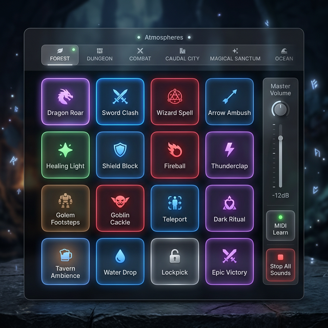

# 🔊 Sound-OS

Sound-OS est une console de déclenchement : **seize pads**, un clic, le son part. Un cri, une porte
qui claque, une explosion. Rien ne boucle, rien ne s'installe — c'est un coup.

Les trois modules audio se partagent le travail : [Music-OS](./71-Music-OS.md) joue des
morceaux, [Ambient-OS](./72-Ambient-OS.md) tient le fond, Sound-OS **frappe**.

---

## 🎛️ Les pads

Seize boutons, autant de sons. **Cliquez** pour déclencher. La polyphonie est totale : superposez un
rugissement et une explosion, rien ne se coupe.

**Clic droit sur un pad** pour l'équiper :

| Réglage | Détail |
| :--- | :--- |
| **Le son** | choisi dans le [Media Hub](./92-Media-Hub.md) |
| **Le titre** | pour le reconnaître en séance |
| **Le volume** | **jusqu'à 150 %** — c'est ici que le boost existe, pas sur le volume général |
| **La couleur** | rouge pour les attaques, vert pour la nature… un code visuel vaut mieux qu'une lecture |
| **Une scène Philips Hue** | jouée en même temps que le son |
| **Une touche du clavier** | voir plus bas |
| **Une note MIDI** | voir plus bas |

> [!TIP]
> **Le lien lumineux est le geste le plus payant du module.** Un pad « Tonnerre » qui déclenche le
> son *et* fait flasher les lampes en blanc froid fait sursauter une table entière pour deux
> minutes de préparation.

---

## 🗂️ Les atmosphères

Une **atmosphère** est un jeu complet de seize pads. Les onglets en haut de la grille passent de
l'un à l'autre instantanément : « Forêt », « Donjon », « Combat spatial ».

Préparez-en une par lieu important de votre scénario, et le changement de décor sonore devient un
seul clic.

> ⚠️ **Les atmosphères ne sont pas rattachées à une campagne.** Contrairement aux playlists de
> Music-OS, elles sont communes à toute l'installation : toutes vos campagnes voient les mêmes
> onglets. Nommez-les en conséquence si vous menez plusieurs jeux.

---

## ⌨️ Le clavier et le MIDI

**Key Learn** (icône clavier, dans l'en-tête) :

1. Passez en mode apprentissage.
2. Cliquez le pad à équiper.
3. Appuyez sur la touche voulue.
4. Quittez le mode.

La touche fonctionne **partout dans GM-OS**, tant qu'aucun champ de saisie n'a le focus. Vous pouvez
déclencher un bruitage depuis la carte ou le suivi de combat.

**MIDI Learn** (icône piano) fonctionne pareil, avec un contrôleur branché — Launchpad, nanoPAD,
clavier maître. Un bouton rafraîchit la liste des périphériques si vous branchez le vôtre après
coup.

---

## 🎚️ Le volume, et ce que le Focus Chat en fait

Sound-OS a **sa propre sortie audio**, réglable dans l'en-tête du module : vous pouvez envoyer les
bruitages sur une enceinte différente de la musique.

> 🔎 **Le Focus Chat ne traite pas les bruitages comme le reste.** Quand vous tamisez pour parler,
> la musique et les ambiances tombent à **10 %** ; les bruitages, eux, s'arrêtent à **50 %**. C'est
> délibéré : un coup d'épée joué pendant votre narration doit garder son impact. Voir la
> [tour de contrôle audio](./70-Tour-de-controle-audio.md).

---

## ⏹️ Les deux boutons rouges de l'en-tête

Ils se ressemblent, et l'un est sans retour.

| Bouton | Effet |
| :--- | :--- |
| **Arrêt Progressif** (carré) | Éteint tous les sons en cours par un **fondu de 3 secondes**. Sans danger. |
| **Réinitialiser le module** (flèche circulaire) | ⛔ **Supprime toutes vos atmosphères et toute leur configuration.** Une confirmation le demande, et il n'y a pas de retour en arrière. |

Le **Stop All** de la barre de titre applique le même fondu de trois secondes aux bruitages — ce
n'est pas une coupure sèche, contrairement à ce qu'annonçait la tour de contrôle.

---

## 🔧 Dépannage

| Problème | Ce qu'il faut regarder |
| :--- | :--- |
| **Ma touche ne déclenche rien** | Un champ de saisie a le focus. Cliquez dans le vide et réessayez. |
| **Le contrôleur MIDI n'apparaît pas** | Branchez-le, puis rafraîchissez la liste depuis l'en-tête. |
| **Le son part sur la mauvaise enceinte** | Sound-OS a sa sortie propre, dans son en-tête — distincte de celle de Music-OS. |
| **Les bruitages sont faibles pendant que je parle** | Le Focus Chat est actif : ils sont à 50 %. |
| **J'ai perdu mes atmosphères** | Le bouton de réinitialisation les efface toutes. Elles sont dans la [sauvegarde automatique](./91-Sauvegarde-automatique.md). |

---

*Guide révisé le 2026-09-04, code à l'appui. Corrigé : la sortie audio se règle **dans le module**
et non dans les Paramètres. Ajouté : le bouton de réinitialisation, qui détruit toutes les
atmosphères ; le fait qu'elles ne sont pas rattachées à une campagne ; et la valeur exacte du
tamisage des bruitages en Focus Chat.*
