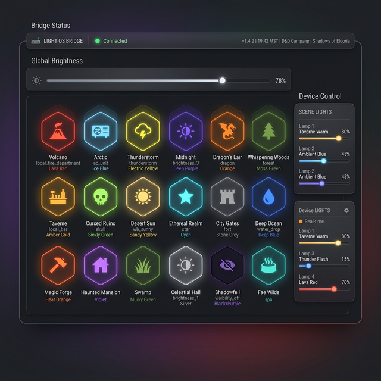

# 💡 Light-OS

Le module **Light OS** est votre centre de contrôle domotique dédié à l'immersion. Il intègre vos lumières **Philips Hue** directement dans votre environnement de jeu, permettant de synchroniser l'éclairage de votre pièce avec l'action, la musique et les effets sonores.

## 📋 Présentation du Module

Light OS transforme vos lampes connectées en véritables accessoires de jeu :

1. **Gestion des Scènes** : Une grille de 18 emplacements pour sauvegarder vos ambiances (Snapshots).
2. **Contrôle en Temps Réel** : Ajustez la luminosité, la température et la couleur de chaque lampe individuellement.
3. **Moteur d'Effets Logiciels** : Déclenchez des animations complexes (Orage, Feu de camp, Stroboscope) non disponibles nativement.
4. **Synchronisation Globale** : Le cerveau de l'OS qui fait le lien entre l'audio et le visuel.

## 🚀 Connexion au Pont (Bridge)

Avant de commencer, vous devez lier GM-OS à votre installation Philips Hue :

1. Cliquez sur le statut de connexion dans l'en-tête (indique "Disconnected").
2. Suivez les instructions : GM-OS va détecter votre Bridge sur le réseau.
3. Lorsque l'OS vous le demande, appuyez sur le bouton physique central de votre **Philips Hue Bridge**.
4. Une fois jumelé, le statut passe au vert ("Connected") et vos lampes apparaissent dans l'interface.

> [!TIP]
> **Réinitialisation (Forget Bridge)** : Si vous changez de pont ou si vous souhaitez réinitialiser la détection automatique, utilisez le bouton **"Forget Bridge"** (icône 🗑️) dans la barre latérale. Cela effacera l'IP du pont et votre clé utilisateur pour repartir sur une installation propre.

## 🎭 Création et Gestion des Scènes

Le système de "Snapshots" vous permet de capturer une ambiance parfaite en quelques secondes :

- **Ajustement Manuel** : Utilisez les curseurs et sélecteurs de couleur du pied de page pour régler
  chaque lampe à votre convenance.
- **Sauvegarde** : survolez une tuile et cliquez l'**appareil photo 📷** en bas à gauche. L'état
  actuel de toutes les lampes y est mémorisé. Une tuile encore vide se capture d'un simple clic.
- **Personnalisation** : le **crayon ✏️** en bas à droite ouvre l'éditeur de la tuile — son **nom**,
  son **icône** (vingt-quatre proposées, ou n'importe quel nom de Material Symbol) et sa **couleur**.
  Cette couleur ne commande aucune lampe : c'est le repère de la tuile à l'écran — bordure de la
  scène active, halo, étoile ✨.
- **Activation** : un clic gauche applique l'ambiance. La transition dure **5 secondes par
  défaut**, réglable dans les options — de l'instantané pour un combat au fondu très lent pour un
  voyage.
- **Effacement** : la croix ✕ en haut à gauche vide la tuile. Elle perd alors son nom, son icône, sa
  couleur, sa touche — et cesse d'être l'éclairage normal si elle l'était.

### ⌨️ Lancer une scène à la touche

Survolez une tuile et cliquez le **⌨** en haut à droite, puis pressez la touche voulue. Elle
s'affiche alors en permanence sur la tuile, et **fonctionne depuis n'importe quel écran de GM-OS** —
c'est tout l'intérêt : changer l'ambiance sans quitter vos notes.

> [!NOTE]
> **Une touche ne commande qu'une scène** : l'attribuer à une seconde tuile la retire à la première,
> sans quoi la gagnante serait tirée au hasard de l'ordre interne. **Échap** (ou un clic sur la
> tuile) annule l'apprentissage.
>
> ⚠️ **En revanche, Sound-OS et Music-OS écoutent le clavier de leur côté.** La même touche peut donc
> lancer un bruitage **et** sa lumière — un cumul souvent utile, mais qui surprend si on l'a fait sans
> le vouloir. Les touches tenues avec **Ctrl, Alt ou Cmd** ne déclenchent jamais rien, et rien ne se
> déclenche pendant que vous tapez dans un champ ou qu'une boîte est ouverte.

## 🪄 Effets Spéciaux (Software Engine)

GM-OS embarque un moteur d'effets ultra-réactif capable de simuler des ambiances dynamiques :

- **🕯️ Bougie / Feu** : Scintillement aléatoire de la luminosité et de la teinte (orangé).
- **⚡ Orage** : Fond noir permanent entrecoupé de flashs blancs aléatoires ultra-rapides.
- **🚓 Police** : Stroboscope alternant rouge et bleu.
- **🔮 Arcane** : "Respiration" lente et intense de la luminosité avec légères variations chromatiques.
- **🌊 Sous l'eau** : Mouvement lent et ondulatoire de la lumière (bleu/cyan).
- **Et trente-quatre autres** : *Glitch*, *Néon défectueux*, *Radiation*, *Souffle de Dragon*,
  *Trou Noir*, *Ruche Alien*, *Terminal Retro*, *Lave Fusion*, *Battement de Cœur*, *Aurore
  Boréale*, *Méditation Zen*, *Le Néant*…

> 🔎 **Il y en a trente-neuf en tout**, là où ce guide en citait quatre et concluait par « etc. ».
> *Grisaille* n'en fait pas partie. La liste complète est dans le sélecteur d'effet de chaque lampe.

### ⏱️ Régler la vitesse d'un effet

Chaque tuile qui contient au moins un effet porte un **curseur de vitesse**, sous son nom. Il va de
**×0,25 à ×3**, par quarts, et **×1** est la vitesse d'origine de l'effet.

- **Vers la droite, tout s'accélère** : la bougie qui scintillait toutes les 250 ms scintille deux
  fois plus vite en ×2, l'orage frappe plus souvent, le cœur bat plus fort.
- **Vers la gauche, tout s'étire** : un crépuscule réglé sur ×0,25 met quarante secondes entre deux
  changements de teinte au lieu de dix — de quoi tenir une scène entière.
- **Le chiffre affiché est un bouton** : un clic dessus revient à ×1.

Le réglage **agit immédiatement** si la scène est en cours : pas besoin de la relancer. Il appartient
à la tuile, il est retenu avec elle, et il repart dans la sauvegarde automatique.

> [!TIP]
> **Deux tuiles, deux vitesses.** Rien ne vous oblige à ranger un effet une seule fois : capturez la
> même ambiance dans deux tuiles, l'une en ×0,5 pour l'attente, l'autre en ×2 pour l'assaut. Vous
> changez de rythme d'un clic, sans toucher aux lampes.

> [!NOTE]
> **Le curseur n'apparaît que là où il a prise.** Une scène sans effet n'a rien à accélérer — elle
> n'affiche donc pas de curseur, comme elle n'affiche pas l'étoile ✨.
>
> Deux limites voulues : un effet choisi **à la main** dans le pied de page (sous une lampe précise)
> garde sa cadence d'origine, car il n'appartient à aucune tuile ; et même poussé à ×3, un effet ne
> descend jamais sous **un dixième de seconde** entre deux commandes — au-delà, le pont Hue sature et
> la lumière prend du retard sur ce que vous faites.
>
> ⚠️ **À ne pas confondre avec le *Temps de transition*** de la barre du haut : celui-ci règle le
> **fondu d'une scène à l'autre**, le curseur règle la **vitesse de l'animation** une fois la scène
> installée.

## 🏠 L'éclairage normal de la pièce

Votre lumière de jeu est aussi celle sous laquelle on lit ses notes et on sert à boire. **Désignez la
scène qui est votre éclairage normal**, et c'est vers elle que la pièce revient quand quelque chose
s'arrête — au lieu de tomber dans le noir.

Deux façons de la désigner, au choix :

- **L'icône 🏠 sur une tuile** : elle apparaît au survol, un clic désigne la tuile, un second la
  libère. La tuile désignée garde sa maison affichée en permanence.
- **Le bloc « Éclairage normal »** de la barre latérale, juste au-dessus du bouton d'extinction : la
  liste de vos scènes capturées, et « Aucun ».

### Ce que ça change, geste par geste

| Geste | Sans éclairage normal | Avec |
| :--- | :--- | :--- |
| **Un son, une piste, une musique se termine** | retour à la dernière scène que vous avez cliquée — et **noir** si vous n'en avez cliqué aucune | retour à votre éclairage normal |
| **Stop All** (barre du haut) | tout au noir | retour à votre éclairage normal |
| **Extinction d'urgence** (bouton rouge de Light-OS) | tout au noir | **tout au noir** — inchangé |

> [!IMPORTANT]
> **Le défaut que cela répare.** Si vous n'aviez cliqué aucune scène depuis le lancement, la fin du
> premier bruitage éteignait votre pièce — en pleine partie, sans que vous ayez rien demandé.
> Désigner un éclairage normal ferme ce trou ; ne rien désigner laisse le comportement d'avant,
> à l'identique.

> [!NOTE]
> **Le Stop All ne repasse pas par la dernière scène jouée.** Il vise votre éclairage normal
> directement : *on ne veut pas retomber sur la scène d'alerte qui jouait il y a trois secondes.* Les
> retours automatiques, eux, préfèrent ce que vous aviez choisi à la main — l'éclairage normal n'est
> leur recours que si vous n'avez rien choisi.
>
> **Le bouton rouge reste une vraie extinction**, pour finir la soirée ou pour le noir complet : sinon
> plus aucune porte ne mènerait au noir tant qu'un éclairage normal serait désigné.
>
> Seules les scènes **capturées** peuvent être désignées, et **effacer la tuile désignée retire la
> désignation** — un repli qui vise une tuile vide ne ferait rien, en silence.

## 🔄 Synchronisation Multi-Modules (Sync Mode)

C'est ici que GM-OS révèle toute sa puissance. Si le bouton **Sync** est activé :

- **Music OS** : Lancer une musique "Combat" peut automatiquement passer l'éclairage en rouge.
- **Sound OS** : Déclencher un effet sonore de "Tonnerre" lancera instantanément un flash orageux dans votre pièce.
- **Intelligence de Retour** : Lorsque l'effet sonore ou la musique s'arrête, Light OS est capable de rétablir automatiquement l'ambiance manuelle précédente, évitant que vos joueurs ne restent dans le noir après une action héroïque.

---

## ⚙️ Configuration Avancée

- **Luminosité Globale (Master)** : Un curseur général pour atténuer toute votre installation sans modifier les réglages de chaque scène.
- **Transition Time** : Réglez la vitesse à laquelle les scènes changent (de l'instantané pour les combats au fondu très lent pour les scènes de voyage).
- **Synchro des modules** : l'interrupteur qui décide si les sons, musiques et ambiances ont le droit
  de commander vos lampes. Allumé par défaut.
- **Key Learn** : associez une touche à vos scènes préférées pour les changer sans quitter vos notes
  — voir « Lancer une scène à la touche » plus haut.

---

> [!WARNING]
> En mode **Synchro**, les commandes envoyées par les modules audio sont prioritaires. Pour garder le
> contrôle manuel absolu, coupez l'interrupteur **Synchro des modules**, dans la barre du haut de
> Light-OS.
>
> ⚠️ **Ne le confondez pas avec son voisin, « Mode simulé »** — celui-là *débranche votre pont Hue*
> et simule quatre lampes, pour préparer une ambiance sans matériel. Il s'appelait « Synchro
> Simulée » jusqu'au 2026-09-07, et un meneur qui suivait ce guide coupait donc son pont en croyant
> couper la synchro.

---

## 💡 Qui d'autre commande vos lampes

Light-OS n'est pas le seul à parler à votre pont. **Cinq modules** peuvent appliquer une scène, et
c'est utile de savoir lequel a agi quand la lumière change sans qu'on ait rien touché :

| Module | Quand |
| :--- | :--- |
| **Sound-OS** | Un pad peut porter une scène, jouée avec le son |
| **Music-OS** | Un pad de musique, de même |
| **Ambient-OS** | Une piste d'ambiance ; à son arrêt, la lumière **revient** à une autre piste allumée |
| **Map-OS** | Une **zone de danger** où un pion entre |
| **Le Storyboard** | Une séquence, parmi ses six éléments |

⚠️ **Le Stop All de la barre du haut agit sur vos lampes** — ce n'est pas qu'un bouton audio. Il les
éteint, ou les ramène à votre **éclairage normal** si vous en avez désigné un (voir plus haut).
→ [Tour de contrôle audio](./70-Tour-de-controle-audio.md)

---

*Corrigé le 2026-09-07 — **trois promesses que rien ne tenait**, trouvées dans le code : le bouton
**Sync** n'existait pas (et son voisin « Synchro Simulée » débranchait le pont), le **Key Learn**
n'avait aucun code derrière, et seul le **nom** d'une tuile pouvait changer — jamais son icône ni sa
couleur. Les trois sont désormais vraies. Corrigé aussi : la capture se fait par un appareil photo et
non une disquette, et l'éditeur s'ouvre au crayon, pas au clic droit.*

*Complété le 2026-09-07 : le **curseur de vitesse** de chaque tuile (×0,25 à ×3), ce qu'il ne
touche pas, et la différence avec le temps de transition. Puis l'**éclairage normal de la pièce** —
les deux façons de le désigner, ce qu'il change pour les trois gestes de retour, et le défaut qu'il
répare (la pièce s'éteignait à la fin du premier bruitage d'une soirée). **Les deux ont été
éprouvés sur les lampes de la table le jour même.***

*Guide révisé le 2026-09-04, code à l'appui. Précisé : **trente-neuf effets** là où la page en
citait quatre avant un « etc. » — et *Grisaille* n'en fait pas partie. Ajouté : la liste des **cinq
modules** qui peuvent commander vos lampes sans passer par Light-OS, et le fait que le **Stop All
les éteint**. Les 18 scènes, l'appairage du pont et la transition de 5 secondes par défaut sont
exacts.*
