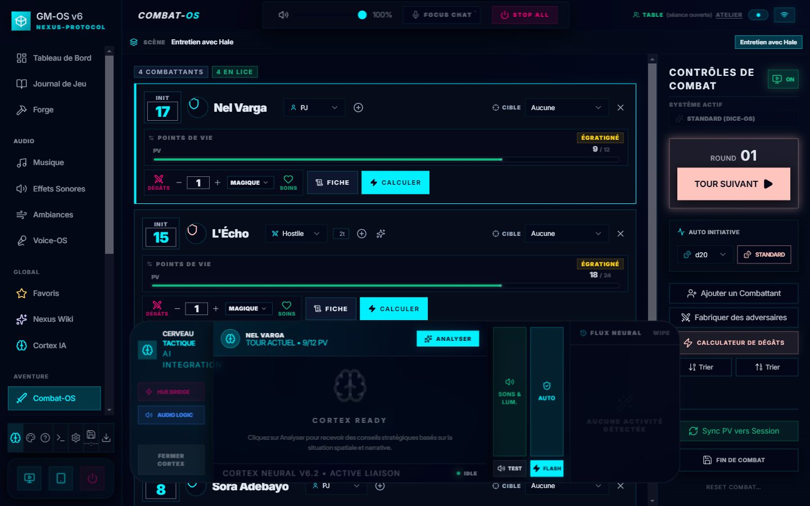
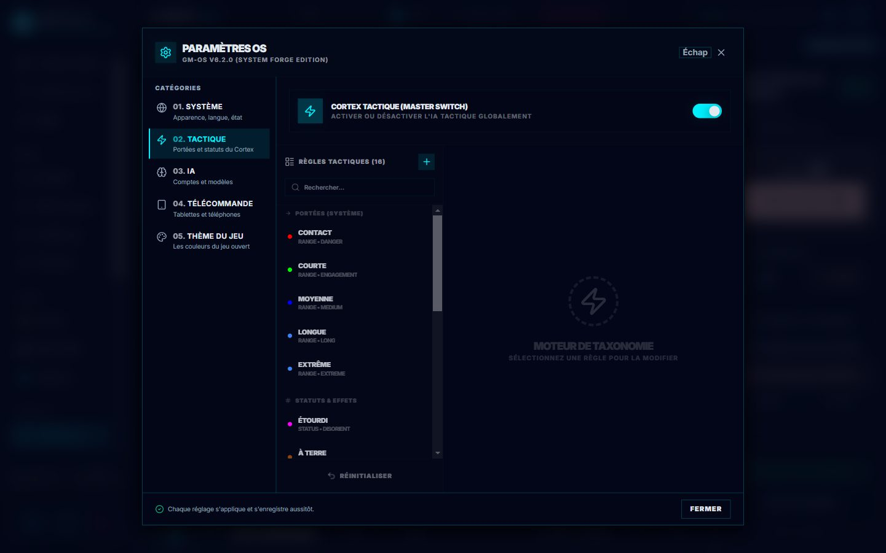

# 🧠 Cortex — l'assistant tactique

Le Cortex regarde votre combat — qui est où, à quelle distance, dans quel état — et vous rend deux
choses : **un paragraphe de situation** à lire à la table, et **des conseils d'action** classés par
urgence. Il pilote aussi vos lumières et vos sons tactiques.

*Le bandeau du Cortex, ouvert par-dessus Combat-OS. Le **flux neural**, à droite, affiche ses
analyses ; **Fermer Cortex**, à gauche, le replie.*

> 📖 Ce guide est **la référence**. Le [manuel du Cortex](./83-Cortex-OS-aide-memoire.md) est le
> mémo de séance : comment lire le panneau pendant qu'on joue.

---

## 🔌 Où il vit, et comment on l'allume

**Le Cortex n'est pas dans Map-OS.** C'est un bandeau en bas de l'écran, présent dans toute
l'application. Il s'ouvre par le **cerveau**, premier des raccourcis en bas de la barre des modules,
et se referme par **Fermer Cortex** — ou par **Échap**, depuis le 2026-10-04, quand rien d'autre ne
réclame la touche : une fenêtre ouverte se ferme d'abord, un champ de saisie garde son Échap, et une
scène de Light-OS en cours s'arrête avant que le bandeau ne parte. *Une frappe, un seul effet.*

> 🔎 **Le bandeau ne bloque pas le clavier.** Il reste ouvert tout un combat ; vos pastilles de
> Sound-OS, Music-OS et Light-OS répondent pendant ce temps. Et depuis le 2026-10-04, il passe
> **derrière** les fenêtres — Paramètres, médiathèque, confirmations — au lieu de les recouvrir.

> ⚠️ **Ne le confondez pas avec « Cortex IA »**, dans la section *Global* de la barre des modules :
> celui-là ouvre la conversation avec l'Oracle ([guide](./80-Oracle-poser-une-question.md)). Même
> mot, deux outils.

L'interrupteur général est dans **Paramètres › 02. Tactique** (*Cortex tactique, master switch*),
au-dessus des **règles tactiques** — les portées et leurs statuts. Une pastille dans la barre du
haut dit son état : éteint, actif, ou **en train d'analyser** (elle pulse).

> ⛔ **Correction.** Le manuel envoyait « ouvrir Map-OS et cliquer sur l'icône Brain de la barre
> d'outils ». Il n'y a pas d'icône Brain dans Map-OS, et le Cortex ne s'y trouve pas.

---

## 🎛️ Les quatre boutons du bandeau

| Bouton | Ce qu'il fait **vraiment** |
| :--- | :--- |
| **Sons & Lum. / Muet** | ⛔ **Coupe le matériel** : les sons tactiques et les lumières Hue. **L'analyse et les conseils continuent.** *Le bouton s'appelait « Sensors » jusqu'au 2026-09-04 — un nom qui laissait croire qu'il coupait les capteurs, c'est-à-dire l'analyse.* |
| **Auto** | L'auto-dissipation. Actif, le Cortex retire tout seul les statuts incompatibles ; sinon il se contente de le suggérer. |
| **Test** | Joue un son tactique pour vérifier le branchement audio. |
| **Flash** | Déclenche manuellement un éclair sur vos lampes Hue, pour ponctuer un moment. |

> ⛔ **Les deux guides se contredisaient sur le premier bouton**, et aucun n'avait raison. Celui-ci
> annonçait que « en mode Muted, l'IA ne fera aucune suggestion » — **faux**, elle continue. Le
> manuel disait « coupe le retour audio » — **incomplet**, il coupe aussi les lumières.
> `isMuted` garde exactement deux choses : le son tactique et le pont matériel. Vérifié le
> 2026-09-04.

Pour arrêter réellement l'analyse, c'est l'interrupteur des Paramètres.

---

## 📊 Ce que le Cortex vous rend

### La narration de situation

Un court paragraphe sur l'état du champ de bataille, à lire ou à paraphraser.

### Les conseils, en trois rangs

| Rang | Priorité | Ce que c'est |
| :--- | :---: | :--- |
| 🔴 **Urgence** | **4 et 5** | Une menace immédiate, ou une occasion de conclure |
| 🟡 **Opportunité** | **3** | Un mouvement à jouer, une zone à couvrir |
| ⚪ **Conseil** | **1 et 2** | Un rappel de capacité, un placement défensif |

> ⛔ **Les trois seuils étaient faux dans le manuel** — il donnait « Urgence 3-5 »,
> « Opportunité 2 », « Conseil 1 ». Le code range à **≥ 4**, **= 3**, et **le reste**.

Les deux sorties sont demandées **en même temps**, pas l'une après l'autre : c'est ce qui rend
l'attente supportable en pleine partie.

---

## 📏 Ce que le Cortex mesure

Il lit les pions de **Map-OS** et traduit les pixels en unités de votre jeu, puis en catégories de
portée :

**Contact** · **Courte** · **Moyenne** · **Longue** · **Extrême**

Chaque catégorie porte son modificateur, affiché dans les conseils. Les seuils viennent du **pilote
de jeu** quand il en déclare ; sinon, d'une table par défaut.

> ⚠️ **Une distance mesurée sur une grille non calibrée ne vaut rien.** Si vous n'avez pas réglé la
> taille de case dans Map-OS, le Cortex compte sur une grille supposée — *un conseil de placement
> fondé sur une unité arbitraire est faux sans jamais se plaindre.* Le rapport distingue ce qu'il
> sait de ce qu'il suppose.

<!-- -->

> 🔎 **Sans carte, le Cortex voit quand même.** Les listes d'alliés et d'ennemis se remplissent
> depuis Combat-OS ; l'absence de pions le prive des distances, pas des combattants.

L'analyse se relance à chaque changement de tour dans Combat-OS et quand vous lâchez un pion sur la
carte.

---

## 🎭 L'immersion automatique

Un **dictionnaire** (la taxonomie) relie des concepts de jeu à des effets réels : un statut
« Inconscient » peut tamiser vos lampes en bleu sombre, une entrée en portée de contact peut
déclencher une alerte de proximité.

**Les sons tactiques sont livrés avec GM-OS** — neuf fichiers dans
`public/assets/sounds/tactical` : alarme de proximité, verrouillage de cible, coup de tonnerre,
tension sourde, éclat de glace…

> ⛔ **Correction.** Ce guide demandait au meneur de fournir « ses banques de sons tactiques ».
> Elles sont déjà là.

Les lumières, elles, demandent un pont **Philips Hue** appairé dans
[Light-OS](./75-Light-OS-les-lumieres.md). Deux voyants en haut du bandeau disent si le pont Hue répond
et si l'audio est prêt.

---

## 🤖 Le moteur

Le Cortex utilise **le même service d'IA que l'Oracle** — donc le fournisseur choisi dans les
réglages : Ollama en local, ou Gemini, OpenAI, Anthropic, Ollama Cloud, une adresse à vous.

> ⛔ **Correction.** Ce guide présentait « OpenAI (GPT-4) et Google Gemini » comme deux moteurs
> optionnels réservés aux analyses poussées. Ni l'un ni l'autre : le modèle n'est pas optionnel — le
> Cortex ne rend aucun conseil sans lui — et le choix est bien plus large.

Le Cortex s'appuie aussi sur les **consignes d'IA de votre pilote de jeu** : un système bien décrit
donne des conseils qui parlent sa langue.

> 🔎 **Vos identifiants ne partent pas au modèle.** L'adresse de votre pont Hue et son jeton sont
> caviardés avant l'envoi — *le caviardage se fait à la source*, pas à l'affichage.

---

## 📜 Le journal d'analyse

Au bas du bandeau, le Cortex montre ce qu'il voit : combien de pions il a détectés, qui vient
d'entrer en portée de contact, quel statut il a nettoyé, quel flanquement il a repéré. Un bouton
**Wipe** le vide.

C'est là qu'on regarde quand un conseil paraît absurde : le plus souvent, le Cortex a mesuré autre
chose que ce qu'on croyait.

---

## ⚠️ Ce qui ne va pas chez les joueurs

> ⛔ **Le Player Hub n'est pas informé.** Ce guide affirmait que « certaines analyses, comme les
> catégories de portée, peuvent être transmises au Hub joueur ». **Aucune** ne l'est : ni le Player
> Hub ni le Tablet Hub ne lisent quoi que ce soit du Cortex. Le Cortex parle au meneur, et à lui
> seul.

---

*Guide refait le 2026-09-04, code à l'appui. Cinq affirmations fausses retirées : le bouton
**Sons & Lum.** ne coupe pas les suggestions mais le matériel ; les **trois seuils de priorité** étaient
faux ; les **sons tactiques sont livrés** et non à fournir ; le **moteur** n'est pas limité à deux
fournisseurs optionnels ; et **rien ne part chez les joueurs**. Ajouté : où le Cortex vit
réellement, et l'avertissement sur les grilles non calibrées.*

*Relu le 2026-10-03 contre l'interface refondue, et illustré. Ajouté : où s'ouvre le bandeau, en quoi
il diffère de **Cortex IA**, et l'emplacement réel de l'interrupteur (**Paramètres › 02. Tactique**).*

*Le 2026-10-04 : Échap referme le bandeau, et le bandeau ne recouvre plus les fenêtres.*
