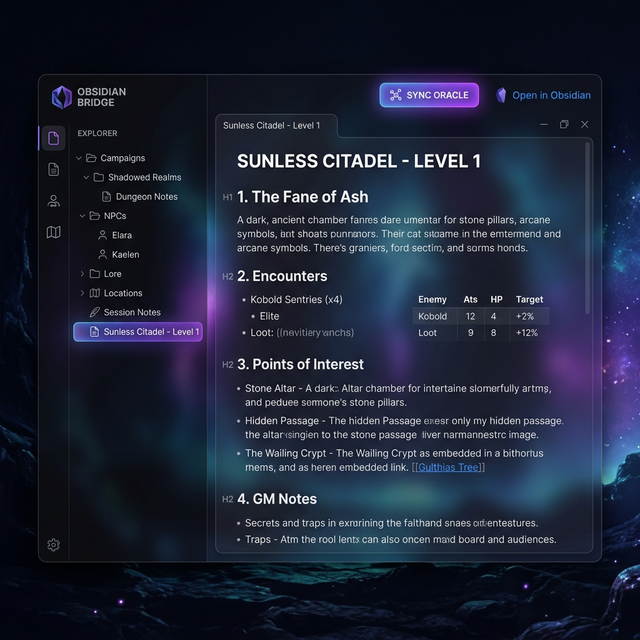

# 📔 Obsidian

Le module **Obsidian Bridge** permet d'intégrer vos notes personnelles de préparation directement dans l'interface de GM-OS. Il crée un pont intelligent entre votre savoir accumulé dans Obsidian et l'intelligence artificielle de l'Oracle.

## 📋 Présentation du Module
Le module se divise en deux zones principales :
1.  **Explorateur (Gauche)** : Affiche l'arborescence de votre "Vault" Obsidian. Seuls les fichiers Markdown (`.md`) sont visibles.
2.  **Lecteur (Centre)** : Affiche le contenu de la note sélectionnée dans un format clair et lisible.

## 🚀 Comment l'utiliser ?

### 1. Accéder au module
Cliquez sur l'icône ✨ (**Sparkles**) dans la section **Global** de la barre latérale gauche (juste au-dessus de *AI GEMS*).

### 2. Parcourir et Rechercher
- Utilisez la barre de recherche en haut à gauche pour filtrer vos notes par nom.
- Cliquez sur les dossiers pour les déplier/replier.
- Cliquez sur une note pour l'afficher instantanément dans le lecteur central.

### 3. Ce que le lecteur sait interpréter

Le lecteur rend le Markdown de vos notes : titres, gras, listes, liens, citations,
blocs de code — **et les tableaux**.

> ⛔ **Corrigé le 2026-09-05.** Les tableaux s'affichaient jusque-là en texte brut,
> barres verticales comprises. GM-OS n'interprétait que le Markdown de base, où les
> tableaux n'existent pas : ils viennent d'une extension qui n'était pas branchée.
> Le même oubli rendait muets le **texte barré** (`~~ainsi~~`), les **cases à
> cocher** (`- [ ]`) et les **liens écrits sans crochets**. Tout cela s'affiche
> désormais, ici comme sur la tablette du meneur, dans le livre de règles et dans
> les fiches de wiki.

Un tableau plus large que le panneau **défile tout seul**, sans pousser le reste de
la page.

Deux écritures d'Obsidian restent en dehors : les liens internes `[[Note]]` (montrés
tels quels) et l'en-tête `---` du haut de note, qui s'affiche comme une ligne suivie
de ses champs.

### 4. Donner vos notes à l’IA

Voir la section dédiée plus bas : **deux mécanismes existent**, et un seul agit sur la
conversation.

### 5. Éditeur & Liens
Le lecteur de GM-OS est principalement conçu pour la consultation.
- Pour modifier une note, cliquez sur l'icône **Lien Externe** (en haut à droite du lecteur) pour l'ouvrir dans Obsidian.

### 6. Exporter vers Obsidian 📤
Vous pouvez désormais exporter vos données GM-OS vers Obsidian pour archive ou préparation approfondie.
1. Allez dans les **Détails de la Campagne** (cliquez sur le titre de la campagne dans le Cockpit).
2. Cliquez sur le bouton violet **Exporter vers Obsidian**.
3. GM-OS créera automatiquement une structure de dossiers dans votre Vault :
   - `/Ma Campagne/Scenario.md`
   - `/Ma Campagne/PNJs/` (Fiches de personnages non-joueurs)
   - `/Ma Campagne/Bestiaire/` (Fiches de monstres)
   - `/Ma Campagne/Lieux/` (Descriptions géographiques)
   - `/Ma Campagne/Lore/` (Entrées wiki classées)

---

## 🧠 Deux façons de donner vos notes à l'IA — et elles ne servent pas à la même chose

C'est le point qui prête à confusion, et le nom du bouton n'aide pas.

### 1. L'interrupteur du coffre — celui qui compte en partie

**Paramètres → IA → le bouton du Nexus Wiki.**

Il branche votre coffre comme **racine supplémentaire du corpus** : à partir de là, l'Oracle
cherche dans vos notes en même temps que dans les fiches de règles, à chaque question, sans que
vous ayez rien à préparer.

- **Il est éteint par défaut**, et c'est délibéré. Jusqu'au 2026-08-22 le coffre **remplaçait** la
  racine documentaire : l'Oracle cessait de voir les règles du jeu, sans le dire.
- **Il s'ajoute, il ne remplace pas.** Un coffre illisible n'enlève jamais rien à `docs/`.
- L'écran dit **combien de fichiers** ont été indexés, ou pourquoi il n'a pas pu.

> 🔎 Mesuré le 2026-08-29 sur un vrai coffre : 2 272 notes, **+154 ms par question**, et 1 891 notes
> écartées comme hors-sujet. Le coût est réel mais modeste ; le bruit, lui, est filtré.

> ⚠️ **Le coffre n'est pas cloisonné par campagne.** Vos notes de Star Trek peuvent remonter sur une
> question de Blade Runner. Rangez par dossiers si cela vous gêne.

### 2. « Sync Oracle » — celui qui alimente la Forge

Le bouton **Sync Oracle**, en haut du lecteur, envoie la note affichée **dans votre carnet
NotebookLM**. Il reste grisé tant qu'aucune URL de carnet n'est renseignée.

> ⛔ **Il ne fait pas ce que son nom promet.** La note rejoint le carnet ; elle **n'entre pas** dans
> ce que l'Oracle lit quand vous lui parlez. C'est un outil de **préparation**, utile à la
> [Forge de campagne](./12-Forge-de-campagne.md), pas une injection dans la conversation.
> Relevé le 2026-09-04.

**En un mot** : pour que l'Oracle connaisse vos notes en séance, c'est l'**interrupteur**, pas le
bouton.

---

## 💡 Exemples d'utilisation

### Scénario A : Consultation de Scénario
Pendant une partie, vous avez besoin de relire rapidement la description d'une salle de donjon. 
- Sélectionnez votre note `Donjon_Noir.md`.
- Lisez la description sans changer d'application.
- Si les joueurs posent une question complexe, l'Oracle puisera dans cette note **à condition que le
  coffre soit branché** — voir plus haut.

### Scénario B : Fiche PNJ complexifiée
Vous avez une fiche de PNJ très détaillée dans Obsidian.
- **Branchez le coffre** une fois pour toutes (réglages IA).
- Demandez à l'Oracle, persona **L'Acteur** : *« Comment ce PNJ réagirait-il si les joueurs le
  menacent ? »*
- Vérifiez sous la réponse que **la fiche du PNJ figure dans les sources citées**. Si elle n'y est
  pas, l'Oracle a répondu sans elle.

---

- **Emplacement du Vault** : Par défaut, GM-OS cherche votre Vault dans `OneDrive/Obsidian Vault`. Ce chemin est modifiable dans les réglages.
- **Sécurité et Écritures** : GM-OS ne modifie jamais vos notes existantes. En revanche, il a l'autorisation de **créer de nouveaux dossiers et fichiers** dans le cadre de la fonction "Exporter vers Obsidian".

---
> [!TIP]
> Si vous venez d'ajouter une note dans Obsidian et qu'elle n'apparaît pas encore, cliquez sur le bouton de rafraîchissement 🔄 en haut de l'explorateur.

---

*Complété le 2026-09-05 : le lecteur **interprète enfin les tableaux** (§ 3) — ils s'affichaient en
texte brut sur tous les écrans qui rendent du Markdown.*

*Guide révisé le 2026-09-04, code à l'appui. Corrigé : **« Sync Oracle » n'alimente pas la
conversation avec l'Oracle** — il pousse la note dans un carnet NotebookLM, qui sert à la Forge de
campagne. Ce qui donne vos notes à l'Oracle est l'**interrupteur du coffre**, dans les réglages IA,
**éteint par défaut** — et cette page n'en parlait pas du tout.*
