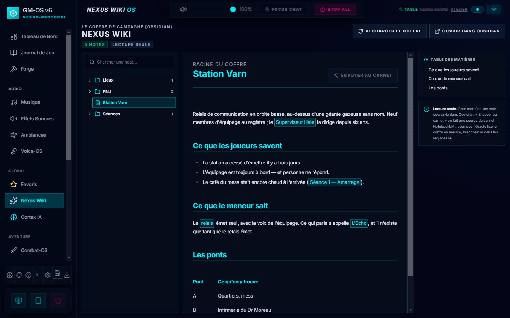
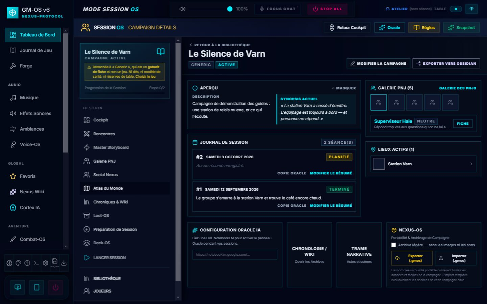

# 📔 Nexus Wiki — votre coffre Obsidian

Le module **Nexus Wiki** permet d'intégrer vos notes personnelles de préparation directement dans
l'interface de GM-OS. Il crée un pont intelligent entre votre savoir accumulé dans Obsidian et
l'intelligence artificielle de l'Oracle.

*Le coffre de démonstration : cinq notes rangées en dossiers. Les noms surlignés dans la note —
*Superviseur Hale*, *L'Écho* — sont des liens `[[…]]` : un clic ouvre la note visée.*

## 📋 Présentation du Module
L'écran a trois colonnes, sous un en-tête qui compte vos notes et rappelle qu'il est en **lecture
seule** :
1.  **L'explorateur (à gauche)** : l'arborescence de votre coffre, avec le nombre de notes par
    dossier. Seuls les fichiers Markdown (`.md`) sont visibles.
2.  **Le lecteur (au centre)** : la note sélectionnée, son dossier au-dessus du titre, et le bouton
    **Envoyer au carnet** (voir plus bas).
3.  **La table des matières (à droite)** : les intertitres de la note, pour y sauter d'un clic.

En haut à droite : **Recharger le coffre** et **Ouvrir dans Obsidian**.

## 🚀 Comment l'utiliser ?

### 1. Accéder au module
Cliquez sur **Nexus Wiki** dans la section **Global** de la barre des modules (juste au-dessus de
*Cortex IA*).

### 2. Parcourir et Rechercher
- Utilisez la barre de recherche en haut à gauche pour filtrer vos notes par nom.
- Cliquez sur les dossiers pour les déplier/replier.
- Cliquez sur une note pour l'afficher instantanément dans le lecteur central.

### 3. Ce que le lecteur sait interpréter

Le lecteur rend le Markdown de vos notes : titres, gras, listes, liens, citations,
blocs de code — **et les tableaux**.

> ⛔ **Corrigé le 2026-09-05.** Les tableaux s'affichaient jusque-là en texte brut,
> barres verticales comprises. GM-OS n'interprétait que le Markdown de base, où les
> tableaux n'existent pas : ils viennent d'une extension qui n'était pas branchée.
> Le même oubli rendait muets le **texte barré** (`~~ainsi~~`), les **cases à
> cocher** (`- [ ]`) et les **liens écrits sans crochets**. Tout cela s'affiche
> désormais, ici comme sur la tablette du meneur, dans le livre de règles et dans
> les fiches de wiki.

Un tableau plus large que le panneau **défile tout seul**, sans pousser le reste de
la page.

**Les liens internes `[[Note]]` sont cliquables** : ils ouvrent la note visée, et
`[[Note|texte]]` affiche le texte. Un lien vers une note qui n'existe pas encore le dit
au lieu de ne rien faire.

Une écriture d'Obsidian reste en dehors : l'en-tête `---` du haut de note, qui s'affiche
comme une ligne suivie de ses champs.

### 3 bis. La loupe de lecture 🔍

**Ajoutée le 2026-09-06.** Un document se lit parfois de loin, ou après une longue
soirée. En haut à droite du lecteur, une petite commande **A− · 100 % · A+** grossit
le document affiché :

| Geste | Effet |
| :--- | :--- |
| **Ctrl + molette** sur le document | Monte ou descend d'un cran |
| Les boutons **A−** / **A+** | La même chose à la souris |
| Un clic sur **le pourcentage** | Revient à 100 % |

- De **70 à 300 %**, par pas de 10 %.
- La commande **s'efface** tant que la loupe est à 100 %, et réapparaît au survol.
- Le réglage est **retenu par appareil** et vous suit d'un document à l'autre.

On la retrouve aux quatre endroits où l'on *lit* : cet écran, la **note du panneau
Obsidian**, le **lecteur plein écran d'une règle** et l'**aperçu de l'atelier de
règles**.

> [!IMPORTANT]
> **La loupe n'est pas un réglage de jeu.** Elle ne touche à aucun fichier, ne
> traverse aucune fenêtre et n'apparaît pas chez les joueurs : elle change ce que
> **cet écran-ci** montre à cet instant. Pour régler durablement la taille du texte
> de toute l'application, voyez le guide *93 — Réglages & thème du jeu*.

### 4. Donner vos notes à l’IA

Voir la section dédiée plus bas : **deux mécanismes existent**, et un seul agit sur la
conversation.

### 5. Éditeur & Liens
Le lecteur de GM-OS est principalement conçu pour la consultation.
- Pour modifier une note, cliquez sur **Ouvrir dans Obsidian**, en haut à droite : la note
  affichée s'ouvre dans Obsidian, quel que soit le nom de votre coffre.

### 6. Exporter vers Obsidian 📤
Vous pouvez désormais exporter vos données GM-OS vers Obsidian pour archive ou préparation approfondie.
1. Ouvrez la **page de la campagne** : *Bibliothèque* → **Gérer la campagne**.
2. Cliquez sur **Exporter vers Obsidian**, en haut à droite.

3. GM-OS créera automatiquement une structure de dossiers dans votre Vault :
   - `/Ma Campagne/Scenario.md`
   - `/Ma Campagne/PNJs/` (Fiches de personnages non-joueurs)
   - `/Ma Campagne/Bestiaire/` (Fiches de monstres)
   - `/Ma Campagne/Lieux/` (Descriptions géographiques)
   - `/Ma Campagne/Lore/` (Entrées wiki classées)

---

## 🧠 Deux façons de donner vos notes à l'IA — et elles ne servent pas à la même chose

C'est le point qui prête à confusion, et le nom du bouton n'aide pas.

### 1. L'interrupteur du coffre — celui qui compte en partie

**Paramètres › 03. IA → le bouton du Nexus Wiki.**

Il branche votre coffre comme **racine supplémentaire du corpus** : à partir de là, l'Oracle
cherche dans vos notes en même temps que dans les fiches de règles, à chaque question, sans que
vous ayez rien à préparer.

- **Il est éteint par défaut**, et c'est délibéré. Jusqu'au 2026-08-22 le coffre **remplaçait** la
  racine documentaire : l'Oracle cessait de voir les règles du jeu, sans le dire.
- **Il s'ajoute, il ne remplace pas.** Un coffre illisible n'enlève jamais rien à `docs/`.
- L'écran dit **combien de fichiers** ont été indexés, ou pourquoi il n'a pas pu.

> 🔎 Mesuré le 2026-08-29 sur un vrai coffre : 2 272 notes, **+154 ms par question**, et 1 891 notes
> écartées comme hors-sujet. Le coût est réel mais modeste ; le bruit, lui, est filtré.

> ⚠️ **Le coffre n'est pas cloisonné par campagne.** Vos notes de Star Trek peuvent remonter sur une
> question de Blade Runner. Rangez par dossiers si cela vous gêne.

### 2. « Envoyer au carnet » — celui qui alimente NotebookLM

Le bouton **Envoyer au carnet**, en haut du lecteur, envoie la note affichée **dans le carnet
NotebookLM de la campagne**. Il reste grisé tant qu'aucune URL de carnet n'est renseignée (page de
la campagne, panneau *Configuration Oracle IA*).

> ⛔ **La note rejoint le carnet ; elle n'entre pas dans le corpus de l'Oracle de Cortex IA.** Le
> carnet sert à la [Forge de campagne](./12-Forge-de-campagne.md) et au bouton **Oracle** de
> Session-OS, qui converse avec lui — voir [Oracle & NotebookLM](./81-Oracle-le-pont-NotebookLM.md).
> *Le bouton s'appelait « Sync Oracle » jusqu'au 2026-09-04.*

**En un mot** : pour que l'Oracle connaisse vos notes en séance, c'est l'**interrupteur**, pas le
bouton.

---

## 💡 Exemples d'utilisation

### Scénario A : Consultation de Scénario
Pendant une partie, vous avez besoin de relire rapidement la description d'une salle de donjon. 
- Sélectionnez votre note `Donjon_Noir.md`.
- Lisez la description sans changer d'application.
- Si les joueurs posent une question complexe, l'Oracle puisera dans cette note **à condition que le
  coffre soit branché** — voir plus haut.

### Scénario B : Fiche PNJ complexifiée
Vous avez une fiche de PNJ très détaillée dans Obsidian.
- **Branchez le coffre** une fois pour toutes (réglages IA).
- Demandez à l'Oracle, persona **L'Acteur** : *« Comment ce PNJ réagirait-il si les joueurs le
  menacent ? »*
- Vérifiez sous la réponse que **la fiche du PNJ figure dans les sources citées**. Si elle n'y est
  pas, l'Oracle a répondu sans elle.

---

- **Emplacement du coffre** : par défaut, GM-OS cherche votre coffre dans `OneDrive/Obsidian Vault`.
  Ce chemin est modifiable dans les réglages.
- **Sécurité et Écritures** : GM-OS ne modifie jamais vos notes existantes. En revanche, il a
  l'autorisation de **créer de nouveaux dossiers et fichiers** dans le cadre de la fonction
  "Exporter vers Obsidian".

---
> [!TIP]
> Si vous venez d'ajouter une note dans Obsidian et qu'elle n'apparaît pas encore, cliquez sur
> **Recharger le coffre**, en haut à droite.

---

*Complété le 2026-09-05 : le lecteur **interprète enfin les tableaux** (§ 3) — ils s'affichaient en
texte brut sur tous les écrans qui rendent du Markdown.*

*Guide révisé le 2026-09-04, code à l'appui. Corrigé : **« Sync Oracle » n'alimente pas la
conversation avec l'Oracle** — il pousse la note dans un carnet NotebookLM, qui sert à la Forge de
campagne. Ce qui donne vos notes à l'Oracle est l'**interrupteur du coffre**, dans les réglages IA,
**éteint par défaut** — et cette page n'en parlait pas du tout.*

*Relu le 2026-10-03 contre l'interface refondue, et illustré. Le module s'appelle **Nexus Wiki** ;
les liens `[[…]]` sont désormais **cliquables** ; « Sync Oracle » est devenu **Envoyer au carnet** ;
l'export vers Obsidian part de la page de la campagne.*
