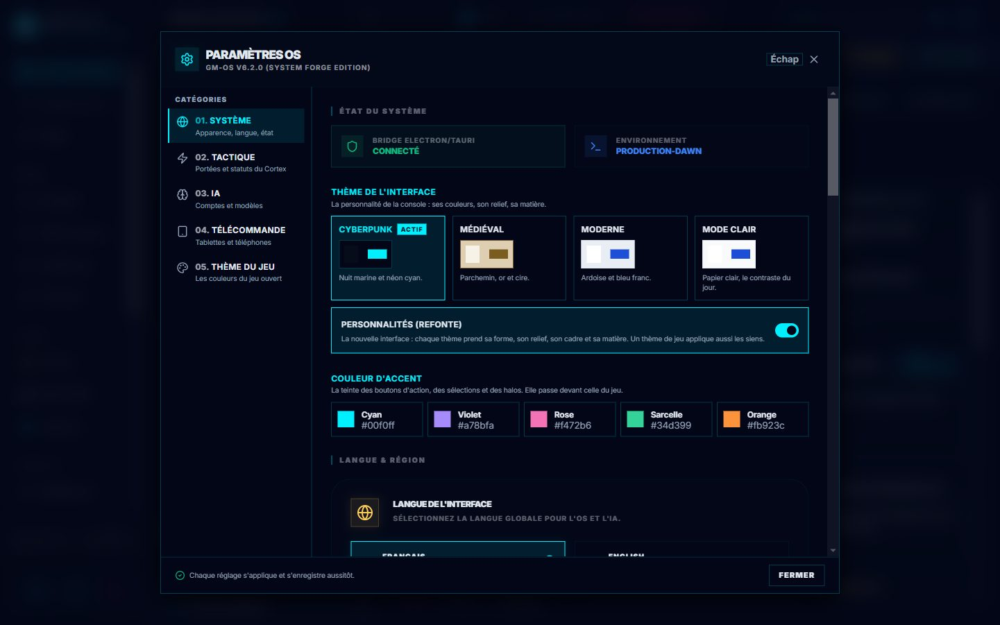
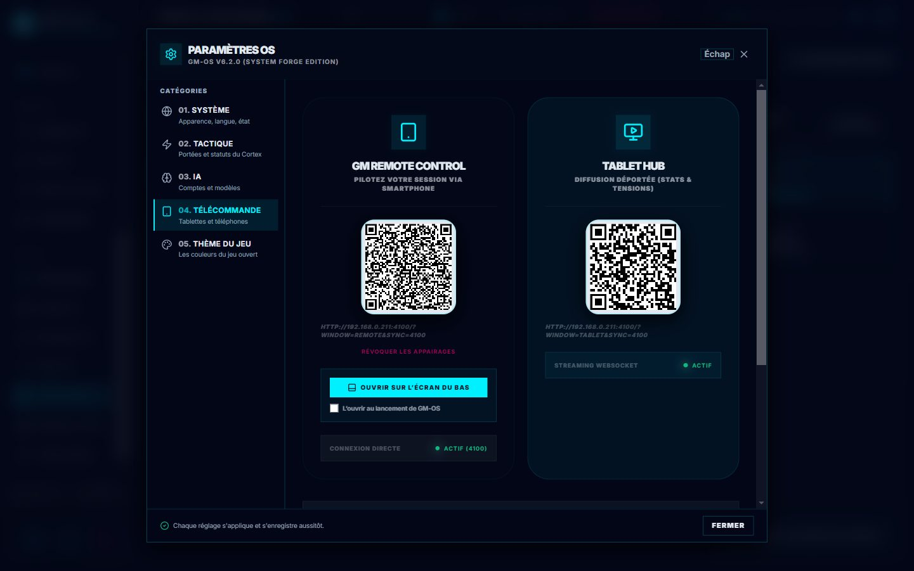
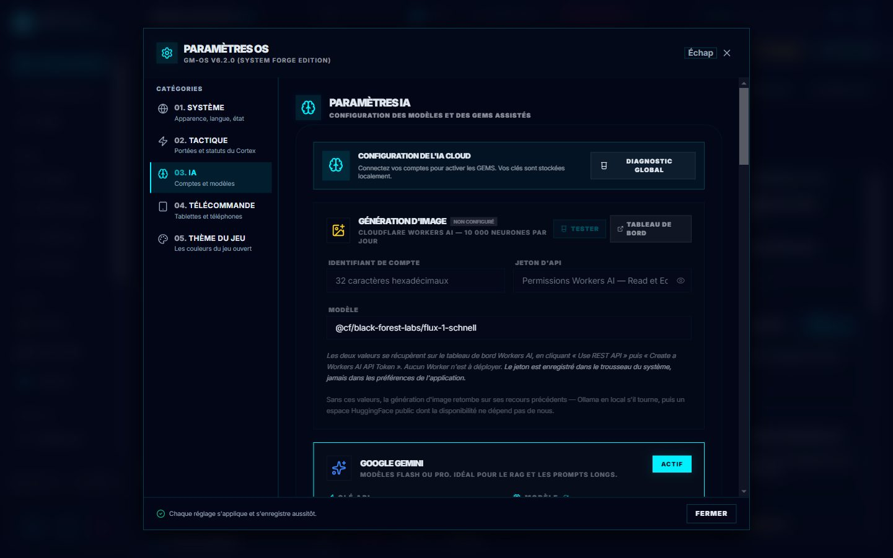

# ⚙️ Paramètres

Le module **Paramètres de l'OS** est le centre de contrôle global de GM-OS. C'est ici que vous configurez l'esthétique de votre interface, votre matériel physique, vos services d'IA et votre **télécommande déportée**.

Il s'ouvre par l'engrenage, parmi les raccourcis en bas de la barre des modules. **Échap** ou
**Fermer** le referme ; chaque réglage s'applique et s'enregistre aussitôt.

| Catégorie | Ce qu'on y trouve |
| :--- | :--- |
| **01. Système** | L'état du système, le **thème de l'interface** et la **couleur d'accent**, la langue, le matériel (*Hardware & Routing* : noms des sorties et des écrans, raccourcis, boutons de l'afficheur), l'intégration Obsidian, la maintenance (dont le nettoyage des médias) et la zone de danger |
| **02. Tactique** | Le Cortex tactique et ses règles → [Cortex](./82-Cortex-OS.md) |
| **03. IA** | Les fournisseurs, les clés et les modèles → [Oracle](./80-Oracle-poser-une-question.md) |
| **04. Télécommande** | Les deux QR codes : votre tablette, et celles des joueurs |
| **05. Thème du jeu** | L'atelier de thème du jeu ouvert (plus bas) |

---

## 🎨 Personnalisation (Look & Feel)
GM-OS s'adapte à l'ambiance de votre table :
- **Thème de l'interface** (*01. Système*) :
    - **Cyberpunk** : nuit marine et néon cyan.
    - **Médiéval** : parchemin, or et cire.
    - **Moderne** : ardoise et bleu franc.
    - **Mode clair** : papier clair, le contraste du jour.
- **Personnalités** : l'interrupteur sous les thèmes. Allumé, chaque thème prend aussi sa forme, son
  relief, son cadre et sa matière — et un thème de jeu applique les siens.
- **Couleur d'accent** : la teinte des boutons d'action, des sélections et des halos — Cyan, Violet,
  Rose, Sarcelle ou Orange. Elle passe devant celle du jeu.

---

## 🖌️ L'Atelier de Thème (onglet **Thème du jeu**)

Chaque jeu peut habiller GM-OS à ses couleurs — et depuis la v6.5, **cela se règle dans l'application** : plus besoin d'éditer un fichier CSS à la main.

> 🎨 **Pour créer un thème de toutes pièces à partir des images d'un jeu**, avec RPG Theme Builder
> dans ChatGPT : voir [Créer un thème de jeu](./95-Creer-un-theme-de-jeu.md). L'atelier sert aux
> retouches.

*L'atelier ouvert sur un jeu qui n'a pas encore de thème : il propose d'en **créer un** — les jetons
seuls. L'aperçu de droite suit chaque réglage ; rien n'est écrit avant **Enregistrer le thème**.*

L'atelier travaille sur le thème du **jeu de la campagne ouverte**, et propose ses réglages en quatre groupes :

| Groupe | Ce que vous y réglez |
| :--- | :--- |
| **Couleurs** | Fond, surfaces, papier, encre, texte, accents, bordures |
| **Polices** | Titres, corps, interface des fiches, chiffres |
| **Tailles** | Le texte d'ensemble, **quatre bandes réglables**, interlettrage des titres et des surtitres |
| **Formes** | Rayons des angles, ombre portée |

### Les tailles de texte, bande par bande

**Ajouté le 2026-09-05, à la demande de David.** Un seul réglage existait — « Échelle du texte » —
et il y en a maintenant cinq :

| Réglage | Ce qu'il redimensionne |
| :--- | :--- |
| **Tout le texte** | L'ensemble. Les quatre suivants s'y **multiplient**. |
| **Étiquettes et badges** | Les petites capitales, les pastilles, les libellés — **la bande la plus dense de l'écran** |
| **Texte courant** | Ce qu'on lit vraiment : notes, résumés, descriptions |
| **Titres et grands nombres** | Les titres de panneau et les grands nombres |
| **Chiffres et code** | Tout ce qui est à chasse fixe : compteurs, jets, minuteurs |

> 🔎 **Pourquoi des bandes et pas « une taille par police ».** Les quatre polices du groupe
> *Polices* choisissent des **familles de caractères**, pas des tailles — et deux d'entre elles ne
> servent qu'aux fiches de personnage. Leur donner un curseur chacune aurait fait **trois contrôles
> sur quatre qui n'agissent sur rien**. Ce qui existe vraiment à l'écran, ce sont ces quatre bandes.

> ⛔ **Et l'ancien réglage ne redimensionnait que la moitié de l'écran.** **1 832 tailles étaient
> écrites en pixels en dur** dans l'interface — `text-[10px]` mille soixante fois — et n'obéissaient
> à aucune échelle. Elles ont toutes été converties le 2026-09-05, **à valeur identique** : rien n'a
> changé d'aspect, mais tout suit désormais vos réglages.
>
> *Le curseur d'avant faisait donc à moitié ce qu'il promettait, et rien ne le disait.*

> ⛔ **Les documents Markdown n'obéissaient à aucune bande — corrigé le 2026-09-06.** Les articles du
> Nexus Wiki, les règles, les notes du coffre Obsidian sont mis en page par un moteur typographique
> qui écrit **ses propres tailles**, ignorant les réglages ci-dessus. On voyait donc les paragraphes
> d'un article grossir pendant que **le tableau juste à côté ne bougeait pas**. Ils suivent
> maintenant la bande **Texte courant** — et un tableau se lit désormais à la taille du texte qui
> l'entoure, au lieu d'être rétréci de 12,5 % comme dans un article de blog.
>
> Pour grossir **un seul document, le temps de le lire**, voyez la **loupe de lecture** (guide
> *84 — Nexus Wiki & coffre Obsidian*) : elle ne touche à aucun réglage de jeu.

### Neuf tailles nommées, de 80 à 200 %

**Depuis le 2026-09-06**, chaque réglage se choisit dans une **liste**, et non plus sur un curseur :

| | | |
| :--- | :--- | :--- |
| Non réglé | Très petit · 80 % | Petit · 90 % |
| **Normal · 100 %** | Grand · 110 % | Très grand · 120 % |
| Énorme · 130 % | Géant · 150 % | **Maximal · 200 %** |

- **« Non réglé »** *efface* le réglage au lieu d'écrire « 100 % » : le jeu retrouve son défaut, et
  le jeton disparaît du fichier. *Ne rien dire et dire « échelle 1 » doivent laisser la même page.*
- Les écarts **s'élargissent en haut** de l'échelle. Dix pour cent de plus sur 190 ne se voit pas,
  là où dix pour cent sur 90 saute aux yeux : c'est le rapport qui compte, pas la différence.
- Un thème réglé avant cette liste — au curseur, à « 107 % » — garde sa valeur, offerte comme
  **« Personnalisé »**. Elle n'est jamais remplacée en silence.

> [!WARNING]
> **200 % est un vrai doublement.** Sur *Tout le texte*, la base de l'application passe de 85 à
> 170 % : des panneaux dimensionnés à l'œil déborderont. Rien n'est perdu — « Non réglé » remet le
> défaut — mais **montez d'abord la seule bande qui vous gêne**, pas l'ensemble.

**Comment ça marche :**

1. Ouvrez les **Paramètres → Thème du jeu**. Si le jeu n'a pas encore de thème, un bouton **Créer un thème** en pose un vierge.
2. Réglez ce que vous voulez : **les changements s'appliquent tout de suite à l'écran**, mais rien n'est écrit tant que vous n'avez pas cliqué sur **Enregistrer**. **Annuler** revient à l'état enregistré.
3. Un **contrôle de contraste** signale les paires texte / fond devenues illisibles.
4. Une **flèche de retour** remet le thème tel qu'il était **avant vos retouches** : la première sauvegarde met le fichier d'origine de côté.

> [!IMPORTANT]
> L'atelier **réécrit les valeurs, jamais le fichier**. Un `theme.css` de jeu contient aussi des centaines de lignes de règles `.rpg-*` qui habillent les **fiches de personnage** : elles sont préservées telles quelles, commentaires compris.

> [!TIP]
> Déposer `docs/systems/<jeu>/theme/theme.css` à la main fonctionne toujours — l'atelier n'a pas remplacé cette porte, il en a ouvert une seconde. Une police Google demandée dans l'atelier est déclarée **et** téléchargée automatiquement.

---

## 📱 GM Remote Control (Télécommande)
Pilotez votre session sans quitter vos joueurs des yeux :
- **Activation** : allez dans **04. Télécommande**.

- **Connexion QR Code** : Scannez le QR Code affiché avec votre smartphone ou tablette.
- **Fonctions mobiles** :
    - **Dés** : Lancez des dés en temps réel.
    - **Sons** : Déclenchez vos pads Sound-OS.
    - **Scènes** : Activez vos séquences Master Storyboard.
    - **Combat** : Suivez l'initiative et gérez les PV des monstres.
    - **Notes** : Lisez vos secrets MJ et le synopsis de session.
- **Diagnostic** : Vérifiez l'état du serveur (Port 3001) et votre adresse IP locale.

---

## 🔊 Hardware & Routing (Audio)
Dans **01. Système**, section *Hardware & Routing*, gérez vos sorties audio physiques :
- **Système d'Alias** : Assignez un nom convivial (ex: "Table Joueurs") à chaque sortie.
- **Actualisation** : Détectez les nouveaux périphériques branchés.

---

## 🖥️ Moniteurs & Projection (Display)
Gérez vos écrans secondaires pour l'immersion :
- **Alias d'Écran** : Nommez vos écrans (ex: "TV Murale") pour savoir où vous projetez vos médias.

> ⭐ **Le nom que vous donnez ici est celui que vous verrez partout ailleurs** : Image-OS, l'atlas,
> les liens web, et le choix d'écran d'un moment de storyboard. Cette page est la seule qui affiche
> en plus l'étiquette du système et la définition — *c'est ici qu'on nomme, il faut donc savoir
> lequel des trois on est en train de nommer.*
>
> ⚠️ **Le nom survit au rebranchement.** Il est rangé sous une signature de l'écran et non sous
> l'identifiant que le système réattribue à chaque branchement — débrancher la TV et la rebrancher
> ne vous fait pas tout renommer.

> ⚠️ **Échap referme cette fenêtre**, comme toutes les autres depuis le 2026-09-13.

---

## 🤖 Intelligence Artificielle (Cloud & Tactical)
Configurez le "cerveau" de votre OS :
- **03. IA** : les fournisseurs de l'Oracle (Ollama, Gemini, OpenAI, Anthropic, une adresse à vous),
  leurs clés et leurs modèles — dont le **modèle de séance** —, la **génération d'image**
  (Cloudflare Workers AI), l'interrupteur du coffre Obsidian, et un **diagnostic global**. Les clés
  vont dans le trousseau de Windows, jamais dans les préférences.
- **02. Tactique** : le Cortex tactique, son interrupteur général et sa taxonomie de règles.

---

## 💾 Sauvegarde automatique — **locale**

GM-OS protège vos campagnes sans action de votre part :

- **Où** : `C:\Projet_David\Security_Backup_GMOS`, **à côté** du dossier de l'application. Les
  **douze** plus récentes sont conservées.
- **Quand** : deux minutes après votre dernier changement, à la fermeture de l'application, avant
  toute suppression de campagne, à la clôture d'une séance.
- **Les images ont un miroir séparé**, incrémental : seules les nouveautés sont copiées.
- **Restaurer reste votre geste** : vous choisissez votre fichier. Rien ne se restaure tout seul.

> ⛔ **Cette section annonçait jusqu'au 2026-09-04 une synchronisation vers une branche GitHub
> `data-sync`, avec restauration automatique au changement de machine. RIEN DE TOUT CELA N'EXISTE**,
> et il ne faut surtout pas compter dessus. Ce mécanisme a **vidé l'installation** en mars 2026 :
> la branche visée étant orpheline, git a supprimé tous les fichiers qui n'y existaient pas. Il a
> été retiré, et **la sauvegarde actuelle n'exécute aucune commande de gestion de version, jamais**.
>
> Pour transporter une campagne d'une machine à l'autre, c'est [Nexus-OS](./90-Nexus-OS-emporter-une-campagne.md).

→ [Guide de la sauvegarde automatique](./91-Sauvegarde-automatique.md)

---

> [!IMPORTANT]
> **Sécurité Réseau** : Pour que la télécommande fonctionne, votre tablette et votre PC doivent être connectés au **même réseau WiFi**.

*Relu le 2026-10-03 contre l'interface refondue, et illustré. Ajouté : la carte des cinq catégories,
le **Mode clair**, l'interrupteur **Personnalités** et les cinq couleurs d'accent. Corrigé : la
section IA citait « Nano Banana » ; la génération d'image passe par Cloudflare Workers AI.*
