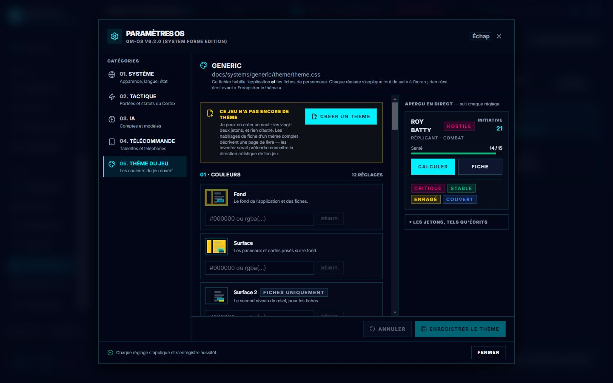

# 🎨 Créer un thème de jeu à partir d'images

> **Pour qui** : le meneur, qui veut habiller GM-OS aux couleurs d'un jeu (Alien, Dune, un jeu
> maison…) à partir de ses livres, de ses captures ou de ses illustrations.
> **Ce qu'il faut** : un compte ChatGPT avec l'assistant **RPG Theme Builder**, et Claude Code
> ouvert sur le dépôt de GM-OS. **Aucune clé d'API OpenAI** : rien n'est facturé à l'usage.
> **Compter** : une demi-heure pour un thème, dont l'essentiel à regarder des captures.

---

## 1 · Le principe, en une image

Trois acteurs, et vous faites le lien entre eux :

```text
   Vous ──── images + demande ────▶ RPG Theme Builder (ChatGPT)
    ▲                                    │  theme.css + intention.md
    │                                    ▼
    │                                  Vous ─ collez la réponse ─▶ Claude Code
    │                                                                │ dépose les fichiers,
    │                                                                │ lance le validateur
    │           refusé : le rapport ◀───────────────────────────────┤
    │           accepté : les captures ◀─────────────────────────────┘ puis la vitrine
    └── vous jugez sur image ; au besoin, retour à ChatGPT
```

| Qui | Fait | Ne fait pas |
| :--- | :--- | :--- |
| **Vous** | Fournissez les images, demandez, jugez sur les captures, décidez | Ranger les fichiers à la main |
| **RPG Theme Builder** (ChatGPT) | Lit vos images et le cahier des charges, écrit `theme.css` et `intention.md`, corrige d'après le rapport | Voir le dépôt, recalculer un contraste que le validateur a mesuré |
| **Claude Code** | Dépose les fichiers **tels quels**, lance le validateur et la vitrine, vous montre le résultat, enregistre (commit) | Retoucher le thème : toute correction repasse par ChatGPT |

> 🔎 **Pourquoi pas d'automatisation entre les deux fenêtres ?** Un assistant ChatGPT ne peut être
> appelé par un programme qu'au travers d'un serveur **public** sur Internet. Ouvrir votre machine
> au monde pour économiser deux copier-coller par tour serait un mauvais échange.

---

## 2 · Une fois pour toutes : l'assistant dans ChatGPT

RPG Theme Builder est un **GPT personnalisé** de ChatGPT. Sa source est rangée dans le dépôt, dans
`outils/rpg-theme-builder/` ; un essai vérifie que ses copies suivent le dépôt.

**Ses instructions** : le contenu de `outils/rpg-theme-builder/skills/instructions/SKILL.md`, à
coller dans le champ des instructions du GPT.

**Ses fichiers de connaissance**, tous dans `outils/rpg-theme-builder/skills/instructions/references/` :

| Fichier | Rôle |
| :--- | :--- |
| `Cahier-des-charges-theme-de-jeu.md` | ⭐ **La source de vérité** : ce que GM-OS lit, ce qu'il refuse. **Contrat v1.4** |
| `RPG_Theme_Builder_Methodologie.md` | La méthode d'analyse visuelle |
| `README.md` et `rpg-core.css` | Le kit de démonstration des thèmes (sans effet dans GM-OS) |
| `alien.css`, `blade-runner.css` | Les deux thèmes de référence **conformes** |

> ⚠️ **À chaque nouvelle version du cahier des charges, remplacez le fichier** dans les
> connaissances du GPT. Claude Code vous le signale quand ça arrive : c'est la seule chose que le
> dépôt ne peut pas faire à votre place. Un GPT qui travaille sur un vieux cahier promet des effets
> que GM-OS n'applique pas, ou en ignore qu'il applique.

---

## 3 · Préparer vos images

Donnez **3 ou 4 images**. Ce qui marche le mieux :

| Image | Ce qu'elle apprend au constructeur |
| :--- | :--- |
| ⭐ **Une page intérieure du livre**, avec du texte, des titres et un encadré | La couleur du papier, de l'encre, des titres, la forme des cadres — **c'est la plus utile** |
| Une **fiche de personnage** ou une page de règles chargée | Les petites capitales, les séparateurs, les chiffres |
| La **couverture** ou une illustration | L'ambiance, l'accent, la lumière |
| Une **capture d'un écran** du jeu (logiciel, site) si elle existe | L'interface telle que l'éditeur l'imagine |

- Des captures d'écran de pages PDF conviennent très bien : pas besoin d'envoyer le PDF entier.
- **Évitez une série d'illustrations seules** : elles donnent une ambiance, pas une interface. Le
  thème sortirait « joli » mais peu lisible.
- Préparez **le nom du dossier du jeu** : c'est celui de `docs/systems/<jeu>/` (par exemple
  `alien`, `blade-runner`, `dune`). Le thème y sera rangé, dans un sous-dossier `theme/`.

---

## 4 · Demander le thème dans ChatGPT

Ouvrez une **nouvelle conversation** avec RPG Theme Builder, joignez vos images, et adaptez :

```text
Construis le thème GM-OS du jeu <Nom du jeu>.
Dossier : <jeu>
Références jointes : <page intérieure>, <fiche>, <couverture>.
Ce que je veux retrouver : <ex. « un terminal de vaisseau sale, vert phosphore, angles vifs »>.
Écran sombre ou clair : <sombre / clair / laisse-moi ton avis>.
```

**Ce que vous devez recevoir** :

1. une phrase qui résume **l'identité** (forme, relief, matière) ;
2. le fichier **`theme.css`** : un bloc `:root[data-theme="<jeu>"]` de jetons `--rpg-*` ;
3. le fichier **`intention.md`** : l'intention en trois phrases, puis les **limites signalées** ;
4. les **ratios de contraste** obtenus, et les **polices approximées** signalées comme telles.

> 💡 Si le GPT pose des questions au lieu de livrer, répondez-y brièvement : il ne le fait que si les
> images ne suffisent vraiment pas.

---

## 5 · Donner le résultat à Claude Code

Copiez la réponse de ChatGPT (ou téléchargez ses fichiers) et donnez-la à Claude Code :

```text
Voici le thème de <jeu> produit par RPG Theme Builder : dépose-le tel quel et valide-le.
```

Claude Code range les fichiers dans `docs/systems/<jeu>/theme/` — `theme.css`, `intention.md`, et
les éventuels `matieres/*.svg` — **sans les retoucher**, puis lance le validateur.

> ℹ️ Les dossiers `theme/` sont exclus de l'index de l'Oracle (`docs/.ragignore`) : un thème ne
> se retrouvera jamais dans une réponse de l'Oracle en pleine partie.

---

## 6 · Le validateur : le contrat, vérifié par du code

```powershell
npm run theme:valider -- <jeu>
```

Il vérifie **tout le cahier des charges** — format, jetons obligatoires, bornes, transparence,
**contrastes chiffrés**, polarité, polices, chemins — et rend un verdict **ACCEPTÉ** ou **REFUSÉ**.
Son rapport range aussi vos jetons :

| Rubrique | Sens |
| :--- | :--- |
| **Appliqués aujourd'hui (LU)** | GM-OS les applique : couleurs, polices, tailles |
| **Appliqués avec les personnalités (LU ⚙)** | Forme, relief, halo, police du corps, verre, matière de fond, cadre — visibles **quand l'interrupteur des personnalités est allumé** (il l'est par défaut) |
| **Annoncés (V2)** | GM-OS les appliquera plus tard. **Leur absence à l'écran n'est pas un défaut** |
| **Sans effet (SDK)** | Ne servent qu'au kit de démonstration |

**S'il est refusé** : Claude Code vous donne le rapport, **prêt à coller**. Dans ChatGPT :

```text
Voici le rapport du validateur GM-OS. Corrige chaque erreur qu'il cite, sans recalculer
les contrastes : lis-les.
<collez le rapport>
```

Puis retour à l'étape 5. Le plus souvent, **un seul aller-retour** suffit.

---

## 7 · La vitrine : voir le thème dans le vrai GM-OS

Claude Code lance deux séries de captures, dans une **copie jetable** de GM-OS (vos données ne sont
jamais touchées) :

| Commande | Ce qu'elle montre | Où |
| :--- | :--- | :--- |
| `$env:GMOS_VITRINE_JEU='<jeu>'; npx playwright test e2e/vitrine.spec.ts` | Le thème sur cinq écrans : cockpit, combat en cours, jet de dés, aide, palette — **sans qu'aucune campagne ne joue ce jeu** | `e2e-resultats/vitrine/<jeu>/` |
| `$env:GMOS_CAMPAGNES='1'; npx playwright test e2e/campagnesEtThemes.spec.ts` | **Chacune de vos campagnes** sous chacun des quatre thèmes de base, personnalités éteintes et allumées, avec une **planche contact** par campagne | `e2e-resultats/campagnes/` |

- Il faut une construction à jour (`npm run build`) — Claude Code s'en charge.
- ⛔ **Le Zenbook doit être l'écran principal**, et vous **ne touchez pas au PC** pendant les
  captures : si la barre des tâches apparaît, Windows rétrécit la fenêtre et les images ne se
  comparent plus.

---

## 8 · Juger, et corriger

Regardez les captures (les planches contact d'abord). Pour chaque remarque, demandez-vous si un
thème **peut** la corriger :

| Classe | Exemple | Suite |
| :--- | :--- | :--- |
| **RÉALISABLE** | « L'accent est trop pâle », « les coins devraient être carrés » | ChatGPT corrige |
| **PARTIELLEMENT RÉALISABLE** | « Il faudrait une vraie texture de papier froissé » | Il approche, et le note dans `intention.md` |
| **NON EXPRIMABLE** | « Le combat devrait être disposé autrement », « ce bouton devrait être rond » | **On s'arrête là** : c'est la mise en page, pas le thème |

Pour faire corriger, joignez les captures dans ChatGPT avec vos remarques :

```text
Voici le thème <jeu> dans GM-OS. Classe chaque remarque (réalisable, partiellement, non
exprimable) avant de corriger :
- <remarque 1>
- <remarque 2>
```

> ⚠️ **Ce qu'un thème ne peut PAS changer.** GM-OS ne lit que les jetons `--rpg-*` du cahier : les
> couleurs, les polices, les tailles, la forme, le relief, le verre, la matière et le cadre. **Aucune
> règle CSS ne l'atteint** — une intention visuelle passe par un jeton, ou elle n'existe pas. Et
> certaines couleurs sont encore **écrites en dur** dans les modules : elles suivront le thème au fil
> de la migration de l'interface (phase 4 de la refonte), pas avant.

---

## 9 · Le thème dans votre GM-OS

**Rattacher une campagne au jeu.** Une campagne trouve son thème par son **jeu** : le pilote de
système qu'elle joue, ou son champ **« Chemin des Règles »** (`systems/<jeu>`), dans la fiche de la
campagne. Rien à faire si la campagne joue déjà ce jeu.

**Rouvrir la campagne.** GM-OS lit le thème **au changement de campagne** : un `theme.css` déposé
pendant que l'application tourne s'applique quand vous rouvrez la campagne.

**Deux interrupteurs pour comparer :**

| Interrupteur | Où | Effet |
| :--- | :--- | :--- |
| 🎨 **Thème du jeu** — par campagne | Le bouton palette sur la **carte de la campagne**, dans le tableau de bord (il n'apparaît que si le jeu a un thème) | Éteint, la campagne garde votre thème de base ; rallumé, le jeu reprend la main. Retenu d'une session à l'autre |
| **Personnalités (refonte)** | Paramètres › 01. Système, sous le choix du thème | Allumé (par défaut), le jeu applique aussi sa forme, son relief, son verre, sa matière et son cadre |

**Retoucher un détail sans ChatGPT.** L'**Atelier de thème** (Paramètres › *05. Thème du jeu*) règle
couleurs, polices et tailles, avec l'aperçu en direct — voir [Paramètres](./93-Reglages-et-theme-du-jeu.md).



> ⚠️ **Deux auteurs pour un même thème se contredisent.** Si vous retouchez dans l'atelier, donnez
> à ChatGPT **le `theme.css` actuel** (Claude Code vous le fournit) avant de lui demander la
> correction suivante : sinon il repartira de sa version, et vos retouches disparaîtront.

**Enregistrer.** Quand le thème vous plaît, demandez à Claude Code de l'enregistrer (commit) : les
essais des thèmes tournent avant chaque envoi.

---

## 10 · Les pièges qu'on paie le plus

| Piège | Ce qui arrive | Le bon réflexe |
| :--- | :--- | :--- |
| ⛔ **La « page de livre »** | Dans GM-OS, le texte est posé **directement sur le fond** (`bg`), pas seulement sur les panneaux : un thème pensé comme une page claire sur une table sombre devient illisible | Le validateur mesure le texte sur `bg` **et** sur `surface`. Quatre des six premiers thèmes sont tombés dedans |
| **Une polarité fausse** | Un thème sombre déclaré clair : listes et champs natifs à contre-jour | Le validateur la vérifie d'après le vrai fond |
| **Une couleur en `rgba()` ou en nom** | Refusée pour le fond, les surfaces, le texte, l'accent, les états | `#rrggbb` uniquement pour ces couleurs |
| **Une police d'un autre site** | Jamais téléchargée : le texte retombe sur la police de repli | Google Fonts ou Bunny Fonts seulement |
| **Une matière en PNG** | Écartée par GM-OS (un message le dit dans la console) | Une matière en **SVG** ou un **dégradé** |
| **Un cadre à moitié déclaré** | `frame-bg` seul : le texte du contenu posé sur le fond du cadre | Déclarer `frame-bg`, `frame-text` **et** `frame-accent`, ou aucun |
| **Un jeton « V2 » invisible** | On croit à un défaut | Ce n'est pas un défaut : le rapport dit lesquels attendent |

---

## 11 · Récapitulatif

1. ☐ Le GPT RPG Theme Builder a le **cahier v1.4** dans ses connaissances.
2. ☐ 3–4 images, dont **une page intérieure**, et le **nom du dossier** du jeu.
3. ☐ ChatGPT livre `theme.css` + `intention.md` + les contrastes.
4. ☐ Claude Code dépose **tel quel** dans `docs/systems/<jeu>/theme/` et valide.
5. ☐ Refusé → rapport collé dans ChatGPT → retour en 4.
6. ☐ Accepté → vitrine et planches contact (Zenbook principal, PC au repos).
7. ☐ Vous jugez ; chaque remarque est classée ; retour en 3 si besoin.
8. ☐ La campagne joue ce jeu ; vous la rouvrez ; les deux interrupteurs pour comparer.
9. ☐ Claude Code enregistre.

→ Pour aller plus loin : le [cahier des charges](../Architecture/Cahier-des-charges-theme-de-jeu.md)
(ce qui est permis) et le [pipeline des thèmes](../Architecture/Pipeline-des-themes.md) (comment on
travaille).

*Relu le 2026-10-03 et illustré : l'atelier de thème, dans Paramètres › 05. Thème du jeu.*
