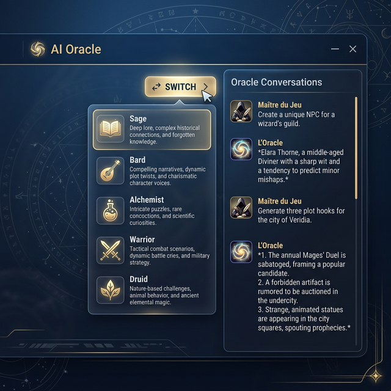

# 🧠 Guide : l'Oracle

L'Oracle est le panneau de conversation de GM-OS. Vous lui posez une question, il cherche la réponse
**dans votre corpus** — les fiches de règles de votre jeu, les notes de votre campagne — et il
répond en vous disant **sur quelles fiches** il s'est appuyé.

---

## ⛔ Ce que l'Oracle n'est pas

> **L'Oracle n'est pas NotebookLM.** Cette page, et celle d'à côté, affirmaient que l'Oracle
> « repose sur la technologie NotebookLM via un pont MCP » et qu'il fallait vérifier un voyant vert
> « Bridged » pour qu'il réponde. **C'est faux, et ça envoyait dépanner le mauvais module.**
>
> NotebookLM existe bien dans GM-OS, mais il sert à **la Forge de campagne**, pour distiller un
> scénario. L'Oracle, lui, parle à l'un des **six moteurs** que vous configurez dans les réglages
> IA. Corrigé le 2026-09-04.

---

## ⚙️ Le moteur

Dans **Paramètres → IA**, vous choisissez le fournisseur :

| Fournisseur | Où tourne le modèle |
| :--- | :--- |
| **Ollama** | Sur votre machine. Rien ne sort de chez vous. |
| **Ollama Cloud** | Le même, hébergé. |
| **Gemini**, **OpenAI**, **Anthropic** | À distance, avec votre clé. |
| **Personnalisé** | Toute adresse compatible OpenAI. |

Un **diagnostic** teste chaque fournisseur configuré. *Attention : la ligne appelée « Oracle » dans
ce diagnostic teste en réalité le pont NotebookLM — celui de la Forge, pas celui de la
conversation.*

---

## 🎭 Les huit personas

Un persona change la voix et le domaine de l'Oracle. Le sélecteur est dans l'en-tête du panneau.

| Persona | Ce qu'on lui demande |
| :--- | :--- |
| 📜 **Le Sage** | Les règles, les statistiques, l'arbitrage technique |
| ✒️ **Le Scribe** | Résumer une séance, ranger des notes, retrouver un fait |
| ✨ **L'Oracle** | Improviser une ambiance, une description, un rebondissement |
| 🎵 **Le Barde** | Le lore, les rumeurs, les légendes, la poésie |
| 🧪 **L'Alchimiste** | Le butin, les objets, les PNJ secondaires |
| 🗺️ **Le Cartographe** | Les lieux, l'architecture, la géographie |
| 👤 **L'Acteur** | Incarner un PNJ : dialogues, motivations |
| ⚔️ **Le Stratège** | La tactique, l'analyse d'un combat, les manœuvres |

> ⛔ **Ils sont huit.** Cette page annonçait « 6 experts », en listait sept, puis parlait de
> « vos 7 GEMS » — trois comptes différents sur une seule page, et aucun juste. **Le Stratège**
> manquait à tous.

### Les adapter à votre jeu

Le bouton **Générer avec l'IA**, dans les réglages d'une campagne ou d'un pilote, réécrit les huit
personas d'après votre système et votre synopsis — l'un après l'autre, pour ne pas les tronquer.

Un persona ainsi configuré porte un badge **SYNC** : il parle avec le vocabulaire de votre jeu.

---

## 📚 Le corpus, et comment l'Oracle le lit

À chaque question, l'Oracle sélectionne les fiches les plus pertinentes de votre corpus et les joint
à la conversation. Trois choses gouvernent ce choix.

### Les racines

Une campagne peut désigner plusieurs racines documentaires. Elles **s'ajoutent** :

- le corpus du **jeu**, sous `docs/` ;
- les notes de la **campagne** ;
- votre **coffre Obsidian**, s'il est branché — voir le [guide Obsidian](./Obsidian_User_Guide.md).

> ⚠️ **Le coffre Obsidian a un interrupteur, et il est éteint par défaut.** Il ne remplace jamais le
> corpus du jeu — mais ce fut le cas jusqu'au 2026-08-22, et le désastre était silencieux :
> l'Oracle cessait de voir les règles sans le dire.

### Le budget

L'Oracle ne peut pas tout emporter : la sélection est plafonnée à **4 000 jetons** de contexte.
C'est une valeur mesurée, pas une commodité — la doubler ajoute presque une minute par question
pour une pertinence qui ne double pas.

*Conséquence pratique : posez des questions précises. « Comment fonctionne la panique ? » remonte
les bonnes fiches ; « parle-moi du jeu » n'en remonte aucune en particulier.*

### Le penchant

Sous chaque réponse, un badge dit comment le tri a été fait :

- **penché règles** — les fiches de règles passent devant ;
- **penché campagne** — les notes de campagne sont mises **à parité** avec elles, et c'est la
  pertinence qui tranche.

Il s'affiche **toujours**, même quand il ne dévie pas : c'est la première chose à regarder devant
une réponse inattendue.

---

## 🔎 L'Oracle cite ses sources — et vous pouvez les corriger

C'est la fonction la plus utile du panneau, et elle n'était documentée nulle part.

Sous chaque réponse s'affiche **le nom de chaque fiche consultée**. Chacune porte son état :

| Marque | Ce qu'elle veut dire | Ce que vous pouvez faire |
| :--- | :--- | :--- |
| **non relue** | Cette fiche a été forgée et jamais vérifiée par un humain | Cliquez pour la **déclarer relue** |
| **relue** | Quelqu'un l'a lue et validée | — |
| **⚑** | — | Cliquez pour **signaler** la fiche comme suspecte |
| **signalée** | Elle a mal répondu ; elle est en file de reforge | Cliquez pour retirer le signalement |

> 🔎 **Signaler ne supprime rien.** La fiche reste en place et continue de servir ; elle est
> seulement mise dans la file de ce qu'il faudra reforger. *Et « signalée » l'emporte sur
> « relue » : une fiche qu'on vient de prendre en défaut n'est plus une fiche validée, quoi qu'on
> ait pensé d'elle avant.*

C'est la boucle qui rend un corpus fiable : l'Oracle répond mal → vous voyez **quelle** fiche l'a
mal renseigné → vous la signalez → elle repasse à la Forge.

---

## 💡 Trois usages

**Arbitrer une règle** — persona **Le Sage** : *« Comment fonctionne la règle de panique ? »* Puis
regardez les sources : si la bonne fiche n'y est pas, le problème est dans le corpus, pas dans le
modèle.

**Improviser** — persona **L'Oracle** : *« Les joueurs entrent dans une taverne mal famée. Décris
l'ambiance et donne-moi le nom d'un client louche. »*

**Incarner un PNJ** — persona **L'Acteur** : *« Prépare une réplique pour Milo, qui vient de se
faire voler sa bourse. »* L'Oracle connaît les PNJ de la session en cours et puise dans leurs notes
d'interprétation.

---

> [!TIP]
> **Videz l'historique entre deux scènes.** Une conversation longue emporte tout son passé dans
> chaque question : elle coûte du budget qui aurait servi à votre corpus, et elle ramène le
> modèle vers ce dont vous parliez il y a une heure.

---

*Guide refait le 2026-09-04, code à l'appui. Deux affirmations fausses retirées — l'Oracle ne
repose pas sur NotebookLM, et il n'y a pas de « voyant vert » à surveiller pour qu'il réponde.
Le compte des personas corrigé (huit, et non six ni sept). Ajouté : les six moteurs, les trois
racines du corpus, le plafond de 4 000 jetons, le **penchant**, et surtout **les sources citées et
leurs marques**, qui n'apparaissaient dans aucun guide.*
