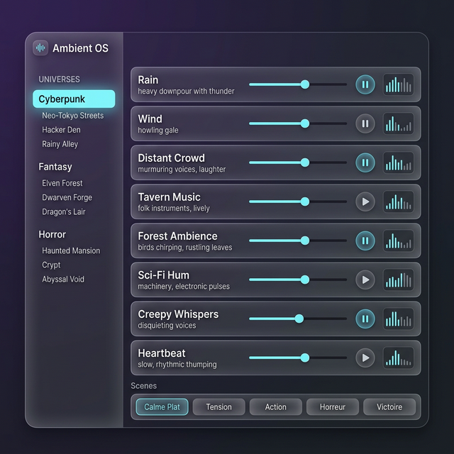

# 🌦️ Guide : Ambient-OS, les paysages sonores

Ambient-OS superpose **huit boucles** indépendantes — pluie, vent, rumeur de foule, drone — pour
fabriquer une ambiance qui n'existe dans aucun fichier. C'est un pupitre de mixage, pas un lecteur.

Trois modules audio, trois usages : [Music-OS](./Music_OS_User_Guide.md) joue des morceaux,
[Sound-OS](./Sound_OS_User_Guide.md) déclenche des coups, Ambient-OS **tient le fond**.

---

## ⚠️ La chose à savoir avant de cliquer sur un thème

**Les thèmes livrés avec GM-OS ne contiennent aucun son.**

Les trois univers d'exemple — *Arcologie* et *Club Néon* en Cyberpunk, *Forêt Enchantée* en
Fantastique — chargent des **pistes nommées et vides** : « Oiseaux », « Ruisseau », « Feuillage »,
avec leur volume et leur couleur, mais **sans fichier audio**. Ce sont des gabarits, pas des
bibliothèques.

Le déroulé réel est donc :

1. Chargez un thème (ou partez des huit pistes vierges).
2. **Attribuez un fichier à chaque piste** depuis le Media Hub.
3. **Enregistrez le thème** : celui-là gardera vos sons, et se rechargera complet.

---

## 🎚️ Les huit pistes

- **Lecture / Pause** par piste. L'entrée se fait en **fondu de 1,5 seconde**, la sortie en
  **1 seconde**.
- **Un curseur vertical** par piste : c'est là que se fait le travail. *Montez le vent, baissez les
  oiseaux, et la tempête arrive sans que rien ne change de fichier.*
- **Un mini-analyseur de spectre** sur chaque piste, pour voir d'un coup d'œil laquelle produit
  effectivement du son.

> 🔎 **Le son est sommé en mono, exprès.** Les deux canaux sont fusionnés avant la sortie. Une
> ambiance n'a pas de scène stéréo à respecter, et vos joueurs ne sont pas assis au point d'écoute :
> la sommation évite qu'une piste s'annule pour celui qui est du mauvais côté de la table.

<!-- -->

> 🔎 **Un compresseur tient la sortie.** Huit boucles à plein volume ne saturent pas.

---

## 📚 Univers et thèmes

Deux niveaux : un **univers** (Fantastique, Cyberpunk, Horreur…) contient des **thèmes** (Forêt
Enchantée, Taverne, Égouts).

- **Enregistrer un thème** capture les huit pistes telles qu'elles sont — fichiers, volumes,
  libellés, couleurs.
- **Charger un thème** remplace les huit pistes… **et ne lance rien**. Vous chargez, vous réglez,
  vous démarrez. C'est délibéré : un thème se prépare avant la scène.
- Vous pouvez créer vos propres univers.

---

## 🎭 Les scènes

Une scène est un **instantané des volumes et des états** des huit pistes — pas des fichiers. Elle
transforme le paysage sans rien recharger.

Trois sont livrées :

| Scène | Ce qu'elle fait |
| :--- | :--- |
| **Calme** | Trois pistes actives, volumes bas |
| **Tension** | Cinq pistes, les drones poussés |
| **Action** | Les huit pistes, presque à fond |

*Le bon usage : préparez le thème d'un lieu, puis trois scènes pour ce lieu — calme, tension,
bagarre. Le lieu ne change pas, son humeur si.*

---

## 💡 Les liens lumineux (Philips Hue)

Chaque piste peut porter une **scène lumineuse**, appliquée quand la piste démarre.

Quand vous arrêtez une piste liée, GM-OS ne laisse pas la lumière en plan : il cherche **une autre
piste allumée qui porte un lien**, et applique la sienne ; s'il n'y en a aucune, il revient à votre
éclairage manuel.

> ⛔ **Correction.** Cette page annonçait une priorité à « la dernière piste **activée** ». Le code
> retient en fait celle qui porte **le numéro de piste le plus élevé** parmi celles encore
> allumées — l'ordre des pistes, pas l'ordre dans le temps. Si la lumière ne revient pas à celle
> que vous attendiez, c'est ça.

---

## 📱 Depuis la télécommande

> ⛔ **Il n'y a pas de pad d'ambiance sur la télécommande.** Cette page promettait un « Toggle
> Intelligent » et un « Auto-Play » qui lanceraient un thème d'une pression. **Ni l'un ni l'autre
> n'existe** — et la grille de pads de la télécommande ne reçoit que **des morceaux de musique et
> des images favorites** : aucune ambiance n'y est envoyée.
>
> *Le code contient bien une branche pour charger un thème depuis un pad ; rien ne peut l'atteindre.*
> Relevé le 2026-09-04, précisé le même jour en passant la télécommande en revue.

Pour lancer une ambiance à distance, le chemin réel est l'onglet **Scénario** : une séquence de
storyboard peut porter une scène d'ambiance, et celle-là part bien.

La **recherche rapide** (Spotlight), elle, sait charger un thème et appliquer une scène.

---

## 🔧 Dépannage

| Problème | Ce qu'il faut regarder |
| :--- | :--- |
| **Un thème livré ne fait aucun bruit** | Normal : les thèmes d'exemple sont des gabarits sans fichiers. Attribuez vos sons, puis enregistrez le thème. |
| **J'ai chargé un thème et rien ne démarre** | Voulu : charger ne lance pas. Démarrez les pistes une à une, ou appliquez une scène. |
| **Je ne trouve pas d'ambiance sur la télécommande** | Il n'y en a pas dans la grille de pads. Passez par l'onglet **Scénario**. |
| **La lumière ne revient pas à la bonne piste** | La reprise choisit le numéro de piste le plus élevé, pas la dernière allumée. |
| **Une piste ne s'entend pas alors que son curseur est haut** | Regardez son analyseur de spectre : s'il est plat, c'est le fichier qui manque ou ne joue pas. |
| **Tout est trop faible pendant une narration** | Le **Focus Chat** est actif : il met les ambiances à 10 %. |

---

## ⚙️ Détails techniques

- **Moteur** : Web Audio, sommation mono, compresseur de sortie.
- **Sources** : fichiers locaux et médias du [Media Hub](./Media_Hub_User_Guide.md).
- **Sortie** : Ambient-OS a sa propre sortie audio, indépendante de la musique.
- **Stop All** : le bouton d'urgence de la [tour de contrôle](./Audio_Master_Guide.md) éteint les
  ambiances en **1 seconde**.

> ⛔ **Correction.** Cette page annonçait un fondu de **2 secondes** au Stop All. C'est la valeur
> par défaut de la fonction, mais le bouton lui en passe une autre : **une seconde**.

---

*Guide refait le 2026-09-04, code à l'appui. Trois affirmations fausses retirées — les thèmes livrés
qui « chargeront des oiseaux et un ruisseau », le fondu de 2 secondes au Stop All, et les deux
fonctions de télécommande qui n'existent pas. Deux précisions ajoutées : la reprise lumineuse suit
le numéro de piste, et la sortie des pistes dure 1 seconde quand l'entrée en dure 1,5.*
