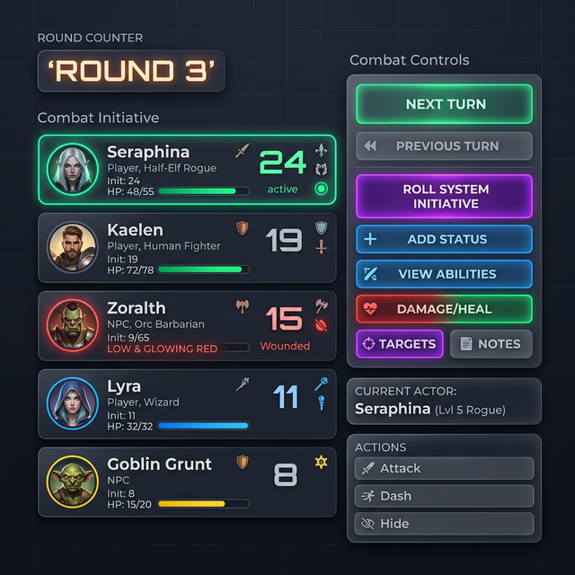

# ⚔️ Guide Utilisateur : Combat OS

Le module **Combat OS** est votre tour de contrôle pour les affrontements. Il automatise la gestion de l'ordre de passage, le suivi de la santé, les effets de statut et synchronise le tout avec le plateau de jeu et la chronologie de votre campagne.

## 📋 Présentation du Module

Combat OS est conçu pour libérer le MJ des calculs fastidieux et du suivi administratif :

1. **Liste d'Initiative** : Visualisez l'ordre des tours de manière claire.
2. **Gestionnaire de Rounds** : Suivi automatique de la progression du temps.
3. **Statuts Intelligents** : Gérez les buffs/debuffs avec gestion automatique des conflits.
4. **Sync PV (Points de Vie)** : Mettez à jour les fiches de personnages et de monstres en un clic.
5. **Rapport de Combat** : Exportez automatiquement un résumé narratif vers votre chronologie.

## 🎲 Lancement de l'Initiative

Vous avez deux méthodes pour définir l'ordre de combat :
- **Manuelle** : Cliquez sur le score d'initiative d'un combattant pour le modifier directement.
- **Jet Système (Auto-Initiative)** : 
    - **Standard** : Lance un dé (configurable, ex: d20) pour tous les combattants ayant une initiative à 0.
    - **Intelligent (Formula)** : Si un système de jeu (Driver) est actif, Combat OS utilise la formule officielle (ex: `1d10 + [DEX]`) ou un système de cartes.
    - **Tri** : Le système trie automatiquement la liste selon les règles du driver (croissant ou
      décroissant).

### ⭐ Quand l'ordre ne se calcule pas : l'alternance

Certains jeux **n'ordonnent pas** leurs combattants. Chez *Dune*, le meneur désigne qui ouvre, puis
les activations **alternent entre les camps** ; un camp peut garder la main en payant.

Un pilote peut donc déclarer un mode **alternance** plutôt qu'une formule. Le combat affiche alors
le **camp qui a la main** — c'est chez lui qu'on choisit le prochain à agir — qui a déjà joué dans
ce round, et combien de tours d'affilée le camp en cours a pris.

- **Garder la main se paie**, sur une réserve de table : deux points d'Impulsion chez Dune, ou deux
  points de Menace concédés au meneur.
- **Le nombre de tours d'affilée est plafonné** par le pilote — chez Dune, deux : *« conserver
  l'initiative est impossible tant qu'au moins un ennemi n'a pas agi ».*

> ⚠️ **Deux camps, pas trois.** Le livre lui-même ne dit pas comment s'organise l'alternance si
> plus de deux camps s'affrontent : les neutres rejoignent donc les adversaires. C'est faux, mais
> **visible** — plutôt qu'un troisième camp qui n'aurait jamais la main.

Sans déclaration, l'ordre reste celui de la formule : **tous les pilotes antérieurs continuent de
fonctionner.**

## 🦶 Déroulement des Tours

- **Tour Suivant / Précédent** : Utilisez les boutons de navigation pour faire défiler le combat.
- **Incrémentation du Round** : Une fois que le dernier combattant a terminé, le round s'incrémente automatiquement.
- **Focus Map OS** : Le pion correspondant au tour actuel est automatiquement mis en surbrillance sur le module **Map OS**.
- **Gestion des Durées** : À chaque nouveau tour d'un combattant, la durée de ses effets de statut diminue de 1 round.

## 🩸 Santé et Statuts

### ⭐ Cinq modèles de santé, pas seulement des points de vie

Tous les jeux ne comptent pas la santé de la même façon. GM-OS en connaît **cinq**, et c'est le
**pilote du jeu** qui décide lequel s'applique :

| Modèle | Ce que l'écran montre | Pour quels jeux |
| :--- | :--- | :--- |
| **Points de vie** (`hp`) | `12/20` | Les jeux à jauge classique. |
| **Horloge** (`clocks`) | `Horloge 3/6` | Vaincre comme une tâche étendue — Dune. |
| **Cases** (`boxes`) | `Cases 2/5` | Les jeux à cases à cocher. |
| **Blessures** (`wounds`) | le nom du palier atteint | Les jeux à échelle nommée. |
| **Anatomie** (`anatomy`) | `2 atteintes` | Les jeux à localisation. |

> ⚠️ **La santé de départ ne vaut pas dix pour tout le monde.** Un pilote peut déclarer **où la
> lire sur la fiche**, en formule : chez *Alien*, la Santé vaut la **Force** du personnage — deux à
> cinq. Sans cette déclaration, chaque écran garde la valeur qu'il fournissait. Idem pour l'horloge
> de Dune, dont le nombre de segments **se lit sur la compétence défensive de la cible**, de quatre
> à huit : un duelliste médiocre et un maître ne tombent pas au même rythme.

Si votre jeu affiche des points de vie là où il devrait afficher autre chose, c'est le **pilote**
qu'il faut corriger, dans la Forge — pas le combat.

### Gestion des Statuts
Ajoutez des icônes et des noms d'effets (ex: *Étourdi*, *En Feu*).
- **Conflits Automatiques** : Le système possède une intelligence métier. Si vous ajoutez le statut "En Feu" à un personnage qui possède le statut "Mouillé", ce dernier sera automatiquement retiré.

### Synchronisation de la santé
Modifiez la santé des participants pendant le combat. Une fois l'affrontement terminé ou pendant
une pause, la synchronisation reporte durablement l'état sur les fiches des personnages joueurs et
des entités de la campagne.

## 📑 Archive et Fin de Combat
Le bouton **"Tout Effacer"** (Fin de Combat) déclenche plusieurs actions de session :
1. **Résumé de Combat** : Génère une entrée dans le Journal listant les rounds écoulés, le nombre de participants, les survivants et les pertes.
2. **Constat de Décès** : Chaque PNJ ayant le statut "Mort" (💀) lors de la fin du combat crée une entrée dédiée dans le Journal et met à jour son statut dans le Session OS.
3. **Log de Session** : Ajoute l'événement à la chronologie de votre session active.
4. **Libération** : Vide la liste pour la prochaine rencontre.

---

## 💡 Astuces pour l'Immersion

> [!TIP]
> **Le Drag-and-Drop** : Vous pouvez réorganiser l'ordre d'initiative manuellement à tout moment en faisant glisser les cartes des combattants, idéal pour gérer les "Hold Actions" ou les changements d'ordre narratifs.

> [!IMPORTANT]
> **Lien Session OS** : Pour que la synchronisation des PV fonctionne, assurez-vous que vos combattants ont été importés depuis le **Session OS** ou le **NPC OS** plutôt que créés manuellement.

---

## ⚙️ Raccourcis Techniques

- **Jet Système** : Utilise le moteur de dés interne (**Dice OS**).
- **Snapshot** : Le combat en cours est sauvegardé en temps réel. Si l'application redémarre, le combat reprend exactement au même round et au même tour.

---

## ⚔️ L'Atelier des adversaires (v6.5)

Le bouton **Fabriquer des adversaires**, sous l'ajout manuel, ouvre un atelier qui **crée** des combattants — pas seulement un nom et une coquille vide.

### D'où viennent les chiffres

**Du gabarit de fiche de votre jeu, et de nulle part ailleurs.** Chaque caractéristique y porte déjà sa valeur ordinaire et son plafond : un adversaire fabriqué est donc dans l'échelle du jeu par construction. Sa santé est ensuite calculée par la formule du pilote, exactement comme pour un personnage.

> [!NOTE]
> Aucun chiffre n'est demandé à l'IA. C'est la leçon la plus chère de ce projet : un modèle qui recopie une table la recopie de travers sans que rien ne le dise. L'atelier tire, le livre décide des bornes.

### Les trois réglages

1. **L'archétype** — Brute, Tireur, Rapide, Meneur, Spécialiste, ou Quelconque pour du figurant. Il décide de ce qui est poussé vers le haut et de ce qui est laissé bas.
2. **Le rang** — Piétaille, Aguerri, Élite, Boss. Il décale les valeurs autour de la moyenne du jeu ; un boss n'est nul nulle part.
3. **Le nombre** — le rang en propose un par défaut (quatre piétailles, un boss).

### Ce que l'atelier a deviné, et que vous pouvez corriger

Sous les archétypes, une rangée de **puces** montre les caractéristiques que GM-OS compte pousser (▲ vert) et négliger (▼ rouge). Elles sont pré-remplies d'après les libellés de votre jeu — *GM-OS ne sait pas lequel de vos champs veut dire « fort »*, il le suppose. Cliquez pour corriger : favorisé → négligé → neutre.

**Votre correction est retenue**, par jeu et par archétype. On ne vous reposera pas la question.

### L'aperçu

Il montre le **premier exemplaire**, pas une moyenne — vous voyez ce que vous allez obtenir. **↻ Relancer** en tire un autre.

### Les trois sorties

| Bouton | Ce qu'il fait |
| :--- | :--- |
| **Envoyer au combat** | Les adversaires entrent directement dans l'ordre du tour, numérotés s'ils sont plusieurs. Rien n'est rangé dans la campagne. |
| **Garder dans la campagne** | Ils deviennent des PNJ avec leur fiche — réutilisables, projetables au Player Hub. |
| **Au bestiaire** | Range le modèle (pas les exemplaires) pour le retrouver plus tard. |

### Revoir la fiche d'un adversaire

Chaque carte de combat porte un bouton **Fiche** : il ouvre, **en lecture**, toutes les caractéristiques du combattant rangées par section du gabarit de votre jeu.

Il fonctionne pour **tous** les combattants, et le pied de la fiche dit d'où viennent les valeurs :

| Ce qui est écrit | Ce que ça veut dire |
| :--- | :--- |
| *Valeurs lues sur la fiche de campagne* | Un PJ ou un PNJ enregistré : sa fiche est la source, et elle est à jour. |
| *Valeurs portées par le combattant* | Un adversaire fabriqué, qui n'existe que sur ce plateau. Si vous voulez le garder, refabriquez-le avec **Garder dans la campagne**. |

Un champ jamais rempli s'affiche **—** et non **0** : *un zéro se lit comme une valeur du jeu, et ferait croire à un adversaire incapable.*

> [!NOTE]
> La fiche est en lecture seule à dessein. Les jauges de la carte de combat se modifient déjà d'un clic ; deux endroits pour changer la même valeur finissent toujours par ne plus être d'accord.

**Deux boutons en pied de fiche**, pour garder un adversaire qui vous plaît :

| Bouton | Ce qu'il range, et sous quel nom |
| :--- | :--- |
| **Au bestiaire** | Le **modèle**, pour le refabriquer plus tard. Le numéro d'exemplaire est retiré : « Tireur 2 » devient « Tireur ». Son archétype et son rang voyagent avec lui — la Fabrique s'en souvient. |
| **Dans la campagne** | L'**individu**, avec son nom complet et ses points de vie actuels. Le combattant du plateau est ensuite **rattaché** à cette fiche : c'est la même créature, pas une copie qui divergerait au premier coup encaissé. |

> [!TIP]
> Le second bouton disparaît pour un PJ ou un PNJ déjà enregistré — les verser en campagne fabriquerait un doublon d'eux-mêmes.

### Le bestiaire

**Où il se trouve — deux portes :**

1. **Combat-OS → colonne de droite → ⚔ Fabriquer des adversaires**, puis l'onglet **Bestiaire** en haut de la fenêtre. Il porte le nombre de gabarits rangés pour le jeu en cours. C'est la porte de la séance.
2. **Librairie de Modèles → onglet Drivers → sélectionnez un jeu → bouton BESTIAIRE.** C'est la porte de la préparation, et elle ouvre le bestiaire **du pilote sélectionné** — pas celui de la campagne ouverte, s'ils diffèrent.

On y relit chaque gabarit — son archétype, son rang, les valeurs saisies —, on le **renomme** (crayon), on l'**oublie** (corbeille), ou on **fabrique depuis lui** d'un bouton, ce qui bascule sur l'onglet *Fabriquer* avec la bonne source déjà choisie.

Dans l'onglet *Fabriquer*, les mêmes gabarits apparaissent en puces ambrées sous les archétypes : c'est le **sélecteur**, pour choisir une source sans quitter le flux. L'onglet, lui, est la **bibliothèque**.

> [!NOTE]
> Renommer un gabarit avec un nom déjà pris **dans le même jeu** est refusé et vous le dit — sinon l'autre disparaîtrait en silence. Le même nom dans un autre jeu ne pose aucun problème.

Un gabarit rangé **appartient au jeu, pas à la campagne** : votre pillard de Blade Runner resservira dans la campagne suivante. Un même nom pour un même jeu **remplace** l'ancien plutôt que d'empiler des doublons.

**Les bestiaires sont étanches d'un jeu à l'autre**, et à tous les niveaux : la liste, le remplacement sur le même nom, le refus d'un renommage en doublon, et jusqu'à vos corrections ▲▼ des caractéristiques. Un gabarit d'Alien ne s'affichera jamais dans une partie de Blade Runner — ses valeurs sont dans une autre échelle, il serait injouable sans que rien ne le signale.

**Il voyage avec son jeu.** Exporter un pilote en `.gmos-driver` (bouton *Exporter* de la Librairie de Modèles) emporte son bestiaire ; l'importer le verse chez le destinataire, rangé sous le pilote importé. Réimporter deux fois le même fichier ne fabrique pas de doublons, et un bundle exporté avant le 03/09/2026 — qui n'en contient pas — s'importe sans rien effacer.

> [!TIP]
> **Reforger un jeu ne perd pas son bestiaire.** La Forge enrichit le pilote existant au lieu d'en créer un second, et le bestiaire suit son identifiant.

> [!NOTE]
> En revanche, **deux campagnes du même jeu partagent le même bestiaire**. C'est voulu : un pillard est un pillard. Il n'y a pas de bestiaire propre à une campagne.

Quand vous fabriquez depuis un gabarit du bestiaire, **ce que vous y avez saisi passe par-dessus le tirage**, champ par champ : ce que vous avez décidé est une décision, le reste est un remplissage. Les caractéristiques que vous n'avez pas fixées varient donc d'un exemplaire à l'autre — trois gardes du même modèle ne sont pas trois jumeaux.

> [!TIP]
> Le bestiaire entre dans la sauvegarde automatique, avec vos corrections de répartition.
