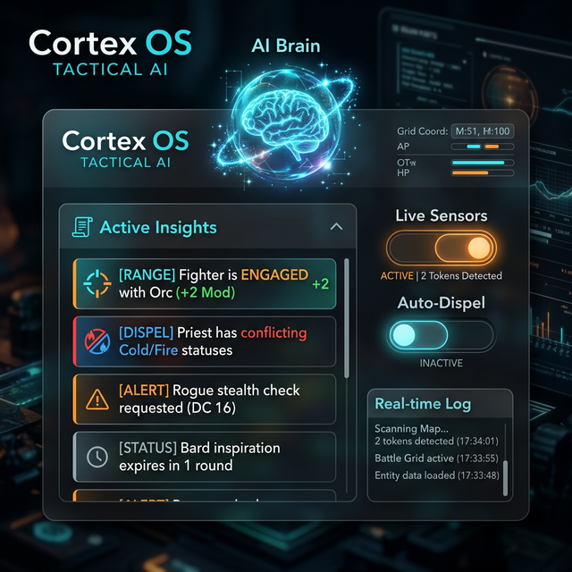

# 🧠 Guide Utilisateur : Cortex OS (Tactical AI)

**Cortex OS** est le "cerveau" invisible de GM-OS. C'est un moteur d'analyse en temps réel qui surveille votre table de jeu pour vous fournir des conseils tactiques, automatiser les règles complexes et orchestrer l'immersion matérielle (lumières et sons).

## 📋 Présentation du Module

Cortex OS agit comme un assistant expert à vos côtés :

1. **Analyse de Proximité** : Calcule les distances entre les pions et applique les modificateurs de portée.
2. **Smart Dispel** : Détecte les conflits d'états (ex: un personnage en feu qui devient mouillé).
3. **Orchestration Immersive** : Pilote vos lampes Philips Hue et vos sons d'ambiance selon l'action.
4. **Insights Tactiques** : Propose des rappels de règles et des **Analyses de Groupe** (Détection de flanquement, suggestions de repli coordonné).

## 🛰️ Capteurs et Interface (Widget Horizontal)

Le panneau de contrôle Cortex se présente désormais sous la forme d'un widget horizontal discret en bas de l'écran (ou via l'icône Brain) :

- **Live Sensors (ON/OFF)** : Active ou désactive l'analyse en temps réel. En mode "Muted", l'IA ne fera aucune suggestion et ne touchera pas au matériel.
- **Auto-Dispel** : Si activé, l'IA nettoiera automatiquement les statuts incompatibles. Sinon, elle se contentera de vous suggérer l'action via un "Insight".
- **Intensité AI** : Règle la fréquence et la "sensibilité" des analyses.

## 📏 Calculateur Tactique Universel

Cortex OS utilise le module **Map OS** pour mesurer les distances :
- **Portées Dynamiques** : Selon le système de jeu (Driver) sélectionné, l'IA traduit les pixels en unités (cases, mètres, pieds) et identifie la catégorie de portée (CàC, Courte, Moyenne, Longue, Extrême).
- **Calcul de Modificateurs** : Si un attaquant est à portée "Longue", Cortex affiche immédiatement le malus associé dans la liste des **Insights Actifs**.
- **Mise à Jour au Déplacement** : Dès que vous lâchez un pion sur la carte, Cortex scanne son nouvel environnement.

## 🎭 Immersion Automatisée (Taxonomy)

C'est ici que la magie opère. Cortex possède un dictionnaire (Taxonomy) qui lie des concepts de jeu à des effets réels :

- **Mots-Clés Visuels** : Si un PNJ gagne le statut "Inconscient", Cortex peut automatiquement tamiser les lumières Philips Hue en bleu sombre.
- **Effets Sonores Tactiques** : Si un personnage entre en portée de "Contact" avec un ennemi, l'IA peut déclencher un son d'alerte de proximité ou de tension.
- **Flash de Combat** : Un bouton manuel permet de simuler un éclair ou une explosion via vos lumières connectées pour ponctuer un moment dramatique.

## 📜 Journal d'Analyse (Analytics)

Au bas du panneau Cortex, vous trouverez les **Recent Analytics**. Ce log technique vous montre ce que l'IA "voit" :
- *"Scan terminé : 4 pions détectés."*
- *"Alerte : Le Guerrier est à portée de corps à corps du Gobelin."*
- *"Nettoyage : Statut 'Froid' retiré (conflit avec 'En Feu')."*
- *"Tactique : Alerte de Flanquement détectée sur le Flanc Droit !"*

---

## 💡 Astuces pour l'Expertise

> [!TIP]
> **Le Player Hub est informé** : Certaines analyses de Cortex (comme les catégories de portée) peuvent être transmises au Hub Joueur pour les aider à anticiper leurs malus de tir avant même de lancer les dés.

> [!IMPORTANT]
> **Dépendance Hardware** : Pour profiter pleinement de Cortex OS, vos lumières **Philips Hue** doivent être appairées dans le module **Light OS** et vos banques de sons tactiques doivent être présentes dans le dossier `assets/sounds/tactical`.

---

## ⚙️ Détails Techniques

- **Moteurs Supportés** : OpenAI (GPT-4) et Google Gemini sont configurables pour des analyses narratives encore plus poussées (optionnel).
- **Mise à Jour** : L'analyse se déclenche automatiquement à chaque changement de tour dans le **Combat OS** ou à la fin d'un déplacement sur **Map OS**.
