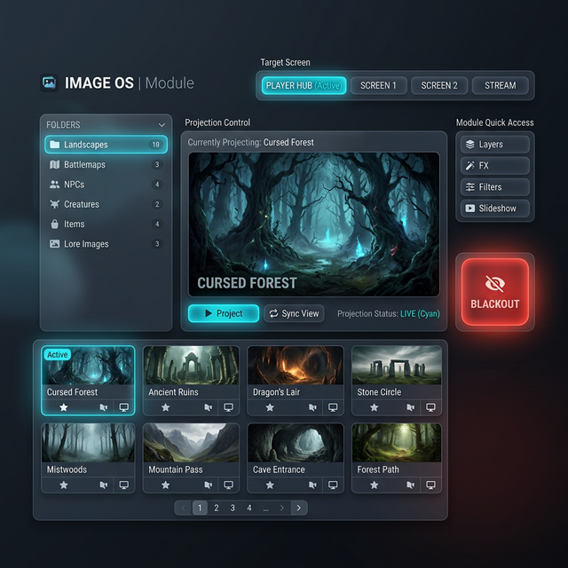

# 🖼️ Guide Utilisateur : Image OS

Le module **Image OS** est votre régie visuelle. Il vous permet de projeter des illustrations, des portraits de PNJ, des cartes ou des ambiances visuelles sur différents écrans (Hub Joueur, Moniteurs secondaires, Vidéoprojecteurs) pour renforcer l'immersion de vos joueurs.

## 📋 Présentation du Module

L'interface est divisée en trois zones principales :

1. **La Bibliothèque (Explorer)** : Gérez vos images avec un système de dossiers et de favoris.
2. **Le Sélecteur de Cible (Target)** : Choisissez sur quel écran projeter votre média.
3. **Le Contrôle de Projection** : Lancez des images isolées, des séquences ou coupez tout en un clic.

## 🚀 Projection et Gestion des Écrans

### Choisir sa Cible (Target Screen)

En haut de l'interface, vous pouvez sélectionner l'écran de destination :

- **Player Hub** : Envoie l'image vers l'application "Hub" des joueurs (fenêtré).
- **Displays (1, 2, etc.)** : Envoie l'image en plein écran sur vos moniteurs physiques connectés à l'ordinateur.

### Modes de Projection

- **Transitions Fluides (v5.3)** : La projection d'une image n'est plus brutale. Le système effectue désormais un fondu au noir (Fade Out) suivi d'une apparition progressive (Fade In). Ce rendu premium garantit une immersion cinématique sans "flash" visuel.
- **Solo (Régie unifiée v6)** : Un simple clic sur une image l'envoie instantanément sur l'écran cible. La fiabilité a été portée à 100% : l'image s'affiche désormais dès la première sélection sans nécessiter de second clic, même si la fenêtre vient d'être ouverte.
- **Synchronisation Automatique** : Si vous ouvrez un écran de projection (Moniteur 1, 2) alors qu'une image est déjà active pour cette cible, l'image s'affichera automatiquement dès l'ouverture de la fenêtre.
- **Diaporama (Sequence)** : Cochez les cases "Sequence" sur vos images, puis lancez le diaporama via le bouton **DIAPORAMA** en haut à droite.
  - **Navigation** : Utilisez les flèches **Précédent** et **Suivant** à côté du bouton pour faire défiler manuellement votre séquence.
- **Entity (NPC/PC)** : GM-OS projette une fiche complète (nom, portrait, stats publiques) vers le Player Hub en mode "Diorama" tout en affichant l'image brute sur vos écrans secondaires.
- **Mode Standby** : Lorsqu'aucune image n'est projetée sur un écran, celui-ci affiche un texte discret "EN ATTENTE" (Standby), garantissant que l'écran reste actif sans polluer l'immersion avant le début d'une scène.

## 📁 Organisation de la Bibliothèque

Pour ne pas perdre de temps à chercher une image en plein combat :

- **Dossiers** : Créez une structure claire. Les dossiers sont rechargés automatiquement d'une session à l'autre.
- **Favoris (⭐)** : Marquez vos images les plus utilisées pour un accès rapide.
- **Séquence** : Marquez les images pour votre scène actuelle afin de les projeter en un clic via le diaporama.

## 🛑 Contrôle de Sécurité (Blackout)

La gestion visuelle est sensible (spoilers). Image OS propose une synchronisation parfaite du blackout :

- **Target Blackout** : Éteint l'image sur l'écran cible sélectionné. Sur un **Moniteur**, la fenêtre se ferme complètement pour libérer votre bureau. Sur le **Player Hub**, l'image s'efface simplement pour rester prête à la prochaine diffusion.
- **Global Blackout (🔴 ALL)** : Coupe instantanément TOUTES les projections sur TOUS les écrans et ferme toutes les fenêtres de projection secondaires. Indispensable pour masquer une carte secrète ou finir une scène sur un écran noir dramatique.

---

## 💡 Astuces pour l'Immersion

> [!TIP]
> **Le Player Hub Dynamique** : Contrairement aux écrans secondaires qui n'affichent que l'image brute, le **Player Hub** peut recevoir des entités riches. Si vous projetez un PNJ via le module NPC OS, Image OS affichera non seulement son portrait mais aussi son ambiance dédiée si elle est configurée.

> [!IMPORTANT]
> **Snapshots** : L'état de vos projections (quelle image est sur quel écran) est enregistré dans votre session. Si vous fermez et rouvrez GM-OS, vos écrans se rallumeront exactement là où vous les aviez laissés.

---

## ⚙️ Configuration Technique

- **Multi-Écrans** : Le module détecte automatiquement le nombre de moniteurs branchés via le `appBridge`.
- **Formats Supportés** : PNG, JPG, WEBP, et même les GIF animés pour des ambiances vivantes.
- **Performance** : Les images sont pré-chargées pour éviter tout délai lors de la projection.
