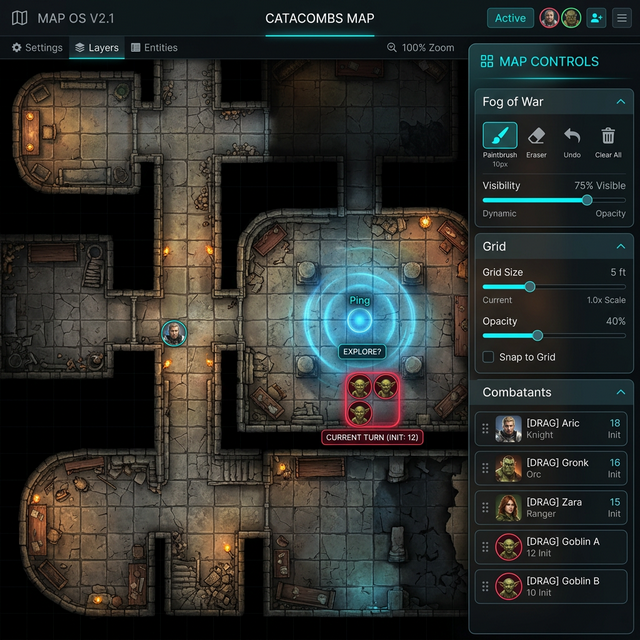

# 🗺️ Guide : Map-OS, le plateau tactique

> Dans l'application, ce module s'appelle **Plateau Tactique**. « Map-OS » est son nom dans le code
> et dans cette documentation.

Map-OS est la carte que vous montrez à vos joueurs : un plan, des pions, du brouillard de guerre, et
tout cela dupliqué en direct sur leur écran. Ce guide dit **ce que chaque geste fait réellement**,
et surtout **ce qui part chez les joueurs et ce qui reste chez vous** — c'est la seule question qui
compte en séance.

---

## 🚀 Le premier plateau, en cinq gestes

1. **Importer Média** (panneau latéral, en haut) — ouvre la bibliothèque du **Media Hub**. Images
   **et vidéos** sont acceptées.
2. **Grille Tactique** — activez-la, puis réglez la **taille de case** jusqu'à ce que le quadrillage
   colle au dessin de la carte.
3. **Pions du Combat** — tous les combattants de Combat-OS apparaissent dans la liste du bas. Le
   bouton **+** les pose sur la carte.
4. **Outils Fog of War** — la carte est **entièrement noire** au départ. Choisissez **Révéler**,
   prenez le **Pinceau** ou une **Zone**, et dégagez la première pièce.
5. **Projeter la Carte** — choisissez le Player Hub ou un moniteur.

Tant que vous n'avez pas cliqué sur *Projeter*, **rien ne part chez les joueurs**. Vous pouvez tout
préparer à froid.

---

## 🌫️ Le brouillard de guerre

### Les deux modes

| Mode | Effet |
| :--- | :--- |
| **Révéler** | Le pinceau et les formes **retirent** le brouillard. |
| **Masquer** | Le pinceau et les formes en **rajoutent** — pour refermer une pièce ou corriger un débordement. |

### Les outils de tracé

- **Pinceau** — tracé libre, pour suivre un couloir.
- **Zone** (rectangle) et **Rond** (cercle) — cliquez-glissez : une pièce entière ou un rayon de
  lumière d'un seul geste.

### Les deux commandes globales

**Tout révéler** et **Tout masquer** demandent confirmation, parce qu'elles sont irréversibles.

> ⚠️ **« Tout révéler » est un bouton d'atelier.** En **régime de table** (séance ouverte), il se
> replie derrière la même protection que les autres gestes destructeurs du module — c'est le
> comportement voulu : on ne révèle pas une carte entière par un clic malheureux à trois heures du
> matin.

### Ce qu'il faut savoir, et qui ne se devine pas

> 🔎 **Votre brouillard est translucide, celui des joueurs est opaque.**
> Sur votre écran le calque est à **80 %** : vous voyez à travers, en sombre. Sur l'écran des
> joueurs il est à **100 %** : ils ne voient rien. Ce n'est pas un réglage, c'est câblé — et c'est
> ce qui vous permet de viser un pion que les joueurs n'ont pas encore découvert.

<!-- -->
> 🔎 **Le masquage est physique.** Le calque de brouillard est posé **au-dessus** des pions, de la
> magie et des zones de danger (`z-index: 20`). Il n'y a aucun calcul de visibilité : ce qui est
> sous le noir est caché, point. *Si un pion ne se voit pas chez les joueurs, cherchez d'abord s'il
> n'est pas sous une zone non révélée.*

<!-- -->
> 🔎 **Un ping traverse le brouillard.** Les pings sont dessinés **au-dessus** du calque. Signaler
> un point dans une zone non révélée montre le cercle aux joueurs — sur du noir.

### La persistance

Le brouillard est enregistré **par carte**, dans la base locale du navigateur (IndexedDB), sous
l'adresse du média. Conséquences :

- Vous pouvez préparer le brouillard de trois cartes à l'avance et basculer de l'une à l'autre.
- Après un redémarrage, chaque carte retrouve son état exact.
- **Toute carte jamais explorée démarre en noir complet**, chez vous comme chez les joueurs. C'est
  une sécurité : aucune fuite possible en chargeant un plan pendant la partie.

---

## 🎞️ Les sept calques

Le panneau **Gestion des Couches** éteint et rallume des familles d'éléments. Mais **tous ne se
comportent pas pareil**, et c'est le piège du module :

| Calque | Éteindre le calque… |
| :--- | :--- |
| **Brouillard de Guerre** | …ne dégage **que votre écran**. Les joueurs restent dans le noir. |
| **Grille Tactique** | …ne retire la grille **que chez vous**. |
| **Pions & Acteurs** | …ne les cache **que chez vous**. |
| **Effets Magiques** | …ne les cache **que chez vous**. |
| **Zones de Danger** | …ne les cache **que chez vous**. |
| **Climat & Météo** | ⛔ **…coupe la pluie sur les DEUX écrans.** |
| **Ambiance & Heure** | ⛔ **…retire la teinte du jour sur les DEUX écrans.** |

> ⛔ **Correction d'une affirmation fausse.** Cette page et le guide des calques annonçaient jusqu'au
> 2026-09-04 que le panneau agissait « sans affecter la projection des joueurs ». **C'est vrai pour
> cinq calques sur sept, et faux pour les deux derniers.** Éteindre *Climat & Météo* ou
> *Ambiance & Heure* les éteint aussi chez les joueurs — ce qui est d'ailleurs souvent ce qu'on
> veut, mais il fallait le dire.

Le premier calque est celui qui sert le plus : **éteignez votre brouillard** pour placer vos pions
et vos zones sur la carte entière, rallumez-le, et jouez. Les joueurs n'ont rien vu.

> ⚠️ **Le pied du panneau annonce « Les réglages sont sauvegardés par carte ». Ils ne le sont pas.**
> L'état des sept calques est **unique et global** : il suit l'application, pas la carte.

---

## 📏 La grille

- **Taille de Grille** — le côté d'une case en pixels de l'image. C'est le seul réglage à ajuster
  avec soin : il conditionne l'alignement des pions.
- **Opacité** — pour que le quadrillage se voie sans écraser le dessin.

> ⛔ **Il n'y a pas de réglage de couleur.** Cette page en promettait un (« blanc / noir ») : il
> n'existe dans aucun écran. La grille est **blanche**, et son opacité est le seul moyen de
> l'atténuer.

La grille suit la projection : taille, opacité et activation partent chez les joueurs.

---

## ♟️ Les pions

### Les poser

Map-OS ne crée pas de combattants : il affiche ceux de **Combat-OS**. La liste **Pions du Combat**
reprend l'ordre d'initiative en cours ; le bouton **+** pose le combattant sur la carte, et l'icône
change quand il y est déjà.

*Taille et statistiques d'un pion se modifient depuis Combat-OS, pas ici.*

### Les manipuler

Sélectionnez l'outil **Pions**, puis glissez. Un clic droit sur un pion ouvre ses trois gestes :

| Geste | Effet |
| :--- | :--- |
| **Cacher aux Joueurs** | Le pion disparaît **de l'écran des joueurs**. Chez vous il reste, en grisé translucide. |
| **Montrer aux Joueurs** | L'inverse. |
| **Supprimer le Pion** | Il quitte la carte (pas le combat). |

Un combattant frappé d'un statut d'invisibilité dans Combat-OS est traité de la même façon,
automatiquement.

> ⭐ **Vos joueurs peuvent déplacer les pions depuis leur tablette.** Tout pion visible sur l'écran
> projeté est saisissable — **y compris les vôtres**. Un verrou de cinq secondes empêche deux
> personnes de tirer le même pion en même temps ; celui qui n'a pas la main voit le pion terni et ne
> peut pas le prendre. Si ce n'est pas ce que vous voulez pour votre table, la seule parade
> aujourd'hui est de ne pas projeter la carte pendant les déplacements.

### Vider la carte

**Vider la carte** retire tous les pions d'un coup, avec confirmation et le compte à l'appui. Comme
« Tout révéler », ce bouton se replie en régime de table.

---

## ✨ Les effets magiques

Un module à part entière, que cette page passait sous silence.

Sélectionnez l'outil **Magie**, choisissez un **type** parmi sept — **Feu**, **Glace**, **Acide**,
**Élec**, **Arcane**, **Noir**, **Poison** — et une **forme** parmi quatre : **Sphère**, **Zone**,
**Ligne**, **Cône**. Puis cliquez-glissez sur la carte.

> 🔎 **La direction du glissement oriente l'effet.** Pour une **Ligne** et un **Cône**, l'angle est
> calculé depuis le point de départ vers le point d'arrivée : partez du lanceur et tirez vers la
> cible, le cône pointe tout seul dans le bon sens. Pour une **Sphère** et une **Zone**, le
> glissement ne règle que la taille.

- La liste **Effets actifs** compte ce qui est posé et permet de retirer un effet à la fois.
- **Clic droit sur un effet** (avec l'outil Magie actif) le supprime — c'est le geste rapide en
  pleine partie.
- **Tout effacer** vide la carte de ses effets, avec confirmation et le compte à l'appui.

Les effets sont posés **sous le brouillard** : une boule de feu dans une pièce non révélée ne se
voit pas chez les joueurs.

> ⚠️ **Les effets magiques ne survivent pas à la fermeture de l'application.** Ils sont hors de la
> sauvegarde locale du module — sans doute pour ne pas rouvrir une partie sous une boule de feu de
> la semaine dernière. Si vous voulez en garder une disposition, passez par un **preset** (voir plus
> bas) : lui, il les enregistre.

---

## ☢️ Les zones de danger

Une zone de danger est une surface qui **sait quels pions sont dedans**, et qui peut déclencher
quelque chose quand ils y entrent.

Outil **Danger**, puis quatre formes : **Zone Rectangulaire**, **Zone Circulaire**, **Cône**,
**Ligne / Couloir**. Comme pour la magie, **le glissement oriente le cône et la ligne** : partez de
la source, tirez vers la cible.

### Les deux natures

- **AURA** — la zone se rattache à un pion et **le suit**. Une torche, une aura de peur, un sort de
  zone qui se déplace avec son lanceur. Le panneau affiche le *Porteur* de chaque zone active.
- **TERRAIN** — terrain difficile, avec un **Coût DT** (multiplicateur de coût de déplacement)
  réglable.

### L'automatisation

Une zone peut porter une **scène Philips Hue** et une **ambiance ou un pad sonore**. Dès qu'un pion
entre, la lumière et le son basculent ; quand la zone se vide, l'état d'avant est **restauré** — le
service prend un instantané du monde avant de le modifier.

### Les modèles

**Gérer les Modèles** ouvre l'éditeur : on y prépare des zones réutilisables (nom, couleur, rayon,
scène, ambiance, aura, terrain, coût) qu'on repose ensuite en un clic depuis la liste **Modèles
(Presets)**.

---

## 🌦️ Le climat

**Effets Atmosphériques** propose quatre états — **Aucun**, **Pluie**, **Neige**, **Brouillard** —
et un curseur d'**Intensité** qui va de la bruine à la tempête. Ce sont de vraies particules
dessinées au-dessus de la carte ; l'intensité règle leur nombre.

Le brouillard atmosphérique (la brume) n'a **rien à voir** avec le brouillard de guerre : c'est un
effet visuel, il ne cache rien.

## 🌅 Le moment de la journée

Cinq teintes posées sur toute la carte, absentes de ce guide jusqu'au 2026-09-04 :

| Moment | Ce que ça fait à l'image |
| :--- | :--- |
| **Aube** | Voile orangé léger, image très légèrement éclaircie et saturée |
| **Jour** | Aucun effet — c'est l'état neutre |
| **Gris** | Voile gris-bleu, image désaturée et légèrement assombrie, contraste réduit |
| **Crépuscule** | Voile pourpre, image assombrie et saturée, virage chaud |
| **Nuit** | Voile bleu nuit **dense**, image assombrie et contrastée — c'est le plus marqué de loin |

Le passage d'un moment à l'autre se fait en **fondu de deux secondes**, chez vous et chez les
joueurs en même temps. C'est assez lent pour qu'on puisse le lancer devant la table sans casser
l'illusion : la nuit tombe, elle ne s'allume pas.

> ⛔ **Une affirmation fausse, qui traînait dans le guide de Nexus-OS.** On y lisait que choisir
> *Gris* « augmente automatiquement l'intensité de la pluie ou de la neige ». **Ce n'est pas le
> cas** : le moteur de particules ne lit que le curseur d'intensité, jamais le moment de la journée.
> Les deux réglages sont indépendants — à vous de monter la pluie si vous assombrissez le ciel.

Climat et moment partent tous deux chez les joueurs. Rappel de la table des calques : **les éteindre
depuis le panneau des couches les éteint aussi chez eux** — ce sont les deux seuls dans ce cas.

---

## 🔊 L'audio de la carte

**Cette section n'apparaît que si la carte chargée est une vidéo.** Une image n'a pas de bande-son ;
une mer agitée, un feu de camp ou une forêt qui bruisse en ont une, et Map-OS vous la donne à
piloter :

- **Couper / Rétablir le son**, d'un bouton.
- Un **curseur de volume** avec son pourcentage, indépendant du volume général de GM-OS.
- Le choix de la **sortie audio** parmi les enceintes détectées — la même liste que Music-OS et
  Sound-OS, mais un réglage distinct.

C'est ce qui permet d'envoyer le bruit de la pluie sur l'enceinte du fond pendant que la musique
tient l'avant. Volume et coupure suivent la projection : ce que vous réglez ici vaut aussi pour la
fenêtre des joueurs.

---

## ⚔️ Le tour de combat, sans quitter la carte

Le panneau latéral reprend le **Round** en cours et deux boutons, **Précédent** et **Suivant** :
vous menez l'initiative sans revenir à Combat-OS.

> 🔎 *Détail qui a coûté un correctif :* « Tour Suivant » reconstruit la liste des combattants, ce
> qui **démarrait une projection** de la carte même quand rien n'était projeté. C'est fermé —
> la carte ne part chez les joueurs que si vous l'avez décidé.

---

## 📡 Projeter

**Projeter la Carte** ouvre le choix de la destination :

- **Synchroniser Player Hub** — l'onglet Joueur interne et les tablettes.
- **Moniteurs Détectés** — une fenêtre plein écran sur un second écran physique.

Une fois la projection active, le panneau affiche la destination et un bouton **Arrêter la
Projection**.

- **Ce qui part** : la carte, le brouillard, la grille, les pions, la magie, les zones, la météo,
  l'heure, les pings, le son de la carte.
- **Ce qui ne part pas** : vos outils, votre panneau, le tracé en cours, et le brouillard que vous
  avez éteint pour vous.
- **Recadrer la Vue** recentre la carte — **chez vous et chez eux**.
- **Une fenêtre ouverte en retard se rattrape toute seule** : branchez un moniteur en pleine partie,
  la nouvelle fenêtre se synchronise sur l'état courant dès son ouverture.

Pour **couper** brutalement toute projection d'écran (carte comprise), le bouton *Blackout* d'
**Image-OS** est l'interrupteur général.

---

## 💾 Les configurations sauvées (presets)

**Sauver l'état** capture, sous un nom, **tout ce qui fait la scène** :

la carte elle-même · le brouillard · les pions et leurs positions · les zones de danger · **les
effets magiques** · la météo et son intensité · l'heure du jour · la grille (activation, taille,
couleur, opacité) · le zoom et le cadrage.

Préparez « Auberge — jour » et « Auberge — embuscade de nuit », et basculez en un clic. Le
chargement demande confirmation, parce qu'il **remplace** l'état courant.

> ⛔ **Correction : les presets ne sont PAS rangés par campagne.** Cette page l'affirmait ; le code
> ne connaît aucun rattachement. Vos configurations sont **communes à toute l'installation** et
> apparaissent dans toutes vos campagnes. Nommez-les en conséquence — `Milo — Auberge nuit` plutôt
> que `Auberge nuit`.

---

## ✨ La Vision de l'Oracle

Le bouton **Vision de l'Oracle** (en haut) et le pavé **Cortex Tactique** (en bas) lancent la même
chose : le modèle lit l'état du plateau et rend un texte.

**Ce qu'il regarde vraiment** : le nom de la carte, la météo et son intensité, les zones de danger
actives, et chaque pion avec sa **position**, ses **PV**, ses **statuts** et sa **faction** (PJ,
ennemi, allié, neutre) — récupérés dans Combat-OS.

**Ce qu'il rend** : un paragraphe d'ambiance, puis une analyse tactique en une ou deux phrases par
camp — une approche suggérée aux PJ, une manière de jouer les hostiles.

Deux boutons ensuite : **Copier le texte**, et **Ajouter au Journal**, qui range la vision dans le
journal de séance comme **chronique** — elle nourrira donc le compte rendu de fin de séance.

> 🔎 **Cette génération ne consulte pas vos règles.** C'est délibéré : décrire une pluie et suggérer
> un repli ne demande pas le corpus entier du jeu, qui coûterait plusieurs secondes à chaque clic.
> L'Oracle travaille ici sur le groupe, les PNJ et l'état du plateau. *L'heure du jour ne lui est
> pas transmise* — mentionnez-la vous-même si elle compte.

---

## ⚠️ Ce que la sauvegarde ne protège pas

**Map-OS ne fait partie d'aucune sauvegarde** — ni la [sauvegarde automatique
locale](./Sauvegarde_Automatique_User_Guide.md), ni l'export manuel de session.

Ne sont donc protégés **nulle part** : vos **configurations sauvées**, vos **modèles de zones de
danger**, les pions posés, les réglages de grille et de calques, et **tout votre brouillard**.

Ce qui l'est, en revanche : l'**Atlas** de la campagne — la galerie des lieux que voient vos joueurs
dans l'onglet *Atlas* de leur tablette. C'est une autre chose que le plateau tactique, même si le
guide général les mentionne ensemble.

En pratique : **un preset de carte est du travail de préparation qui ne survivrait pas à une perte
de données.** Gardez les images sources ailleurs, elles, sont sauvegardées par le miroir des médias.

---

## ⚙️ Raccourcis

| Geste | Effet |
| :--- | :--- |
| **Molette** | Zoom avant / arrière, centré sur le pointeur. |
| **Clic milieu maintenu** | Panoramique (déplacer la carte). |
| **Clic droit** | Avec l'outil **Magie** : supprime l'effet sous le pointeur. Sur un **pion** : ouvre ses gestes. |

> ⛔ **Deux raccourcis annoncés n'existent pas.** Le **clic droit ne fait pas de panoramique** —
> seul le clic milieu le fait. Et **ESC n'annule pas l'outil courant** ; la touche ne sert que dans
> le champ de nommage d'un preset, où elle annule la saisie.

---

## 💡 Trois habitudes qui font gagner du temps

> [!TIP]
> **Cartes animées.** Une vidéo MP4 ou WebM importée depuis le Media Hub tourne en boucle sous les
> pions. Une mer, un feu de camp, une pluie battante — le rendu vaut largement l'image fixe.

<!-- -->
> [!TIP]
> **Préparez avec le brouillard éteint.** Éteignez le calque *Brouillard de Guerre* chez vous,
> posez pions et zones sur toute la carte, rallumez-le. Les joueurs n'ont jamais rien vu.

<!-- -->
> [!TIP]
> **Un preset par scène, pas par carte.** Le même plan d'auberge sert trois fois dans la campagne ;
> ce qui change, ce sont les pions, la lumière et le brouillard. C'est exactement ce qu'un preset
> retient.

---

*Guide refait le 2026-09-04, guide en main et code à côté. Cinq affirmations fausses retirées
(couleur de grille, presets par campagne, calques sans effet sur les joueurs, clic droit
panoramique, ESC), et six fonctions qui n'y figuraient pas ajoutées : l'heure du jour, les effets
magiques, l'audio de la carte, le tour de combat, les gestes sur un pion, et le fait que les joueurs
déplacent les pions — chacune avec sa propre section.*
