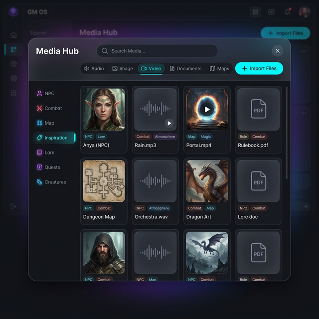

# 🗄️ Guide : le Media Hub

Le Media Hub est **la** bibliothèque de fichiers de GM-OS : illustrations, musiques, bruitages,
vidéos d'ambiance, documents. Tout ce que vous importez une fois y reste, et tous les modules y
puisent.

---

## 🚪 Une chose à comprendre avant tout le reste

Le Hub s'ouvre de **deux** façons, et elles ne montrent pas la même chose.

**Pour tout voir** : la barre latérale, section *Outils* → **Media Hub**. Aucun filtre : images,
sons, vidéos et documents ensemble. C'est le mode « ranger ma bibliothèque ». Le bouton
*Sélectionner* n'y sert à rien — il n'y a pas de module à qui rendre le fichier.

**Pour choisir un fichier** : depuis le module qui en a besoin. Il s'ouvre alors en plein écran, et
**ne montre que ce qui l'intéresse** :

| Vous l'ouvrez depuis… | Vous voyez… |
| :--- | :--- |
| Image-OS, une fiche de PNJ, un portrait de personnage, un indice, le fond d'une campagne | **les images seules** |
| Music-OS, Sound-OS, Ambient-OS | **l'audio seul** |
| Map-OS, l'Atlas | **images et vidéos** |
| L'éditeur de fiche, en mode document | **les documents seuls** |

> 🔎 **Conséquence pratique.** Si un fichier « a disparu », il est le plus souvent d'un type que
> l'écran d'où vous regardez ne montre pas. Les onglets **TOUT / IMAGE / AUDIO / VIDEO / DOC** ne
> filtrent qu'à l'intérieur de ce que le module a déjà autorisé : ouvert depuis Image-OS, l'onglet
> AUDIO reste vide. Passez par la barre latérale pour tout revoir.

---

## 📥 Importer

**Importer Asset Tactique**, en bas à droite, ouvre le sélecteur de fichiers de votre système.

> ✅ **Vous pouvez en choisir plusieurs d'un coup depuis le 2026-09-05.** Le Hub n'en prenait qu'un,
> ce qui obligeait à rouvrir la fenêtre entre chaque fichier — ranger une sonothèque prenait la
> soirée.
>
> **Un fichier refusé n'arrête pas les autres** : les vingt-neuf restants entrent, et un message
> nomme celui qui a échoué. *Un import qui abandonne au premier problème oblige à tout recommencer
> en devinant où il s'est arrêté.* La question du doublon, elle, se pose fichier par fichier — dire
> non à l'un ne saute que celui-là.

| Famille | Reconnue par |
| :--- | :--- |
| **Audio** | le type du fichier (`audio/…`) — MP3, WAV, OGG, M4A… |
| **Vidéo** | le type du fichier (`video/…`) — MP4, WebM… |
| **Image** | le type du fichier, **ou** l'extension — JPG, PNG, WEBP, GIF, SVG, AVIF, HEIC, JFIF… |
| **Document** | PDF, DOC, DOCX, ODT, RTF, TXT, MD, CSV, JSON — **et tout ce qui n'entre pas ailleurs** |

> 🔎 **Deux corrections du 2026-09-04.** « Image » était le repli : un fichier que GM-OS ne savait
> pas classer y atterrissait et n'affichait qu'une **vignette cassée**. Le repli est désormais
> « document », qui montre une carte neutre avec l'extension — *se tromper en le disant vaut mieux
> que se tromper en le cachant*. Et les images dont Windows ne donne pas le type (`.jfif`, `.avif`
> selon les versions) sont maintenant reconnues à leur extension.

<!-- -->

> ⚠️ **Un fichier à la fois.** Le sélecteur ne prend pas de sélection multiple.

<!-- -->

> 🔎 **Les doublons sont signalés depuis le 2026-09-04.** Un fichier de **même nom et même taille**
> déclenche une demande de confirmation. C'est un avertissement, pas une interdiction : vous pouvez
> vouloir la copie — une variante retouchée sous le même nom, par exemple.

Les fichiers importés sont **recopiés dans la base interne** de l'application. Déplacer, renommer ou
supprimer l'original sur votre disque n'a plus aucun effet sur votre partie.

---

## 🔎 Retrouver un fichier

Le Hub offre **six** manières de réduire la liste, qui se combinent toutes.

### La recherche

Le champ du haut cherche dans **le nom, les tags et le type** à la fois. Taper `audio` remonte tous
vos sons ; taper `elfe` remonte aussi bien `elfe_archer.png` qu'une image taguée `Elfe`.

### Les tags, et la logique OU / ET

Colonne de gauche, **Tags Tactiques**. Cliquez pour en sélectionner plusieurs, et **le bouton
`OR` / `AND` change tout** :

- **OR** (par défaut) — les fichiers qui portent **au moins un** des tags choisis.
- **AND** — seulement ceux qui les portent **tous**.

*C'est ce bouton qui transforme les tags en vrai outil : `PNJ` + `Ennemi` en mode AND vous donne
exactement les portraits d'adversaires.*

### Les dossiers de collection

Colonne de gauche, en haut. **Trois familles** :

| | |
| :--- | :--- |
| **Archive Globale** | tout, sans filtre |
| **Matrice Intelligente** | deux dossiers calculés : **Dernière Fréquence** (les imports récents) et **Contenu Non Aliasé** (tout ce qui n'a **aucun** tag — la pile à ranger) |
| **Domaines Utilisateur** | **vos** dossiers, que vous créez avec le **+** |

Un fichier peut appartenir à plusieurs dossiers, et un dossier supprimé **n'efface aucun fichier** —
il défait seulement le rangement.

### Le focus campagne

Le bouton **Focus Opérationnel / Matrice Globale** bascule entre « tout » et « seulement ce qui est
lié à la campagne active ».

### Le type, et le tri

Les onglets **TOUT / IMAGE / AUDIO / VIDEO / DOC**, et un menu de tri : **Plus récents**, **Plus
anciens**, **Taille**, **Nom (A-Z)**.

---

## 👁️ Regarder, choisir, ranger

### Sur une vignette

**Cliquez sur l'image** pour l'ouvrir en plein écran. C'est un vrai lecteur :

- une **image** s'affiche en grand ;
- un **son** et une **vidéo** démarrent tout seuls, avec les commandes de lecture ;
- **ESC** referme.

> 🔎 **Les documents s'ouvrent aussi, depuis le 2026-09-04.** Un **PDF** et le **texte brut**
> (`.txt`, `.md`, `.csv`, `.json`) se lisent en plein écran. Les formats bureautiques — `.doc`,
> `.docx`, `.odt`, `.rtf` — ne s'affichent pas : GM-OS le dit désormais au lieu de montrer un cadre
> blanc. *Une absence expliquée n'est plus une panne.*

Au survol de la vignette apparaissent **Supprimer Asset** et le grand bouton rond **Sélectionner
pour Transmission** — celui qui renvoie le fichier au module qui a ouvert le Hub. Un crayon permet
de **Modifier l'identifiant** (le nom d'affichage ; le fichier d'origine n'est pas touché).

### Le panneau de détails

Le bouton **ÉDITION DÉTAILLÉE** ouvre un panneau latéral qui donne, sur un seul média :

- un **grand aperçu**, son type et son poids ;
- le **cadenas de persistance** (voir plus bas) ;
- **Classification Dossier** — cocher les dossiers auxquels il appartient ;
- **Matrice de Tags** — en ajouter, en retirer ;
- ⭐ **Utilisé par** — la liste nommée de ce qui retient ce fichier ;
- son **identifiant** et sa **date d'import** ;
- **Attribution Opérationnelle** — lier ou délier le média à chacune de vos campagnes.

> 🔎 **La section « Utilisé par » est née de cette relecture.** Le guide promettait un « Status
> Tactique » qui n'existait pas — mais l'application, elle, savait déjà répondre « personne » :
> c'est ce que le nettoyage calcule pour décider d'effacer. La même donnée, lue dans l'autre sens.
> Ajoutée le 2026-09-04.

---

## 🔒 Le cadenas, et le nettoyage

### Deux temps, jamais un seul

**Paramètres → Nettoyage de l'Index Médias.**

1. **Analyser** ne touche à rien. GM-OS parcourt **douze modules**, note tout média que quelqu'un
   retient, et vous **nomme les fichiers** que plus personne ne réclame, avec leur poids.
2. **Supprimer ces N fichiers** exécute exactement la liste affichée — pas une liste recalculée
   entre-temps.

Les fichiers **verrouillés** sont listés à part et jamais supprimés.

> ⛔ **Deux corrections, et elles changent la façon de s'en servir.**
>
> Ce guide affirmait que GM-OS « scanne **régulièrement** la base ». **Rien ne tourne
> automatiquement** : sans votre clic, aucun média n'est jamais effacé.
>
> Et jusqu'au 2026-09-04, ce bouton **supprimait au premier clic**, sans confirmation ni liste,
> et annonçait le compte une fois le mal fait. C'est désormais deux gestes, avec la liste entre
> les deux.

### Ce que le nettoyage regarde

Douze modules : NPC-OS, Image-OS, les campagnes (fond d'écran, PNJ, Atlas, wiki), les joueurs
(leur avatar, les portraits, jetons **et documents** de leurs personnages), les indices, Combat-OS,
**Map-OS** (la carte du plateau **et celle de chaque configuration sauvée**), **le storyboard**,
**les favoris**, Sound-OS, Music-OS, Ambient-OS.

> ⛔ **Six de ces douze ne s'y trouvaient pas avant le 2026-09-04** : Map-OS, les indices, le
> storyboard, les documents attachés à une fiche, l'avatar d'un joueur, et les favoris. Un fichier
> qui n'existait que là passait pour un orphelin — et un clic sur *Nettoyer* le supprimait. **Si
> vous avez lancé un nettoyage avant cette date, c'est là qu'il faut chercher ce qui manque.**

<!-- -->

> 🔎 **Un module qui ne répond pas bloque le nettoyage.** Si l'un des douze échoue, GM-OS le dit et
> **ne supprime rien** : tout ce que ce module détenait paraîtrait orphelin. *Épargner trop est
> acceptable ; effacer trop ne l'est jamais.*

### Voir qui se sert d'un fichier

Deux endroits, désormais :

- Le **panneau de détails** ouvre une section **Utilisé par** qui nomme chaque usage —
  *« Map-OS — Configuration « Embuscade de nuit » »*, *« Campagnes — Dame Ysolde »*. Un fichier que
  personne ne retient le dit simplement : **Aucun usage**.
- La grille pose un petit badge **Aucun usage** sur ces fichiers-là. **Il constate, il n'alarme
  pas** : sur une bibliothèque bien fournie, une bonne partie de votre réserve est légitimement
  inutilisée, et un badge rouge sur la moitié de l'écran ne voudrait plus rien dire.
- Le dossier calculé **Orphelins**, dans la colonne de gauche, les rassemble — c'est la revue à
  faire avant une purge. Il montre aussi les orphelins **verrouillés**, qui ne risquent rien : ce
  dossier sert à passer les fichiers en revue, pas à prédire la suppression.

### Verrouiller

Dans le panneau de détails, le **cadenas** en haut à droite de l'aperçu. Fermé, il devient coloré,
un badge **Persistant** apparaît, et une icône de cadenas s'affiche sur la vignette.

> [!TIP]
> **Verrouillez ce qui n'a pas encore servi.** Le boss de l'acte III, la carte secrète, l'image du
> retournement final : tant qu'ils ne sont attachés à rien, ils sont exactement ce que le nettoyage
> appelle un orphelin.

Un import n'est **jamais** persistant : c'est toujours un second geste.

---

## ☢️ Purger le Hub Global

Le bouton rouge en bas de la colonne de gauche. Il **efface tout** — tous les fichiers et tous les
dossiers, **y compris les fichiers verrouillés**. Une confirmation le dit, et il n'y a pas de retour
en arrière depuis l'application.

---

## 💾 Où vivent vos fichiers, et sont-ils protégés ?

Les médias sont dans une base locale de l'application (IndexedDB), séparée de la base des
campagnes. La place disponible dépend de votre machine ; plusieurs gigaoctets sont la norme.

**Oui, ils sont sauvegardés** — par le **miroir des médias**, qui les recopie à côté de la
sauvegarde automatique. Il fonctionne **par différence** : le premier passage est long (115 images,
261 Mo mesurés le 29/08), les suivants ne coûtent que les nouveautés. Une image illisible se
journalise et n'interrompt jamais la sauvegarde.

> 🔎 **À la restauration, chaque image revient sous son identifiant d'origine** — sans quoi vos
> cartes et vos portraits pointeraient dans le vide alors même que les fichiers seraient revenus.

→ [Guide de la sauvegarde automatique](./Sauvegarde_Automatique_User_Guide.md)

Une **campagne supprimée** ne supprime aucun fichier : GM-OS retire seulement l'étiquette de cette
campagne sur les médias concernés.

---

## 🔧 Dépannage

| Problème | Ce qu'il faut regarder |
| :--- | :--- |
| **Un fichier n'apparaît pas** | Vous avez ouvert le Hub depuis un module qui ne montre pas ce type. Ouvrez-le depuis le bon module. |
| **Une vignette est cassée** | Un import antérieur au 2026-09-04, rangé dans les images par défaut. Renommez-le ou réimportez-le. |
| **Un `.docx` s'ouvre sur une explication au lieu du texte** | Normal : seuls les PDF et le texte brut se lisent à l'écran. |
| **Le même fichier apparaît deux fois** | Deux imports antérieurs au 2026-09-04, quand rien ne les signalait. Supprimez-en un. |
| **Le sélecteur de fichiers n'affiche aucun document** | C'était un défaut, corrigé le 2026-09-04 : le filtre demandait un type de fichier qui n'existe pas. |
| **Des images ont disparu après un nettoyage** | Si c'était **avant le 2026-09-04**, elles n'étaient sans doute référencées que par l'un des six angles morts d'alors (Map-OS, un indice, le storyboard, un document de fiche, l'avatar d'un joueur, un favori). Restaurez depuis la sauvegarde. Depuis, ces six modules sont recensés. |
| **Le nettoyage refuse d'agir** | Un module n'a pas répondu, et l'écran le nomme. Tout ce qu'il détenait passerait pour orphelin : GM-OS préfère ne rien supprimer. |
| **Le filtre par tags ne rend presque rien** | Le bouton est sur **AND** : il exige *tous* les tags. Repassez-le sur **OR**. |
| **La liste est vide et je n'ai rien filtré** | Vérifiez le **Focus Opérationnel** : il ne montre que les médias liés à la campagne active. |

---

*Guide refait le 2026-09-04, code à l'appui. Deux affirmations fausses retirées — le nettoyage
« régulier » (il est manuel) et le « Status Tactique » qui n'existait pas. Trois fonctions ajoutées :
les **dossiers de collection**, la **logique OU / ET** des tags, et le **tri**.*

*Et la relecture a débordé sur le code : le nettoyage ignorait **six** propriétaires de médias, il
supprimait sans confirmation ni liste, et rien ne disait jamais qui se sert d'un fichier. Les trois
sont corrigés le même jour — le « Status Tactique » qui manquait est devenu la section
**Utilisé par**.*

*Quatre défauts de plus le même jour : le filtre du sélecteur demandait `document/*`, **qui n'est
pas un type de fichier** ; le repli de classement était « image », d'où les vignettes cassées ; les
doublons passaient sans un mot ; et les documents n'avaient aucun aperçu.*
