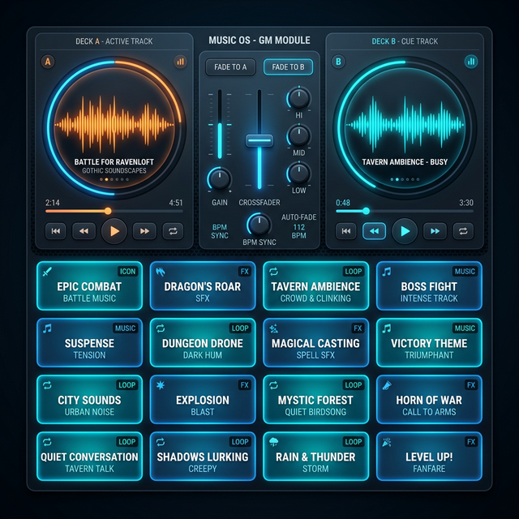

# 🎵 Guide Utilisateur : Music OS

Le module **Music OS** est le coeur de l'ambiance sonore de vos sessions. Contrairement à un simple lecteur audio, il est conçu comme un véritable mixeur de DJ thématique, vous permettant de gérer des transitions fluides entre vos musiques d'ambiance.

## 📋 Présentation du Module

Le module s'articule autour de trois zones de contrôle :
> [!TIP]
> **Contrôle Global** : Le volume de Music OS est désormais asservi au [Master Soundscape Controller](./Audio_Master_Guide.md). Utilisez le mode **Focus Chat** pour atténuer la musique instantanément pendant vos narrations.

1. **Les Platines (Decks A & B)** : Deux lecteurs audio indépendants capables de charger et de jouer des pistes simultanément.
2. **La Console de Mixage (Mixer)** : Permet d'équilibrer le volume entre les deux platines et de réaliser des transitions professionnelles.
3. **Le Gestionnaire de Playlists & Pads** : Une grille de 16 boutons (pads) pour lancer instantanément vos musiques préférées.

## 🚀 Comment l'utiliser ?

### 1. Charger et jouer une piste

- Cliquez sur un **Pad** dans la playlist pour charger la musique sur la platine inactive (ou active si rien ne joue).
- La platine affiche alors la forme d'onde et la progression de la piste.

### 2. Maîtriser les Transitions (Fades)

- **Manual Fade** : Déplacez le curseur central (Crossfader) vers la gauche pour entendre uniquement le Deck A, ou vers la droite pour le Deck B.
- **Auto-Fade** : Cliquez sur les boutons **Fade to A** ou **Fade to B**. GM-OS va alors baisser progressivement le volume de la platine active tout en augmentant celui de l'autre de manière fluide (rampe de 1.5s).

### 3. Points de Boucle (Loops) 🔁

Idéal pour les musiques d'ambiance qui ne doivent jamais s'arrêter.

- Chaque piste peut avoir un point d'entrée et de sortie défini.
- Le lecteur rebouclera automatiquement entre ces deux points, évitant ainsi les silences ou les intros non désirées à chaque répétition.

### 4. Organiser vos Playlists

- Créez des onglets thématiques (ex: "Combat", "Exploration", "Taverne").
- Chaque onglet dispose de sa propre grille de 16 pads.
- **Drag & Drop** : Réorganisez vos musiques par simple glisser-déposer sur la grille.

---

## ⌨️ Raccourcis Clavier & Key Learning

Le module **Music OS** supporte l'assignation de touches clavier à n'importe quel pad de musique, vous permettant de déclencher vos ambiances sans même toucher à la souris.

### Comment mapper une touche (Key Learning)

1. Cliquez sur le bouton **Key Learn** (icône ⌨️) dans l'en-tête du module. L'interface passe en mode "Apprentissage".
2. Cliquez sur le **Pad** auquel vous souhaitez assigner un raccourci.
3. Appuyez sur la touche de votre clavier que vous souhaitez utiliser (ex: `Numpad 1`, `Espace`, `K`, etc.).
4. Le raccourci est enregistré et s'affiche sur le pad. Quittez le mode Key Learn pour tester.

### Utilisation globale

Une fois mappés, vos raccourcis clavier fonctionnent **partout dans GM-OS**, tant qu'aucun champ de texte n'est actif. Cela vous permet de changer d'ambiance tout en étant sur la carte ou dans le combat tracker.

---

## 💡 Ambiance Lumineuse liée (Philips Hue)

Le module Music OS est capable de piloter vos lumières Philips Hue en synchronisation avec votre musique.

Chaque **Pad** peut être lié à une scène lumineuse spécifique. Ainsi, lorsque vous cliquez sur un pad pour lancer une musique, l'OS envoie simultanément une commande à vos lampes pour changer l'ambiance visuelle du salon.

### Comment lier une scène ?

1. Faites un **clic droit** sur un Pad.
2. Dans le menu de configuration, sélectionnez la scène lumineuse correspondante dans la liste (si vous avez configuré le module Light OS).
3. Cliquez sur "Save". Désormais, dès que ce pad est joué, la lumière suivra automatiquement.

---

## 💡 Exemples d'usage

### Scénario A : Transition Narrative

Les joueurs quittent la sécurité de la taverne pour entrer dans une ruelle sombre.

1. La musique de taverne joue sur le **Deck A**.
2. Cliquez sur le pad "Ruelle Siniestre". Il se charge sur le **Deck B**.
3. Cliquez sur **Fade to B**. La taverne s'efface doucement au profit de l'ambiance mystérieuse.

### Scénario B : Intensification du Combat

Le combat s'accélère !

1. Vous avez une musique de combat "Rythmique" sur le **Deck A**.
2. Chargez une piste avec des "Cuivres Héroïques" sur le **Deck B**.
3. Mixez progressivement les deux en déplaçant le crossfader au centre pour un son massif et épique.

---

## ⚙️ Configuration Technique

- **Multi-Sorties (Sink)** : Vous pouvez configurer Music OS pour envoyer le son sur une carte son spécifique (ex: sortie audio "Table virtuelle" ou "Casque").
- **Types de fichiers** : Supporte les formats `.mp3`, `.wav`, `.ogg` et `.m4a`.

---

> [!TIP]
> Vous pouvez lier une musique à une ambiance lumineuse. Par exemple, lancer le pad "Incendie" peut automatiquement passer vos lampes Philips Hue en rouge clignotant !
ple, lancer le pad "Incendie" peut automatiquement passer vos lampes Philips Hue en rouge clignotant !

---

## 📏 Aligner les niveaux (Niveaux alignés, v6.5)

Deux morceaux d'une même playlist ne sortent presque jamais au même volume, et on court au crossfader entre deux scènes. Le bouton **Niveaux alignés**, en haut à droite du mixer, corrige cela tout seul.

**Comment ça marche :**

1. Pendant que vous écoutez une piste, GM-OS **mesure sa sonie** — pas son volume brut, mais ce que l'oreille en perçoit, au sens de la norme de diffusion **EBU R 128 / ITU-R BS.1770**.
2. La mesure est retenue pour cette piste. **Dès la fois suivante, elle est calée** sur les autres.
3. Le compteur à côté du bouton dit combien de pistes sont déjà mesurées.

> [!NOTE]
> **La première écoute d'une piste n'est pas encore alignée** — on ne peut pas mesurer un morceau avant de l'avoir entendu. Passez une playlist neuve une fois, et la séance suivante sera d'aplomb.

> [!IMPORTANT]
> **Le gain est posé au chargement de la piste, jamais pendant qu'elle joue.** La mesure s'affine seconde après seconde ; la suivre ferait bouger le volume sous vos doigts. *Un correctif qui remue pendant qu'on écoute est pire que le défaut.*

**Deux choses que la mesure sait faire, et qu'un simple volume moyen ne saurait pas :**

- Elle **pondère comme l'oreille** : un morceau de basses profondes et un morceau de cordes aiguës peuvent avoir la même puissance et sembler séparés de 6 dB.
- Elle **ignore les silences et les intros murmurées** : sans cela, un morceau qui commence par vingt secondes de calme serait poussé de 10 dB, et le refrain arracherait la table.

La correction est **bornée à ±12 dB** : une prise d'ambiance très douce ne sera pas remontée jusqu'à en réveiller son propre souffle. La cible est **−18 LUFS**.
