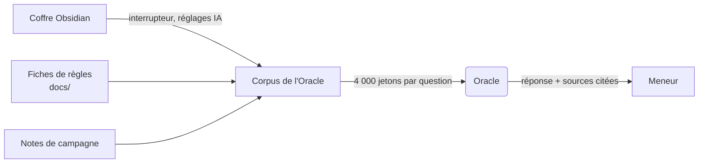

# 🔗 Obsidian et l'Oracle : le chemin réel

Vos notes de préparation vivent dans Obsidian. GM-OS sait les lire, les afficher, et — c'est le
sujet de cette page — les faire entrer dans ce que l'Oracle consulte quand vous lui parlez.

Il y a **deux chemins**, et un seul agit en séance.

---

## 🧭 Le chemin qui compte : brancher le coffre

**Un seul geste, une seule fois** : *Paramètres → IA → brancher le Nexus Wiki*. À partir de là,
chaque question interroge vos notes **en même temps que** les règles du jeu.

- **L'interrupteur est éteint par défaut.** Jusqu'au 2026-08-22, le coffre *remplaçait* la racine
  documentaire, et l'Oracle cessait de voir les règles sans le dire.
- **Il s'ajoute**, il ne remplace rien.
- Sous chaque réponse, l'Oracle **cite les fiches** dont il s'est servi : c'est là que vous vérifiez
  qu'une note a bien été lue.

---

## 📤 L'autre chemin : « Sync Oracle », qui ne fait pas ce qu'il dit

> ⛔ **Correction.** Cette page annonçait que le bouton *Sync Oracle* « injecte votre note active
> comme source dans NotebookLM », et concluait que « l'IA répond en tenant compte de VOTRE monde ».
> La première moitié est exacte, la seconde ne suit pas : la note rejoint un **carnet NotebookLM**,
> qui sert à la [Forge de campagne](./Forge_De_Campagne_User_Guide.md) — **pas** à la conversation
> avec l'Oracle. Relevé le 2026-09-04.

Utilisez-le quand vous préparez une campagne à partir d'un long document. Pas pour qu'on vous
réponde en partie.

---

## 🎭 Les personas

Le sélecteur de l'en-tête change l'expert : **huit** sont disponibles — Sage, Scribe, Oracle, Barde,
Alchimiste, Cartographe, Acteur, Stratège. Ils se réécrivent d'après votre jeu par le bouton
**Générer avec l'IA** des réglages de campagne.

→ [Guide de l'Oracle](./AI_Oracle_User_Guide.md) pour le détail, les sources citées et le penchant.

---

## 🛠️ Le coffre

- **Emplacement** : configurable dans les réglages ; parcourez jusqu'à votre dossier de coffre.
- **Lecture seule**, sauf pour la fonction *Exporter vers Obsidian*, qui **crée** des dossiers et
  des fichiers — elle n'en modifie jamais d'existants.
- ⛔ **Une jonction Windows n'est pas suivie.** Si votre coffre est atteint par un lien de ce type,
  l'indexation ne trouve **rien**, et sans un mot. Désignez le dossier réel.
- ⚠️ **Le coffre n'est pas cloisonné par jeu.** Des notes de Star Trek peuvent remonter sur une
  question de Blade Runner.

→ [Guide du module Obsidian](./Obsidian_User_Guide.md)

---

*Page refaite le 2026-09-04. Retiré : la conclusion que « Sync Oracle » fait répondre l'IA sur vos
notes — c'est l'interrupteur du coffre qui le fait —, un chemin de coffre écrit en dur avec un nom
d'utilisateur, et une consigne de dépannage (`notebook_query`, bouton RECONNECT du panneau Oracle)
qui ne correspond à aucun bouton existant. Le compte des personas corrigé : huit.*
